# 一二代小众史
## 【Endless Extraterrestrial Civilization History】春秋

> 作者：czmppppp
>
> 发布时间：2012-09-30
>
> 收录日期：2024-05-05

本贴体例抄袭自[【PVZ】我们的故事，从0开始，定格于1](http://tieba.baidu.com/p/991516877)，因觉此格式无甚拘束，极顺手，即可叙史，也能漫谈，不必头疼时间轴与空间轴之安排，遂归为己用。
文中所用游戏术语，恕不一一讲解。对了，不少术语的解释可以在上面那个链接里及某变代奏体系中找到，如果非EL资深玩家足够无聊的话。无论是否能懂，抱着个纯粹消遣的心态，保准没错。

---

## 00:00 构架 地外文明与笔者所处的历史阶段

搞游戏研究是件蛋疼的事儿，搞小游戏研究疼中有疼，而搞小游戏研究史则疼上一层楼。

最宏观地说，PVZ吧的Survival Endless研究，有两条主线，三种节奏，四个方面。

- 两条主线：地球文明/地外文明
- 三种节奏：自然节奏/代奏/变奏
- 四个方面：阵型设置/阵型运行/变阵救阵/开局造阵

第三部分最为明显，在整个研究中，阵型设置及运行占据了大量篇幅。而比之变代奏的已经完备详细的体系，最基础的无变代奏干预纯炮构成的自然节奏，虽易于理解但却一直未得到总结归类。至于两条主线，则是经某3个蠢货讨论分析EL饭史后所得出，原本是分为地球文明和火星文明的，然后我觉得火星文明这个叫法略显贰比，透出浓浓的饭味，为增加专业气氛及显得更加装X，遂改为地外文明。

用地球地外的限定词去命名一个普通小游戏的发展史自然是太过宏大，但这不过是一种修辞，所象征的是两条时而平行时而交叉的道路，两个间或融合间或分立的体系。

“地球文明”主要指各种主流阵型、基础理论框架的建设与成熟，以及理论逆运算所产生的大量成果，EL纪录与记录同样包含在内，犹如公式所至，答案顺理成章。三次科技革命中的各种核心理论与实践成果构成了EL地球文明的主体。众所周知这部分内容浩如烟海密似花林，仅梳理主干并从中摘出代表阵形五十有余，便已令人倍感疲劳。若要完成全部黑历史，须尽殚精竭虑之功。

“地外文明”则简单清晰许多，以超前、奇思、挑战为首要宗旨，以非主流、纯蛋疼、抖M为核心特征，不拘泥于现存束缚，随心所欲天马行空，思维所到之处生根发芽。所体现出的不仅是玩家面对高难毫不停歇的自我挑战精神，更大有2B少年们创新无止自得其乐的洒脱风格。

细分下来，地外文明主要由三条交相发展的支线组成。

- 其一，Endless少炮主流炮阵的娱乐化，高难化及EL极限过关尝试。
- 其二，Endless开局及变阵的多样化，自虐化。
- 其三，手动超多炮。

需要说明的是，以上三点只是特征，是必要条件，但绝非充分条件，不是有点难度的自虐阵或者娱乐阵都算地外阵型，具体的标准是多方面的，有些模棱两可的分类，不过决定于一念之间罢了。

两大主线从来都不是互为隔绝的，一开始源头或许相异，但之后则时有交互，地外文明借地球文明之成果作为基础，地球文明被地外文明之思路所拉动之事例屡见不鲜，有时甚至分不清楚何谓地球何谓地外，一时荒谬灵感造就理论体系或现有寻常科技筑下不可思议之地基，均属正常。

以上，就是整个故事背景的基本设定。

而作为本帖作者的我，则是于2010年3月份随舍友发布的某个早已火星很久的LS3卡来到PVZ吧，你们也不用去搜索了，原帖已护，因为我首条发言2到不能直视。这是偶然性犯下的不可挽回的错误，不说也罢。

地球文明及地外文明同时起源于09年夏天，09年秋冬之际两条主线均得到开创性发展，我来这里时恰逢第二次科技革新兴起后不久，虽暗流汹涌蓄足劲力但表面上却显出青黄不接之象，导致不少吧友都认为EL至彼已经全部发掘完毕。可见无论是哪条主线，我都像是个乱入的，未能有缘从头到尾一睹黑历史全程。所以地外文明最初的三分之一部分我只能在现有各种资料的基础上讲述，部分模糊细节也只能略过。不过自2花和我打破两条主线的瓶颈，全面将二次科技革命推向高潮以后，绝大部分重要事件我不是亲历亲为便是亲身旁观，尤其是2011年以后的地外文明相关，可以说没人比我了解的更清楚更全面。阵海的出现缘于我对地球加地外文明作一个人总结的企图，结果只是变成了二次科技革新的手控阵总论，连地球文明本身都远远未能涵盖。如今面对将要讲述的Endless地外文明的故事， 我即不希望却又希望出现相同的尴尬。

开始第一次EL鸿图绘制的尝试之时，我已经看到大致的轮廓所在，尽管负担沉重，但在写下某个帖子标题的那一刻，心中的信念告诉我即便这是一次抛砖引玉的尝试亦有其灿烂价值。后来突变迭起，EL研究进入全新境界，然而内容愈多，脉络反而愈加明晰，随着第三次高潮逐渐平息，终于能够在灯火阑珊处看到我梦寐以求的波澜壮阔，全图几乎已经完成，缺的只是文字化的编年史，只是一点一滴的记录与文采飞扬的叙述。我一直所怀的遍览黑历史，笑谈江山画之心愿算是有了实现的契机。当然，仅仅是契机而已。某个坑爹帝放鸽子上瘾之后一发不可收拾，开坑弃坑一气呵成，食言而肥。在无法无视他起源是吃饭这一事实的情况下，我们只好怒看这货拿EL发展史百句吐槽这种毫无明细可言近似大纲不如大纲错误不少bug甚多所以其实只能骗骗小朋友的帖子糊弄群众。另外一方面，形成鲜明对比的我一向是有坑必填节操满满，有目共睹。

地球文明史实在太长，太多，太杂，太累人，非一个性格懒散的乱入者所能完成，更何况此坑早已名花有主，而我又不控NTR。地外文明则不然，只需二十多个个代表性的主干便可将整体轻松串接起来，如果一小时近观一片拼图， 那么一天一夜就足以领略一幅画卷——怎么感觉还是有点长啊喂！

总之，无论是蛋疼或者是蛋疼，我决定刻下这段历史，讲出这个故事。

自身的游戏技术与经验，对贴吧游戏研究发展的长期观察与鲜明记忆，以及与平渊和风花镜月关于EL史的多次深入交♂流，给予了我充分的自信写出这个帖子。九月始作， 断断续续，终不忍弃，三周乃成。我既以【二三事】为题，可见并不打算写什么全无遗漏中规中矩殊无感情色彩的正史，只是露其主干，示其关键，加以废话，附以见解。你可以当这货是少儿读物，也可以当这货是成人段子，又或是只言碎语，村野歪史，我都没意见。

相比巨大臃肿的地球文明发展史，地外文明史小巧玲珑，妙趣横生，重寂寞之人，多无聊之乐，极适宜闲散时翻阅欣赏。观摩之如食甘饴，甜美溢齿；回味之如品清茶，淡香不散。

## 01:00 本初 jiangxichu键控14炮——天外飞仙

在平渊接手EL研究及第一次科技革命出现之前，新生的PVZ及PVZ吧长时间处于萌芽状态，贴吧氛围随意温和，发展方向缺少主导，对游戏之研究了解更是模糊。相比零星出现的EL碎片，更多的是冒险和小游戏的喧哗，当然也不乏同人周边的声音和灌水版聊的嫩芽，一个贴吧所可以具备的各种各样的元素全都初露端倪。

那时候的PVZ吧是一块璞玉，最初有能力雕琢的人，便一举决定了它的未来。若这个人是一条纯粹的大水狗，那么PVZ吧可能就会直接变成一个小粪坑；若这个人是YY帝或周边高手，那么PVZ吧可能会以同人故事周边创作为中流砥柱；若这个人……

历史没有假设，发生的事实也无需我再重复。无论是游戏本身的丰富内涵已经注定贴吧的道路或是纯粹的偶然，09年秋，混沌数月后，PVZ吧被一次点滴积累后的爆发带入我们所认知的正轨，同时游戏技术研究被某个【哗】经过大量努力后牢固为贴吧立足之本。

那么，2009年5月~8月处于摇篮时期的PVZ吧，EL发展大致是怎样的状况呢？

雏形8炮能无尽，4炮及其他几个少炮能玩，无炮坑爹。一个设置不合理操作难度稍高的双边加速无炮配合SL过500就已经可以让一般玩家怀疑开挂，用平渊的话说，这个时候EL没有研究可言，称之为探索更加合适。

所以，我们应该不难想象，当天上突然掉下个同时插有14根黑又硬神器的阵型时，奔波于冒险和小游戏之中，对8炮以上完全没有概念的吧友们会作出怎样的反应。

不，其实还是挺难想象的，因为无论是诞生时间，操作工具，还是操作理念都实在是过于不科学了。

2009年6月19日晚上8点多，JXC在[墨小仙的晒阵贴](http://tieba.baidu.com/f?kz=595969548)中亮出惊天一发，瞬间完爆全场。

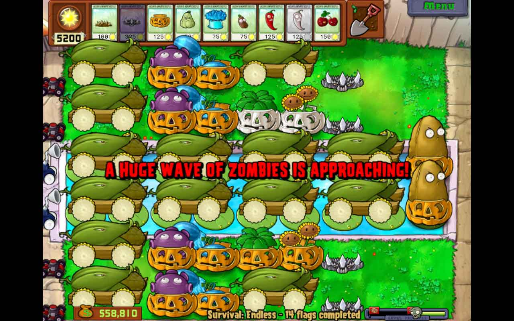

键控14炮诞生了，且不论8炮，且不论Endless，无数玩家恐怕还连金向都没拿到吧。

键控14炮诞生了，距游戏正式发行一个多月，而距离贴吧首个EL传记作者【iisbc007】正式推开生存无尽之门还有近半个月之久。

键控14炮诞生了，整个PVZ吧并没有为之沸腾，甚至质疑之音也稀稀落落，因为它的存在完全超出了一般玩家对游戏的理解，更因为，在那个充斥着怎样过M关买不买N卡槽的环境中，它和它的主人，是孤独的。

突破常规的14炮——把时代对于炮数的限制远远甩在背后

使用按键精灵辅助——现今精确超多炮的重要工具

意识炸+4炮容错——在无严格预判理念下的可运行超多炮

无论从何种角度评判，JXC的14炮都是天外飞仙，地外来客，不为尘世所容。直到4个多月后平渊正式提出超多炮预判操作理论并开发出16炮+阵型时，地球人方才有了第一次回望传奇的资本。

急先锋并不满足于此，键控14炮发布一个月后，JXC开帖提出[无伤12炮](http://tieba.baidu.com/f?kz=612554471)的咋舌创意，再次完爆了全吧的智商，再次大踏步拉开与整个时代的差距。面对诸多现在看来低端可笑的提问质疑，他仿佛从未来穿越，一行一段耐心做出解释，但过深的沟壑实在非文字所能弥补，彼时他的心和阵一样，已无暇再顾及落后太多的过去与当下，只求一路向前。

jiangxichu_1，首个将PVZ吧托上云巅的先行者，第一位真正体会到“高处不胜寒”的玩家，

最早观天坠井，探求星之所在的大能，他使我们领略的，是阵受制而心无限，炮有数而意无穷，“春哥原来可以放这么多”，他传播给贴吧的，是永无止境的追求，敢想敢做的蛋疼，

“EL存在这样那样的摆法玩法，只不过你还没想到”。毋庸置疑，作为PVZ吧的上古之神，JXC的才华立起了空中楼阁最初的牙柱，JXC的精神则作为整个地外文明史乃至EL史的核心风骨，贯穿始终。

领先世界半步是天才，领先世界一步是巴神。PVZ领域的巴神就这样思考着人生，遗世独立，越走越远，终于慢慢消失在我们的视野之中。而他所留下的14炮和12炮，自成雪峰，酝酿出与地球文明之洪流并驾齐驱的滔天瀑布，直击岁月，冲刷出历久弥新的斑斓。

## 02:00 纽带 王子高难度8炮——继往开来

JXC之本初虽已经羽化登仙并彪炳后世，但碍于时代鸿沟所阻隔，断无可能直接带动当时一盘散沙的EL研究。因此直到贴吧的上古攻略党逐渐积累起一定的基础，平渊3C等老一辈攻略核心折腾完MG，将魔爪伸向EL体系之后，婴儿才终于爬出襁褓，开始步履蹒跚地学习行走。

2009 年秋，随着3C大成、王子开创、虚空发掘、小倩神思和平渊构建，包含冰消梯瓜EL阵形框架化多样化，以及无炮八炮新旧世界交接的第一次科技革命呼啸而来，EL体系与框架初步成型。地球文明连续得到突破，一日千里，正是借助凿此壁所偷之光，地外文明成功迈出了超前的第二步。

2009年10月10日下午，平渊发布一枚名为猎奇实为[蛋疼的8炮](http://tieba.baidu.com/p/653587304)，充分体现了他的广乐多属性。

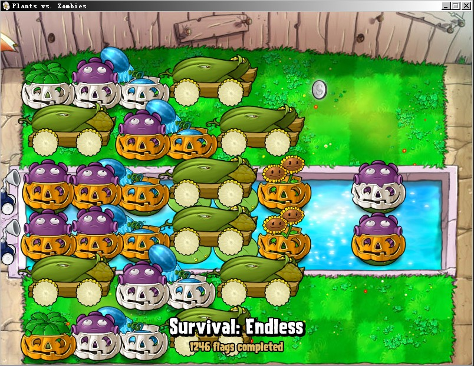

简单评价的话，这个“猎奇”8炮就如同换体位寻求刺激，却还是高潮不起来，根本原因是自己阳痿的问题没有得到解决：每过几十轮抽空换一下底线炮，其他和普通8炮几乎无区别——好比每抽插几下换个套套，难免有调戏荷尔蒙智商之嫌。

不可否认的是，该8炮对Endless阵型设置的多元化做了十分重要的启发及预热，提供了新的思路，这已经足够。没能一次性到位严格来说不能算作缺憾，整个EL史中几乎没有理论或实践能够一步就做到绝对完美无可改进，那太不科学了。

以上两段毫不矛盾

在新科技的帮助下，王子运用自己对炮阵设置、卡片使用的深刻理解与强悍操作，成功实践了[两个在当时而言难度极高的8炮](http://tieba.baidu.com/p/666399308)并于11月9日下午发布。以单曾配冰杀矿工的瞎眼创意和冰核代炮补节奏的超时代意识，王子又一次雄辩地证明了这个世界是有神存在的。

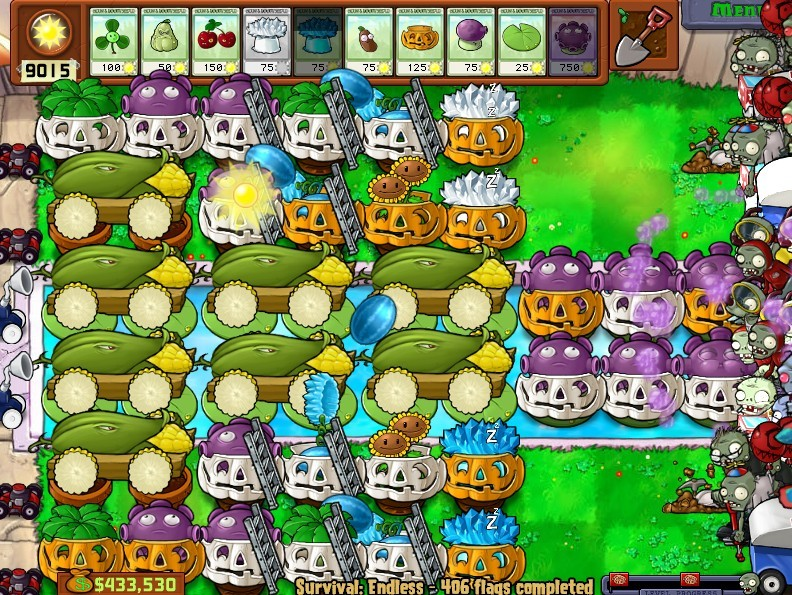

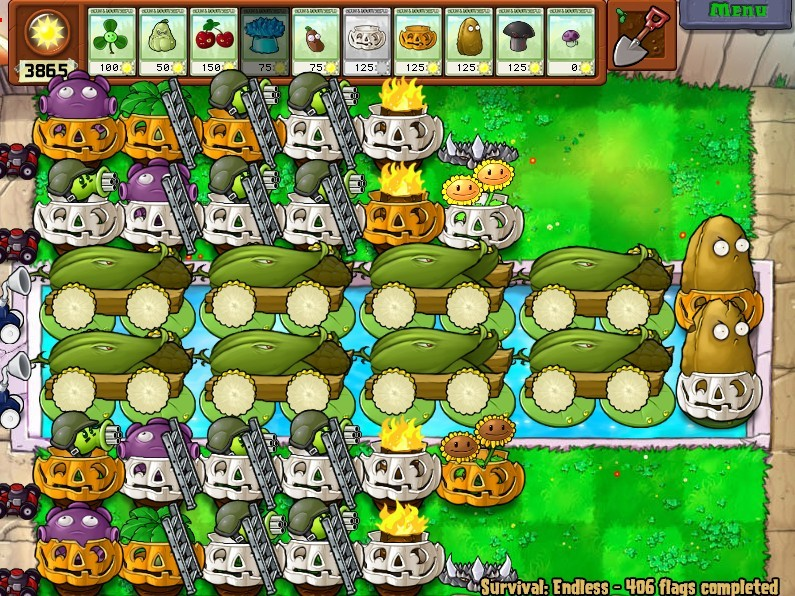

第一个底线8炮前承绿字的猎奇8炮，更加大胆创新的体位以及自身能力的增强彻底解决了软得快，射的少，用时短等问题，同时后启整个底线炮体系，但由于阵型操作都过于先进，直到两个月后吧友【魂氵岦§艽々幽】才再度将底线炮扩展并延伸至前院，而底线炮体系的高峰与彻底成熟居然分别要等到近一年后的二次革命高峰期和三次科技革命，可见地外文明引领潮流之凶残。

而第二个水路8炮所用的冰核代炮则纯粹是第二次科技革命的核心内容之一，王子不愧是可以用操作超越理论的存在，在完全没有成熟代炮理论的情况下凭借自身经验与意识和僵尸A的有来有回，委实令人叹服，堪称是PVZ慢手流玩家的最杰出代表。

JXC之后，王子和平渊在有力科技支持下对8炮阵型所作的自虐与拓展，标志着EL阵型的多样化难度化从个人的灵感逐渐向体系的发展过渡。聚力磨合，推陈出新，不可或缺之功也。

## 03:00 启发 玉米6炮与8炮——别具一格

25%的黄油可能与春哥部件的设定让玉米成为一种特别的植物。

IZE里的玉米特别特别特别厉害——厉害到看到它我就想吐。

EL里的玉米特别特别特别废……废个毛啊，有人体才有蜈蚣，没玉米何来春哥？！

至少在平渊尝试颠覆常规[种植大量玉米守线](http://tieba.baidu.com/p/666214717)之前，EL玩家眼里的玉米，其作用几乎仅限于春哥合成。

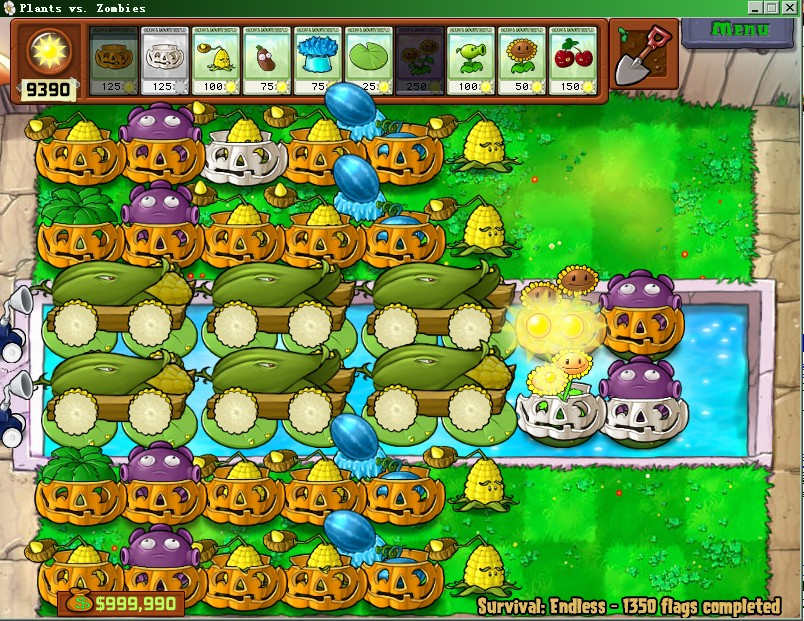

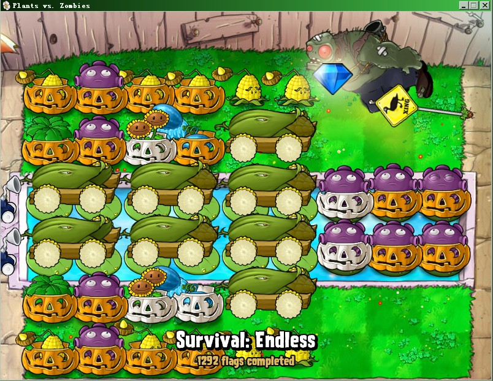

高难度8炮诞生当日，玉米双阵亦携手出山，众惊疑，然观其视频，本体价廉物美，攻防井然有序，收尾轻松惬意，遂称是。

神的子民和神在一起，一样可以齐心协力，力克强敌。

细析双阵，可得以下数结论

1. 收尾时玉米效果尤其拔群，对借减速真空而快速冲前的僵尸亦有奇效。
2. 其功效和垫材各有优劣，但绝对无法超越神之绿卡。
3. 如果假设春曾冰瓜双子卡片是赖以生存的基本条件，那么玉米就是物质生活满足后的精神享受。

很明显，这是又一次EL阵形多样化娱乐化的成功尝试，进一步丰富了正快速前行的地外文明。不过，玉米双阵既然能单列一节，足见其贡献不止于此。

如平渊在原贴中所言，他本来的目的是证明是玉米在EL中的可行性，而非必要性。目的当然是达成了，但事实上更加关键的是由这个证明本身所延伸得到的推论—— 在阵形设置，带卡及节奏能够极限满足所需运算量的情况下，其余的中后场空地几乎尽数可以用来塞植物，玉米不过是其中之一罢了。譬如最简8炮，8炮2双子， 伞叶单花临时补外带所需卡片，如此阵形就足以无尽。剩下大量空白想种什么种什么。

无心插柳柳成荫，就是玉米6炮/8炮及坑了的玉米10炮和现在看起来废话一般的推论，引出枝叶渐茂之主干上又一新芽，为后来某个神系列的出现埋下预判量超高的伏笔。

## 04:00 破立 无春无曾高F过关挑战——建宗立派

接下来登上历史舞台的是腹黑攻【小楼_初晴】，通称晴姨，章鱼，触手姨等等。作为PVZ夜空里最耀眼的恒星之一，晴姨将EL阵形难度化及自虐玩法开发到空前的高度，同时自创一派，成为贴吧的EL极限通关先驱。如果说早期的地外文明靠平渊和王子得以迎风加速，那么它则因晴姨而乘风飞驰。

大概是觉得常规后置8炮太过稳定不够刺激吧，09年12月初，晴姨完成了前无古人的[无春曾极限过关视频](http://tieba.baidu.com/p/676611929)，让吧友过足了眼瘾。

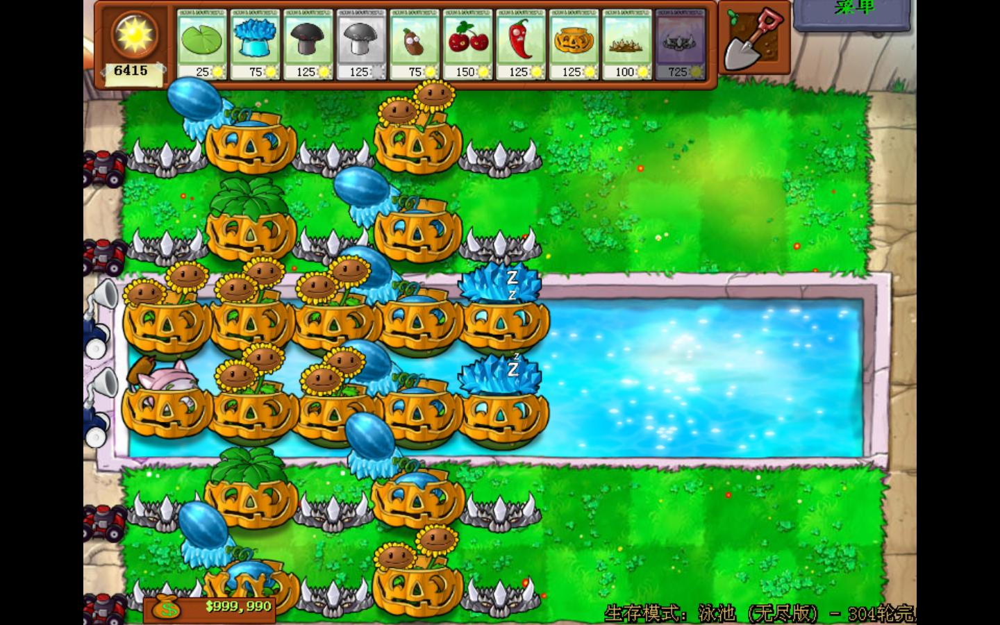

所谓无春无曾当然是不能循环无尽的，只是用其他阵型将F数打高以后变阵过来，然后挑战高难僵尸组合以求打过2F坚持到下一次选卡，冰菇核武玩命用，地刺垫材使劲拖，该阵的极限通关即为此意。无论之前是否有人想过，晴姨以一种在当时看来不可置信的方式强势宣告了新流派的诞生。

除开了一次性高难通关及极限自虐的先河之外，晴姨也是最早令EL无炮无曾焕发光辉的玩家。视频中从开始的阵型完好戒备森严，到中期的龙战于野高潮迭出，再到后期残垣断壁余烬不灭，观来提心吊胆，却又酣畅淋漓，仿佛自己置身其中，最原始的暴力欲望得到了满足。

原来，形单影只一张阵型图，就能使人直观感受到另一个世界的锋芒。

原来，即便不能实现一般意义上的无尽，Endless也可以精彩如斯。

在今天，这样的阵型或是挑战可谓平平无奇。然而，现在常识的普通，正是源于过去不走寻常路的卓越。

## 05:00 支流 手动14炮——手速之初

从前有一个人，他的名字叫#，然后他的智商就不幸失足落井，再也没能上来。

那个时候#与章鱼是PVZ吧的蛋疼双壁，那个时候某个二笔的坑已经可以吞天化地，那个时候挂在ID上的性别，基本是真实的。

说起龙#骑，可能大部分熟悉历史的吧友第一时间想到的是他对地球文明中RE及其他生存场地作出的卓越贡献，诚然不假。不过#的另一不易为人所注意的核心成就才是本节的主题：横刀立马创下地外文明三大流派之手动超多炮。

还是在09年12月3日，就在晴姨破旧立新大展身手时，龙骑高同步发表贴吧首个[手动14炮](http://tieba.baidu.com/p/676613510)，在绿字一句“你TM真够自虐”的画外音下，正式宣告新支流的出现。

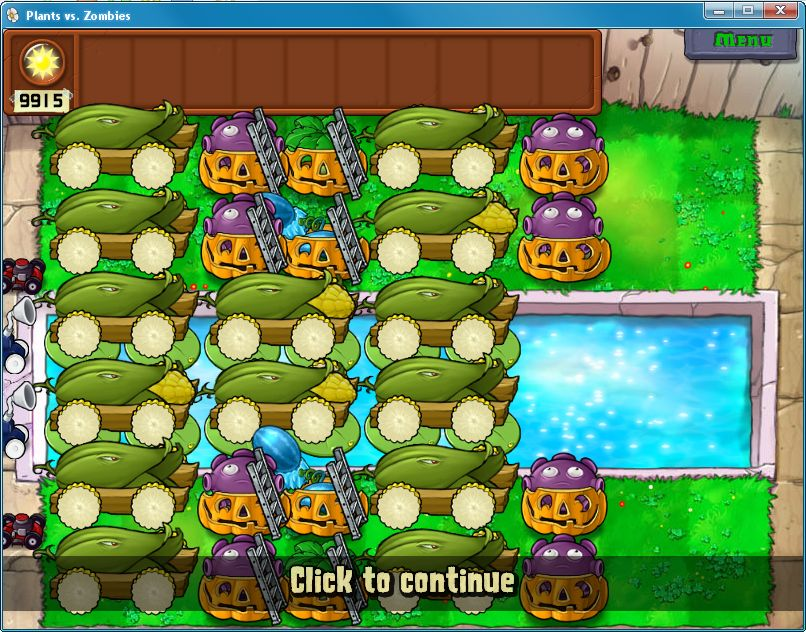

数日后，龙骑又一鼓作气#上添花，在抑郁心情的催动下开发出[手动底线12炮](http://tieba.baidu.com/p/677912337)，成功改变了常规12炮万年不变的十字架体位，一展P6自然上限的魅力。

有的成功总是悄然降临于不经意间，或许#只是闲的无聊，只是蛋疼娱乐，只是单纯想证明手动玩超多炮也不是不行。无论如何，他首次做到了之前借助按键精灵才能完成的事情。

实际上无论是14炮还是12炮的视频，#并未展现出来无影去无踪的变态手速，只是踏踏实实有条不紊，按照一边预判一边游离于预判反应之间的方案，稳准俱佳。 这不仅完全不能黯淡他创古法之未有为前人之不为的光环，相反作为祖师爷，手动超多炮三要诀一出已得其二，倒更加令人钦佩。换个角度辩证看来，在那个“超多炮需要键控”的观点已成为一种常识的时间段里，我可以自信地写下历史的声音：#，就是最快的。

步可停，思不歇。很久很久以后，我们坐拥手动24炮的辉煌，回首两年来源自龙骑手动14炮的种种坎坷，如攀险峰，如渡暗河，感慨万千。

## 06:00 虚实 水路18格——惊世骇俗

数字量化后置8炮是求稳，是节奏，是厚积薄发的必然，是水路的伞叶最呀最摇摆。

无春曾通关是新意，是霸气，是纯粹的自虐，是因为无聊所以蛋疼的产物。

[水路18格](http://tieba.baidu.com/p/689221142)是什么？

除了风姿卓绝惊世骇俗之外我找不出其他更贴切的形容，请原谅我的语死早。

2009年最后一天，在晴姨的超绝创意下，EL阵形借用无比极端的表现形式，首次展示出半虚半实，非缺非满之魅力。

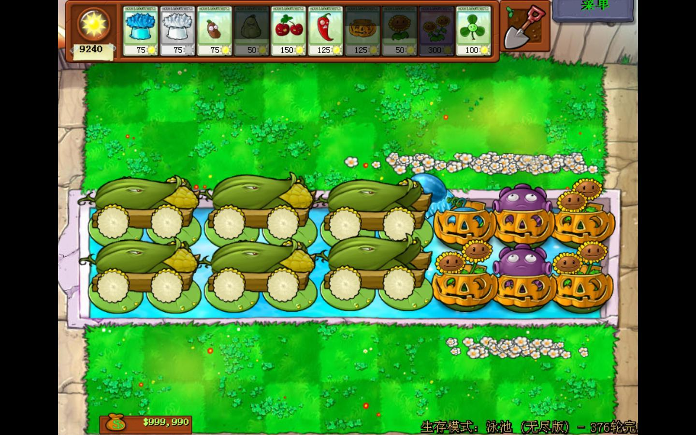

丢车保脑，后场大开，全面摒弃IO解决小鬼矿工的方案；水路顶满，陆地全空，难度高过简4，怪异更胜神X，再次印证了JXC早前隐含在史前14炮中的谶言：心有多大，舞台就有多大。

不可否认前场怕炸，不可否认经济不稳定，但是意义何在？对于这样的阵型，若用一般的眼光去看待，那还不如不去看待。PVZ吧，从来就是一个海纳百川的地方。

前所未有的水路18格6炮，是对EL炮阵布局传统的第一次彻底颠覆，影响深远，亦是操作超越理论，创新照耀时代的非凡实例之一。平渊对其推崇备至，盛赞为“一切BT的根源”。

PS， 在这里提一下，后来诞生的空陆4炮，裸6，裸8及裸10，从节奏上讲虽是高度成熟的地球文明理论逆运算的产物，但从设阵思路玩家目的及发展历史来看，应属地外文明无疑，并与晴姨这个6炮一脉相承，香火连绵。只不过裸6被绿字抢去入选某副地球文明扑克牌，阴差阳错，强征霸敛。外加某些时候确实难有严格的地球地外之分，只有视角之异，于是我将其略去，只作补充说明。

以晴姨的18格6炮为标志，EL地外文明中的阵型难度化&自虐化走完了过渡发展的青涩，脱蛹而出，进入鼎盛时期。

## 07:00 封神 后置8炮靠天开局——超凡入圣

Endless 开局是EL研究中起步较晚且发展缓慢的领域之一，最初的开局只是为了服务成型的EL阵而存在的，研究探索的重心长期集中在阵型的设置及运行上，自然而然地，开局只要保证“这个阵可以搭出来”，并尽力以良好的可操作性在可接受的时间内成阵就OK。后来，开局逐渐出现拖僵尸养阳光等小技巧及刻意加速或减速以控制时间的意识，但根本上还是为了更好更稳更快地达成目标阵型，其目的性没有改变。从绿字化身IP发的某个前几轮满阳光8炮开局的普及贴，到第一次科技革命后介绍开局搭梯的教程，再到针对一些特殊阵型的开局，EL开局一直在默默地围着地球文明鞍前马后地服侍，不可谓不尽心，不可谓不贤惠。

把开局本身作为一种挑战的玩家应该早已有之，然而若问是谁首次将这种挑战上升到技惊四座众人侧目的高度，从而使得EL开局独树一帜，不再单纯作为附庸存在的话，非自虐章鱼晴姨莫属。和前几个神迹的打开方式不同，促成靠天开局的并非完全是晴姨自身的动机，事实上，若追本溯源的话，还要从吧友【剑寒如水】的[少花开局娱乐贴](http://tieba.baidu.com/p/696912446)说起。

剑寒原帖意在证明开局布阵大可轻松惬意，4双子已足够收放自如，无论何种方式，只要达成目标即可，因此或许可以摆脱到处种花前几F满阳光的强迫症，对此我个人深表赞同。像某些少年录开局视频，必然减速南瓜拖僵尸，必然全屏点阳光，必然很卡，必然找借口曰“开局不是表演，完成目的即可，打得无懈可击意义不大”，呵呵？？

言归正传，对于PVZ吧几近不正常的攻略气氛来说，一切没事找事都是光荣正确的。在4花8炮开局帖的回帖讨论中，有吧友提出全程选卡无小向靠天开局的设想，而剑寒本人也承认自己的极限止步于2小向8炮开局。8春哥+曾哥伞叶冰瓜若干的超高花费完全靠天降阳光来支付，放到现在仍难置信，诓论当时，被当作不可能实现的传说也是正常的吧。

做到常人不可能做到之事，可称为神，对于难以置信的常识毁灭，通常称之为“神了！”。实际以晴姨的数字量化8炮，无春曾挑战及水路18格等，早已具备封神的资格，而[6卡无阳光植物8炮开局](http://tieba.baidu.com/p/699758670)，则正式完成了继3CMM后新时代女神的加冕。

在靠天开局帖1楼，晴姨用事实向我们解释了何为扭曲的蛋疼：只是第一个吃螃蟹远远不够，还要吃3遍……

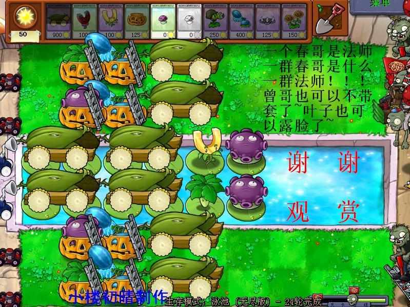

不做想不到，一做吓一跳。很多时候所谓的不可行只是自己用来恐吓自己的借口，晴姨连吃3次螃蟹后，攻略党们发现比起想象中逆天的理论操作难度，靠天工程更注重耐心和细节，以及必要的运气。于是各种靠天纷至沓来，从PE延伸到DE,RE，乃至所有场地，自此，Endless开局以自己的过程作为目的，迈出在 Endless研究中独木成林的第一步。

2010的春节，PVZ吧得到的重量级礼物除了压制无炮引领的第二次科技革命和ME场地之外，还有一个让人赞不绝口的开局。

两个多月后，吧友【越小梦】发布[DE6卡靠天开局](http://tieba.baidu.com/p/746463842)，三个多月后，吧友【风花镜月】发布[RE靠天开局](http://tieba.baidu.com/p/771267642)，六大场地中所有的白天场地到齐。在此基础上，一年后，吧友【身入苦海销尘垢】率先提出黑夜场地“准靠天”的创意，并成功实践于[FE](http://tieba.baidu.com/p/976126814)，之后又以一人之力，补上[NE](http://tieba.baidu.com/p/1036359398)及[ME](https://tieba.baidu.com/p/1038477824)的准靠天开局，在难度，持久和文字量三个方面再创佳绩，其余3个黑夜场地至此圆满。

前望舒使先驱兮，后飞廉使奔属。当我们在时间的展览馆里交相称诵形形色色的EL开局佳构时，切记最初之奠基者带给我们的启迪与震撼。

## 08:00 逆转 水路无植物4炮/6炮/12炮——湖光山色

请先认真观看如下资料

[图一张，解释一些Endless评阵的基本原则](http://tieba.baidu.com/p/838381534)

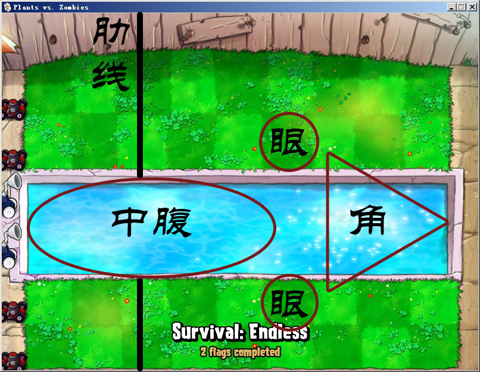

给新手和入门者参考的常规阵型评阵原则在高手玩蛋用的火星文明中用处不会太大，我只是为了突出强调一下水路，尤其被称为“中腹”的水路中后场的重要性而已。

对于一般无炮而言中腹是双子或存冰所在之地，角为群曾破敌之用；对于常规少炮而言中腹是最安全的春哥归宿；对于多数超多炮而言中腹乃至水路尽量塞满炮保准是不会错的，可见“外慎而内安之地也，常为兵粮器械屯集之所，乃阵型章法之中枢”的地位名副其实，对绝大多数阵型来说，中腹正如心脏，负责着全阵的造血。而整个水路又由于所出现僵尸相较陆路弱小太多，安全性成倍提高，成为前攻后守，同气连枝的绝佳之地。也正因为如此，晴姨才能在充分发挥水路设置潜力的情况下成功实践出陆地无植物6炮。

心脏，中枢，绝不可少的存在，面对有目共睹的传统观念，地外高手们在如何打脸的问题上着实花了不少功夫，除去面临巨大困难、漏洞百出的阵型设置，运阵所需的操作也足以叫人望而却步。

2010年3月5日，#用新马甲撸出一发[水路简化设置的后置4炮](http://tieba.baidu.com/p/723977210)，为真·水路无植物4炮提供了最初的模板。

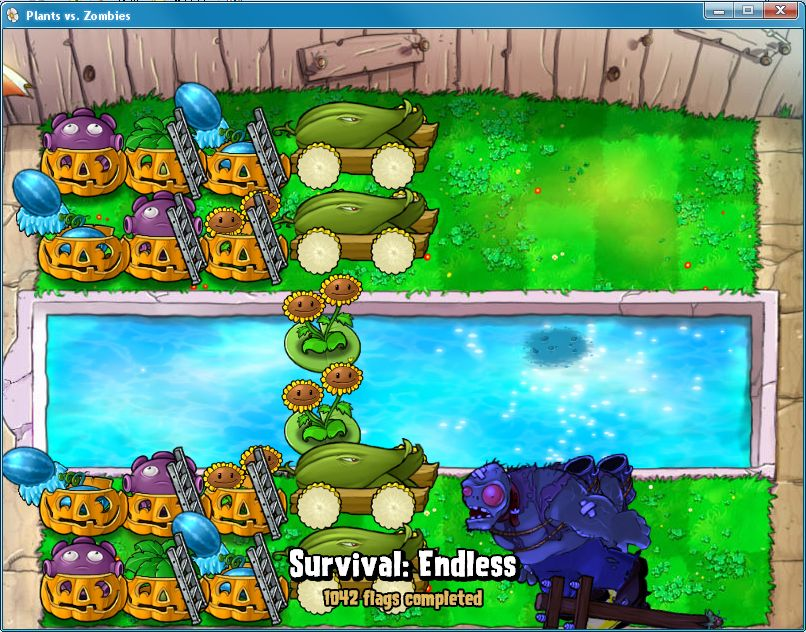

当时就有吧友回帖讨论水路禁用一切植物的可能，不过，尽管离水路无植物只有一步之遥，在阳光稀缺核武易位以后，其间的难度可想而知会陡然增加数个层次。同时期亦有人开贴探索水路无植物的真正可行性，但在缺乏操作水平和理论知识的前提下，研究这类高屋建瓯的东西注定不会有结果。水无实现的重任遂落在当时贴吧核心攻略党之一，看吧“娘”越小梦的肩上。

小梦的成就大多和地球文明相关，其阵型以稳定易玩，操作便捷为主，唯独这个[水无](http://tieba.baidu.com/p/760415193)异军突起，成为突破地外文明一大瓶颈的利剑。

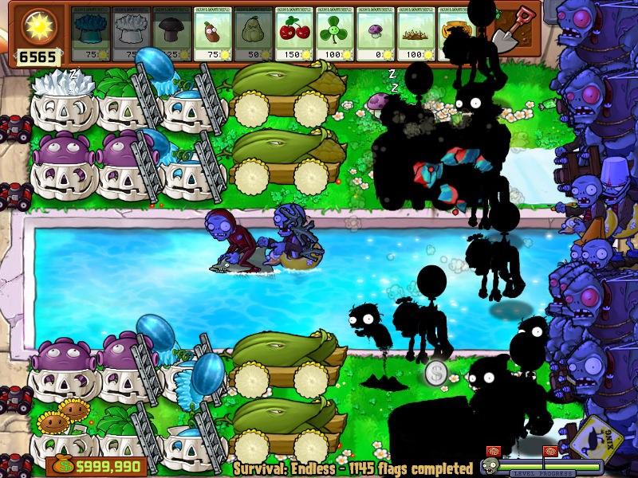

鉴于阳光的巨大消耗，这货是没法无尽的，只能构成理论上的循环，达成对真·水路无植物的初步实现，仅此已经十分不容易，不只一个人构思出这样的4炮却操作不能，小梦做到了。

小梦发帖当夜，潜水两月，DE即将破千的我全程围观，大饱眼福，想当初入手DE是认为PE太简单没什么可玩性，如今看来全然错误，只要愿意，任何难度均可以自己找给自己。这个帖子让我确认了我对小梦的心意，自小玉以后我第二次为一个ID所动的心意，想要第一时间在帖子里留言，却又羞涩得不敢点下发表，像是惴惴不安欲说还休的少女。

无独有偶，PVZ1周岁当日，2花发布了包含一组基于P6节奏的娱乐阵型的贺礼贴，其中阵型一继续利用神节奏P6对12炮进行多样化工作，而阵型二以[20炮去掉水路](http://tieba.baidu.com/p/763574445)的方式再次达成水无成就，这回出问题的不是阳光而是特殊僵尸应对，2花坦言红眼压力很大，需要垫材帮忙，同时面对撑杆跳+MJ这一前置炮+超前置炮深恶痛绝的僵尸组合无能为力，只能靠运气，亦即水无12炮在当时连严格的理论循环都不能完成，只能当做半一次性娱乐阵来看。

而解决方法及水无12炮的精彩后续离目前讲述的时间点还过于遥远，就先在这里打住吧。

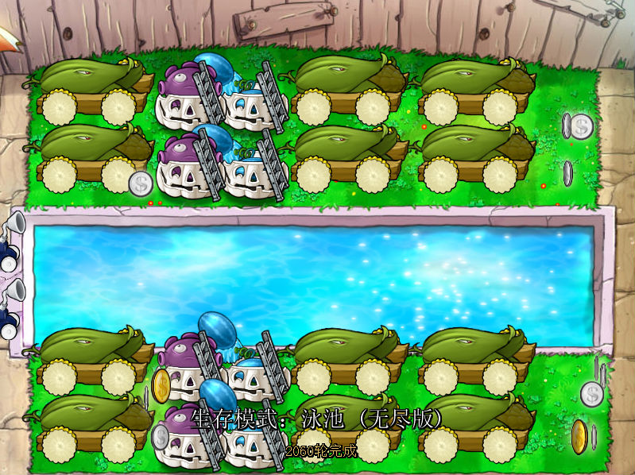

如前所述，PVZ吧的攻略氛围很早就已经高涨到扭曲，扭曲到寂寞，蛋疼创意来者不拒，高难操作争当先锋，唯恐求虐抖M之路先被别人走了。数日后，王子发布第3个水无阵型——[水无6炮](http://tieba.baidu.com/p/767459141)，在可操作性和调整空间上进步不小，唯二的问题是核武与下路后置春哥菊花的冲突以及依旧不够的阳光。在3个阵型里，王子的水无6炮是可玩性最好，腾挪空间最大的，而预判6炮也成为预判少炮的开端。

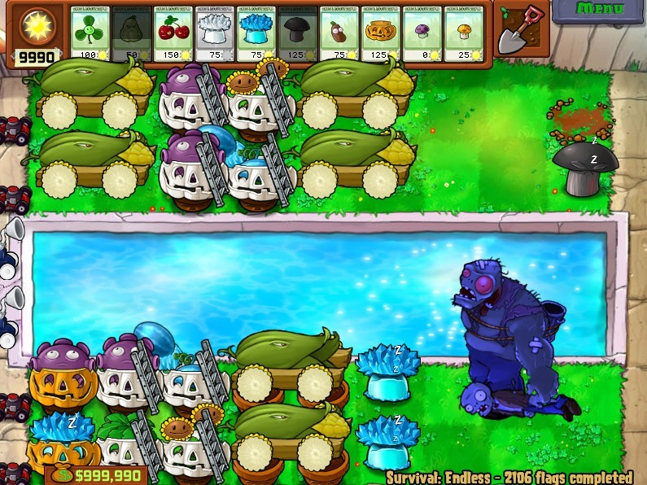

纵观水无三阵，都各有漏洞，未能尽善尽美实现一般意义上的无尽。在毫无先例的艰难中探索，出现种种不能一时解决的缺陷再正常不过，而能于险地将高楼筑起，本身已足以留名青史，所以我们经常说，用现在的挑剔去菲薄过去的成就是毫无意义的行为，自身和时代的双重局限是每个人一出生就带有的设定，只能去尽力挑战而无可能推翻。

反观一年以后的[水无8炮](http://tieba.baidu.com/p/1093405382)，尽管解决了各种问题，基本实现水无的无尽，但那不过是变代奏高度成熟后逆运算的结果，比起先行者们在黑夜中闪烁的灵感，黯然失色。

水无反转了陆无的虚与实，颠倒了陆无的圆与缺，继陆无之后第二次颠覆了EL传统布局的理念，与陆无一起为Endless阵型设置添加了新的两极，是PVZ吧地外文明最卓著的成果之一。

## 09:00 奔涌 手动20炮——百尺竿头

#开创了手动超多炮一派，由此产生的一个命题长期困扰着PVZ吧：无任何辅助，纯手动最多能够驾驭多少纯爷们呢？又或者将命题推进得更深入一点，纯手动操作量和操作精确度的极限到底在哪里？

贴吧无聊党创造的种种不可思议告诫我们，如果自以为那啥啥然后就轻易下结论的话，那是很容易被扇耳刮子的。ABCDE等人实在无法想象可行性的东西，会在一定时间后被X以大跌眼镜的神奇理论或操作完美怒草——此谓之PVZ吧教你删植物大战僵尸系列。

手动超多炮是个卖操作的玩意，它的操作要求与无炮少炮截然不同。撸多炮要突出稳，准，快三要素。稳——节奏稳定，第1波第2波怎么炸，我后面还怎么炸，出了意外心态不乱，快速补救；准——落点timing把握精确，不乱来；快——这个就不需要解释了，如果你玩超前置+超多炮还和玩常规炮阵一样慢腾腾地撸一发然后手缩回去摸好炮再轻飘飘射一下，这并炸间隔足够僵尸干的你妈都不认识。

当然，有一点必须承认：包括某21炮在内的手动超多炮的发展，全程依赖于地球文明中超多炮理论的进步，没有例外，但反推动是存在的。

遗憾的是，早期的PVZ吧从高手玩家到神级玩家，几乎都是慢手流，玩超多炮直接上按键精灵，手动之类的要么没兴趣，要么手速不够，要么觉得可能性不大，#到不行的龙#无疑是个奇葩。无炮少炮的难和手动超多炮的难是两种境界，无炮少炮玩的溜不代表手动20+炮能撑过1F，同样，超多炮玩到出神入化，也不代表高难度的无炮少炮能玩好，虽然有相通之处，但总体上二者所需求专注的方面是完全不同的。

所以，第一次看到冲关帝【名字是什么】和王子分别于2010年[2月](http://tieba.baidu.com/p/714230988)和[4月](http://tieba.baidu.com/p/753145934)发布的手动16炮，我就觉得很不对。

哪里不对？在#建立的手动14炮，平渊的键控16及P6的雄厚基础上，手动16原本应该非常简单才对，就算不简单，也绝不至难于上青天的地步，那么为什么手动16在冲关帝的玩法里前置曾被各种砸还要频繁使用垫材，在王子的描述下又变成了一个容错较低，难度“疯狂”的阵形呢？

打开方式不对嘛，冲关帝的根本问题是他的设阵和手速都没到家，并炸间隔太明显，虽然他是拿16炮当12炮打，但那一样可以轻松保住7列梯曾不用垫材；而王子用驾驭少炮及常规炮阵的思路去玩16炮，缺陷是十分明显的，明快流畅变成了环环纠结，金庸武侠变成了琼瑶小说，这样的手速和方式玩16炮还勉强凑合，炮数要再往上加，请打GG。 其实我不太明白为什么在那个帖子里还有人讲神操作，这并非是拿现在的眼光去挑刺，当时我看完帖子就去试手动16炮，试过之后就确认了某些事实，大概因为那时贴吧慢手流横行，对手动超多炮的要点并不明确，又或者盲目的个人崇拜是人类潜在的属性之一罢。

不过，手动超多炮毕竟磕磕绊绊地从14炮走到了16炮。

至此手动超多炮实际上进入了一段瓶颈期，只不过它被打破的太快结果给人感觉像没有一样……常规16再往上加炮，意味着要出现留空一格的超前置炮，MJ撑杆顿成大敌，对手速节奏感的要求上升的不是一点半点，至于手动20炮——醒工砖，那是彼时贴吧的又一公认不可能。

自发现手动16炮无难度后，我转而挑战DE手动14炮，谁知一下就碰了硬钉子，其手动难度超出预计，练习良久连2F都过不去……难免大失所望，我料想DE14都没戏，更别说PE20了，顿感一阵茫然，好生郁闷。

10年5月下旬，我用新档变阵的时候不小心毁掉梯子，然后怒录视频，连试十几次，终于很勉强地录出DE14炮，但没梯子各种尴尬，前置炮也造啃，又不想重录，心情之沮丧难以言表。

这时，2花却充分肯定了丢在我个人贴吧的14炮视频，并鼓励我尝试PE手动20炮，就此成为了一切的转折点。

不知道怎么形容当时的感动，看到之后我就打开游戏摆出20炮，相比DE14那么长时间的努力，我从上手到基本熟悉玩法只用了半个下午，录视频只用五次，最后一次成功。诚然这个成功是有水份的，某路的梯子被辣椒消去（重看视频的时候发现那辣椒完全可以不用，自己心态太差），青涩的败笔，不过我打出贴吧第一份全难度[手动20炮](http://tieba.baidu.com/p/782758258)，突破极限的事实没有改变。

手速帝紧接着也发布了手动20炮，他的视频里倒是没出现烧梯子的尴尬，但是缺少了绝不可缺的撑杆跳——没了撑杆跳20炮和12炮区别实在是不大，看情况随便炸炸红眼就可以了。

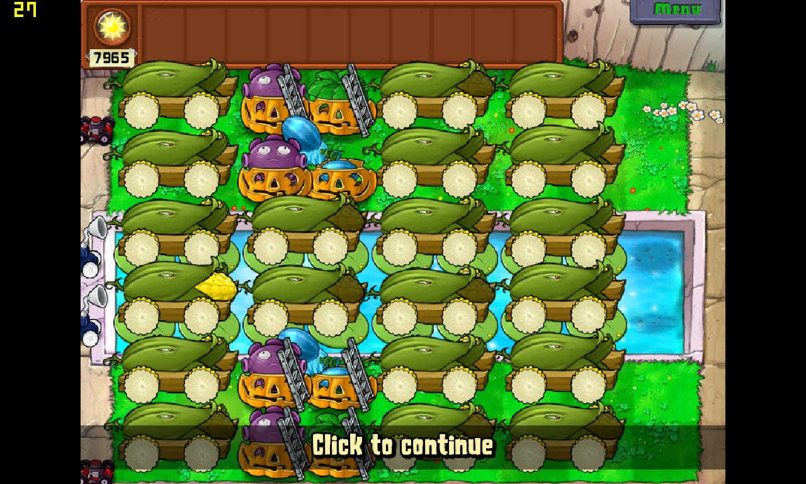

似乎我叙述的非常平淡，因为当时的一切本不绚丽，我选择挑战不可能的理由，并非要一举登顶，并非想大展才艺，而是因为2花对我说：去试试吧。

一条很普通的回帖而已。

爱情的力量从不掩饰它理所应当的伟大。

无论是第一个手动20还是第一个DE手动14，我的成功几乎完全依赖于基础的P6预判及临场反应，那时候远未产生经典20炮的节奏，也自然没有什么成熟的冰蘑菇用法，一切消耗卡片基本都是救急，有时炸的太早导致不刷新，那就赶快补炸然后灰烬预判；有时感觉预判的晚了，那就先冰一下然后看情况补炮，发炮时机也不唯一，在P6的时间点上来回浮动，为了炸撑杆越来越快，然后补一轮卡片接循环，逐渐变慢后再补一轮。这样导致本就高难的阵型又添加变化，出怪延迟多发， 极度不稳定，但确实一定程度上弥补了怕撑杆跳的问题，至于具体弥补到什么程度，那和玩家本人的操作意识直接相关。

后来，这种在P6操作时间点前后摆动循环，临机决断的多炮超前置炮玩法，被2花命名为“超12炮节奏”，最初由我和手速帝开发，是早期手动超多炮重要的探索节奏。在冰核代炮高度成熟及 ICE1之前，从PE20炮到前院12+炮，该节奏是几乎所有高难度手动超多炮的亲爹，之后亦有使用。

至于绿字某个黑历史贴里说的先有经典20炮节奏后带动手动20炮，膝盖很疼的当事人表示那是扯蛋蛋，坑爹不打草稿。手速帝紧追不舍玩出手动20炮来的时候ICE1还只是个卵子，2花玩出来并发现自己怀了的时候算是差不多了，正式生下来还要更晚。由此可见，是地外文明的手动20炮孕育了地球文明的ICE1。而ICE1以无冰瓜20炮为载体诞生以后， 手动20炮难度骤降，现在已经变成可以用来冲关的阵型。这才是“经典20炮”历史的正确打开方式。

或许再进一步，再研究一下就可以更早发现ICE1的巧妙了吧，用了那么多次冰，离正解还是咫尺天涯。但差一点始终就是差一点，失之毫厘谬以千里，这应该是除辣椒消梯之外，我首个手动20炮的唯一遗憾了。

缺陷遗憾又如何？和造就珍贵回忆的那份心意相比，早已无足轻重。在某个少女的心中，永远存在一个夏日的完美午后，风和日丽，光影横斜。后院草碧如茵，水平似镜。因沁人心脾的二次元花香而绽放的笑靥，融化在浓浓绵羊音中，随蝶振翅，轻舞飞扬。

## 10:00 奇迹 尾炸18炮——渐趋佳境

尾炸能吃吗？

以春哥或其他灰烬后场空拦小鬼并尽量避免出现小鬼化灰情况的方法，叫做尾炸。

且让我暂时将时光轮盘回拨一点，从10年2月12日某魂发布的[诱受12炮](http://tieba.baidu.com/p/711811607)说起。

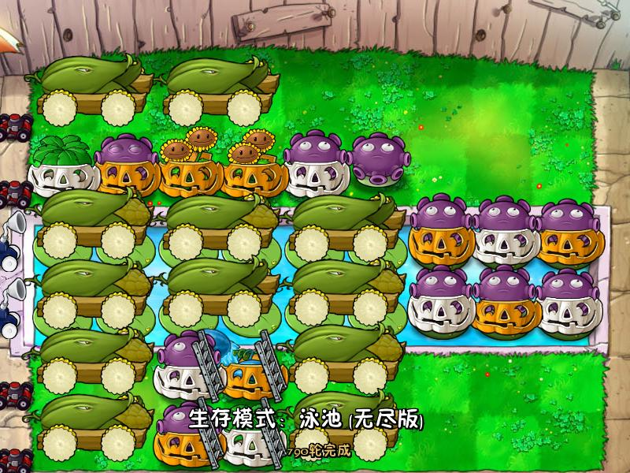

诱受12炮这么性感的名字当然是我给现取的，原帖题为“当春哥锁定了小鬼——一个悲剧的终结”，帖子中也并未提到阵型的命名。你看1路两根神器携手立于死地，意态倨傲，此时脑补其对小鬼矿工之台词“有本事来艹我啊，傻X”，嗯，果然诱受。

诱受12炮的唯一意义，是把之前只存在于理论中的秒炸小鬼变成了一部3分钟的视频，仅此而已，或许本来它可以承载的更多，然而笨拙错乱的布局，毫无严谨可言的节奏以及质量过差的视频，极大限制了首次拦截小鬼实体化的发挥。

上半场的阵型设置是一个彻头彻尾的失败，无论怕炸的前场或不合理的后场；下10上8的节奏在全难度组合齐出的时候连理论论证都很难通过；最致命的问题还是视频本身：操作没有严格执行节奏，出怪太坑，只有1F。这些不能直视的缺陷让一个本来应该开天辟地的视频看起来无比难受，几乎尽失了它本身所含的意义。

之前我是将诱受12炮的视频看作首个后场空拦小鬼，即尾炸的视频，不过仔细重看的时候发现，某魂的操作基本上和尾炸没什么关系，他那个叫落地秒炸，小鬼结结实实踩在炮上已经看得到啃食动作的同时炮弹落下——红白眼密度一大春哥必然被瞬间磨掉，与后场空拦尽量避免春哥受伤的设想差距巨大。他首次实践了秒炸小鬼，却没有真正意义上完成尾炸及其循环与无尽，连下一次选卡也没能见到。

小鬼与春哥的纠结远未结束。

而在攻略中向来认真得可爱的2花则决心完成某魂未就之业，3个月后的PVZ生日当天，2花在娱乐P6贴中，用全难度找抽18炮视频令人心服口服地实现了[首个尾炸阵](http://tieba.baidu.com/p/763574445)的2F循环。

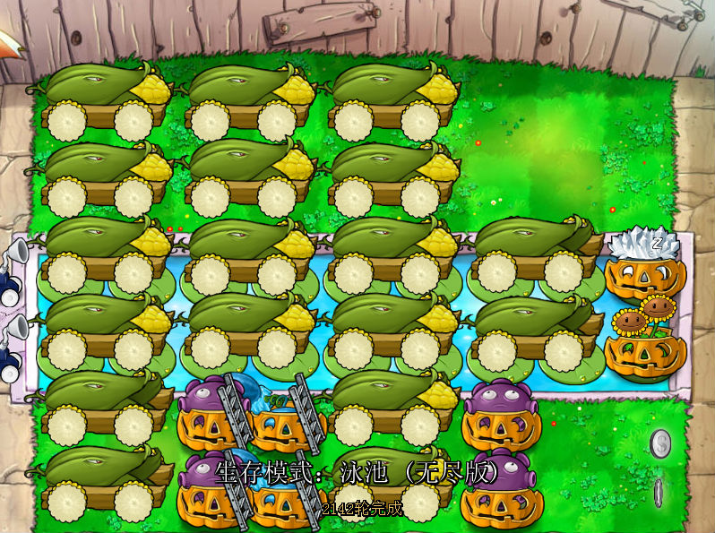

经济充沛，操作细腻，手动炸小鬼配合键控前场相得益彰，建立在P6节奏潜力基础上的阵型搭配也比较合理。至此，后场拦截小鬼的设想才算是被真正实现，第一个通过理论论证，可以玩的尾炸阵型诞生。找抽18炮的上半场6炮完全用于自我保护，去掉春哥后场加曾就是一个很常规的12炮。阵本身不难构思，之前早有玩家设想过，然而第一个做到的是2花。后来畅谈回忆时2花告诉我，当年为了录制出一份严谨的找抽18炮，SL多少次他自己也记不清了。

对于设阵空间紧凑，精密度要求极高的超多炮而言，想和做的差距太大，想得到而没做到，除了拿来自我阿Q之外没有意义。在没有切实理论或实践证明的情况下，别人没有任何义务承认你为自己的空想所添加的版权。

在那个挂机尚处雏形，后台科技起步，超多炮“精确度”的概念还未升级的年代，找抽18炮已是论外。4个多月后，testla实现前场空炸，立下新的里程碑，地球文明顿时沸腾。而当超多炮科技随之发展到全新的高度后，我们才蓦然醒悟，原来2花愣是用键手合一的操作，奇迹般地使尾炸领先前场空炸数月，在地外文明的史册上添下浓墨重彩的一笔。

## 11:00 创举 养海豚8炮——鬼斧神工

养僵尸——最得“娱乐”二字之精髓，Endless娱乐化的巅峰升华之作。

要我给评价的话就是这样，至于前无古人后有来者想到且做到养僵尸的2花，我唯一能说的就是他很寂寞，寂寞的女人穿丝袜，寂寞的男人打dota，寂寞的2花养僵尸。

无论是EL还是IZE，植物与僵尸作为核心对立要素支撑着整个游戏框架的构建，巧妙地将这种对立由刚转柔，由生死变为共存，非养僵尸的神创意莫属。

发布于2010年5月末的[养海豚8炮](http://tieba.baidu.com/p/781951467
)，节奏不过简单的轮炸，从设套捕捉到循环喂养，全程没有望而生畏的高难，没有复杂曲折的理论，所带来的是单纯的乐在其中，别样的闲情逸致。越是反复玩味，越觉妙不可言。血海尸山的Endless还可以这么有趣。

创新改变世界的养僵尸玩法显然不会昙花一现。各类养MJ养雪人乃至同时养多只僵尸的阵形纷纷涌现，你方唱罢我登场，争芳赛艳。始于养海豚的养僵尸是EL阵型娱乐化最骄傲的成就，没有之一。

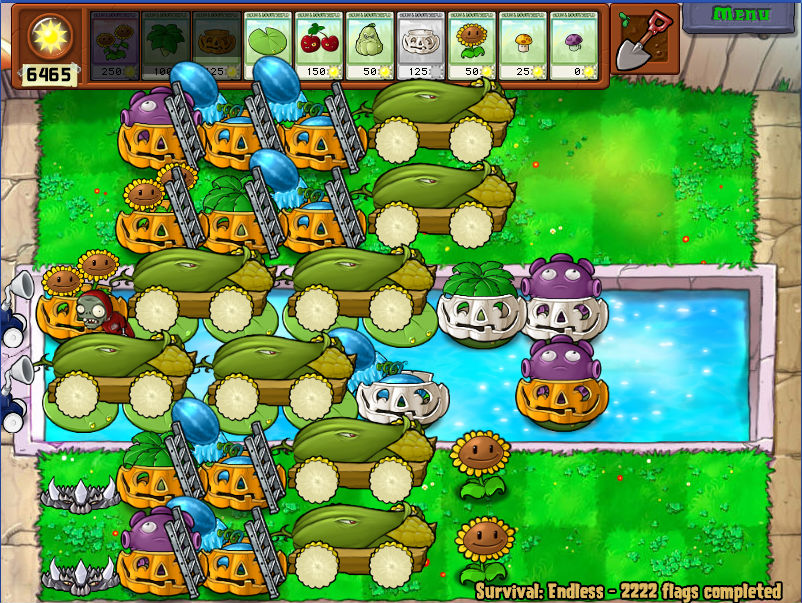

大家好我是海豚，今天带来的是后院求生第一季第一集。嘘~你们看，我发现了什么？这里有一只落单的高坚果，我们可以尝试捕捉它，一只高坚果可以为我们提供好几天的能量，它富含大量的蛋白质，不过高坚果可不好对付。我们慢慢从水路接近它，小心别被爷们波炸到。 嘿，我抓到了，它挣扎得很厉害！我们把它的头割下来，其余的部位可以生吃，它的蛋白质含量是南瓜的6倍，当然，如果时间不紧迫，我们可以先烤一烤，那样会更美味。它的口感嘎嘣脆，味道就像那个25阳光的可照明垫材一样。

## 12:00 风采 手动尾炸21炮/DE15炮——敢为人先

借两阵，品一人。

rwtiqz擅长手动超多炮的核心基础，是他玩CS练就的手速，而他被册封为手速帝的决定因素，则是他知难而上，敢为天下先的气场。

初到贴吧就以嚣张12炮一鸣惊人的rwtiqz认定一般向的超多炮完全不能满足自己，于是又转战NE并成功打出了NE也是整个前院的第一份[手动14炮](http://tieba.baidu.com/p/777445496)，与PE手动20炮平分秋色，那两个手动14炮的视频到现在我还偶尔翻看，秒放樱桃补炸中3路MJ的操作精彩绝伦。

出林乳虎锐不可当，撸出14炮两周后，rwtiqz以气势如虹的[手动21炮](http://tieba.baidu.com/p/789294149)再掀波澜，受绿字封号手速帝，终于在手动超多炮领域书写下自己的传奇。而于两个多月后发布的[DE手动15炮](http://tieba.baidu.com/p/832938392)，则标志着他手速，技巧与意识的大成。

除NE7炮的佳构之外，手速帝留给PVZ吧的核心财富有二。

其一为物质层面上的——手动DE15炮里的垫撑杆操作后来成为超多炮重要的常用技巧；作为手速帝前院超多炮最后也是最优秀的作品，使用超12炮节奏运行的 DE15炮行云流水，炮冰炸垫四大元素浑然一体，在我心里，它是单边PSD之前最优秀的手动超多炮，带来的视觉享受已不在空炸小鬼之下，惊艳的垫材克制撑杆，是手速帝在他自己的PVZ中最具创造力与活力的杰作。

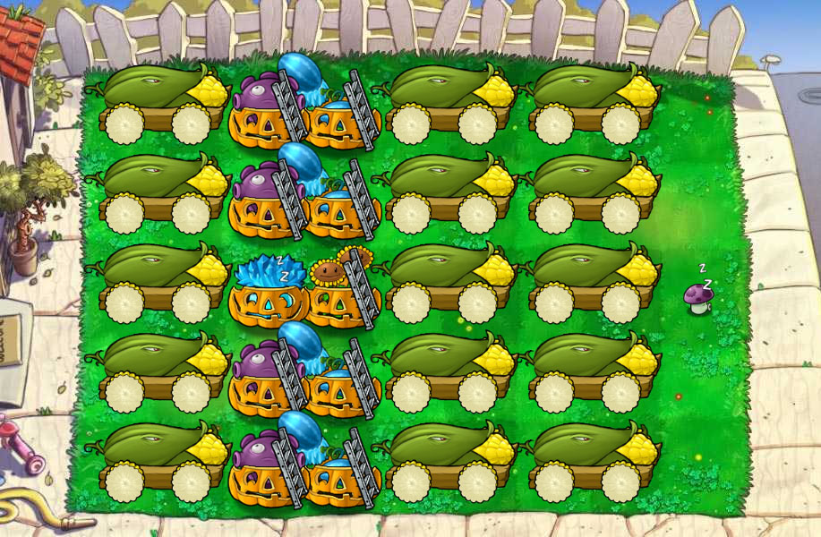

其二为精神层面上的——明知山有虎偏向虎山行的霸气和一往无前的韧劲。20炮尚且不稳定，自然没人知道需要拦截小鬼的21炮该怎么摆怎么玩，手速帝同样不知道，在对21炮的描述中他明确坦白理论上的全难度循环完全做不到，无尽那就别想了。而唯一录过2F的视频只是在非极限出怪+反复努力的基础上达成，没有垫材帮忙，没有冰菇辅助，只靠自己的毅力，勇气及手感。

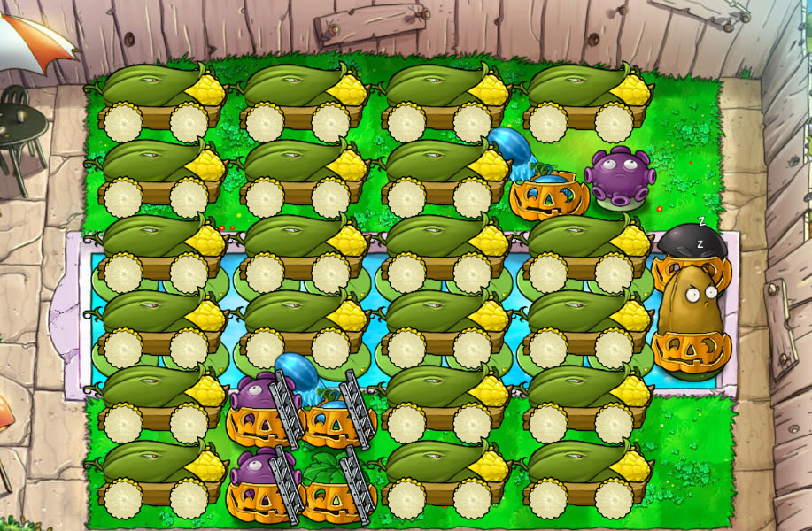

外行看热闹，内行看门道。实事求是地讲，21炮视频中的手速比起日后DE15炮的差一截，出怪无白无MJ无撑杆，论总操作量未必能胜过NE手动14炮，毫无可能代表当时的手速极限。说手速绝代或者看着手疼的，显是对手动超多炮一知半解，不曾细品其味。

所以，不成功的尾炸21炮能在EL史中占有一席之地，不是凭借无敌的操作或者先进的节奏，而是因为知其不可为而为之的义无反顾，因为人定胜天的坚决信心，因为蔑视传统的超凡风采。20+炮的大雾弥漫，目之所及一片朦胧，手速帝看不到丝毫雾散的希望，于是他用自己的满腔激情，点燃了破空长啸的首道火光，也许它照耀的范围太过有限，也许它并不能为后来者导航，然而，即使倾当世之灰暗亦不能淹没哪怕一根蜡烛的明亮，试问区区魑魅魍魉，有何能耐阻止这直达天际的厉芒？

## 13:00 变通 PE无绿卡10炮开局——偷梁换柱

EL开局有三要素：阳光，选卡，速度。平民化的解释就是护一个木耳要用多少钱，具体怎么护到的，以及从畅谈人生到旅馆开房耗时几许。

植物卡片分为绿卡和紫卡，紫卡须在绿卡的基础上使用，这是游戏设定。全程不用绿卡就等于无卡可用，那还开个P局……所以说无绿卡10炮开局肯定是作弊用了修改器的，挂B要严厉惩罚，于是2花两年前就被封ID踢会员，离开PVZ吧，我伤心欲绝亦随之离去，绿字悲痛不已，自杀身亡，龙#听说我走了，于50层酒店大楼上全裸跳下，890服毒自尽，小玉用卫生巾把自己闷死。故事结束。

我觉得上面这个剧本很赞。

设定是死的，做不了文章，概念和定义是活的，风花镜月敏锐地观察到了卡片体系中可以钻空子的地方，即可模仿所有绿卡但自身并不存在特定价值的模仿者，2花根据模仿后植物白色的特征，单独为模仿者命名“白卡”，如前所述的二元矛盾遂被外来元素[解决](http://tieba.baidu.com/p/796014386)。

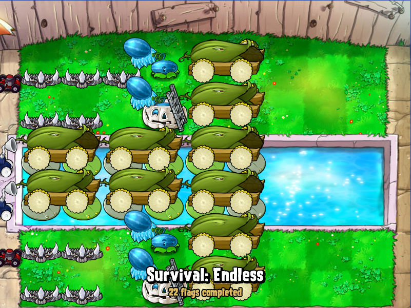

从目的性及功用来看，模仿者完全为绿卡而存在，同属绿卡范畴；但若从卡片本身的命名起源，价值分类及外延说起，模仿者的确又不与绿卡对等，具体怎样看待是千万怀有不同视角的玩家的自由，唯一不得不承认的是2花“无绿卡=白卡+紫卡”的变换很成功，根据卡片特性引入新的概念要素以解决旧矛盾。

观其实质，【无绿卡10炮】开局等同于【单绿卡10炮开局】，由模仿者作为概念上的掩护。当然，【单绿卡】与【单卡】又是两码事，每次选卡只能任选一张（模仿者）绿卡是很难受，但紫卡可是随便用的。单绿卡比单卡简单许多，比起各种小向冰豆荷叶蛋，土豆大蒜侧翼曾的常规开局又难不少。22F的全程开局视频，让当时的吧众享受了一次丰厚的视觉盛宴。

晴姨在阳光上达成突破，使EL开局有了核心竞争力，2花在卡片上做的文章，将这种竞争力再度扩大。此时已有3场地靠天开局，2卡开局等基础，外加无绿卡之神棍，积累日厚，Endless开局体系持续形成中。

## 14:00 融合 半边无植物5炮——随流赋形

恍惚间盛夏已过，第二次科革命在2花与某少女的推动下如火如荼，前院少炮操作规范趋于完善，冰核代炮日益细腻深入，超多炮以ICE1为突破口越发齐整多样，挂机科技发展迅速。相比愚蠢人类之昌盛，地外文明淡定低调，除DE手动15炮之外，三月以来几乎无所事事。度其就里，乃因两人均专注于主流理论，无暇他顾，而手速帝竟耗时练就三鹿7炮这般奇技淫巧，虽亦善，然不免流于肤浅，又因此肤浅不拘旧法，令人耳目一新，终成名阵

夏末秋初，地球文明势头稍缓，2花夜观天象，知逆袭之时将至，遂算准timing果断反击，祭出堪称集不对称美、散炸美、极限美等诸多艺术于一身的“残缺系”最高作：[半边无植物5炮](http://tieba.baidu.com/p/877176986)。

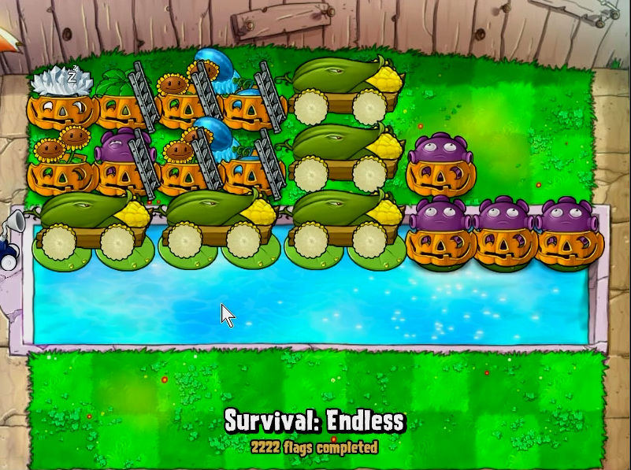

对endless了解不深的朋友，定然无法想像此阵不仅可运转自如，亦且经济充沛，已无昔日水无陆无阳光稀缺之虞。有利则有弊，除阳光外，原先两级所怀诸多困难被同时继承。

是时常规冰核代炮只不过初具规模，用来应付奇阵力有未逮。经过一段时间的反复练习与适应，2花找到了与阵相称的特殊玩法及手感。即尽早消灭上半场僵尸保证安全，同时充分利用下半场毫无IO拖延僵尸刷新的特性，为卡片春哥争取时间，下半重心放在后场，平衡激活与延迟。

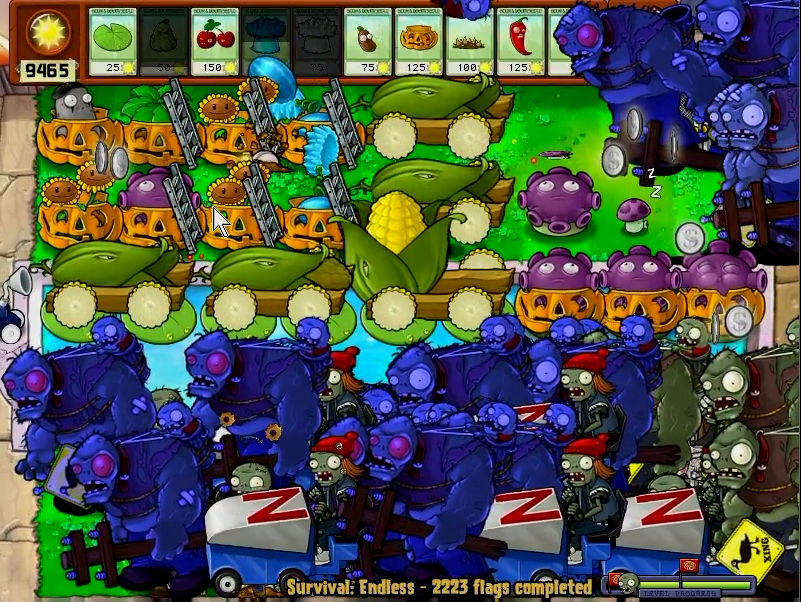

半边无植物5炮即是水无和陆无的融合又是水无和陆无的分离，即是旧中点又是新极限。慢速视频惊险无比，诸如红眼倒在家门外，半场冰车小丑滚滚碾过之类实在稀松平常，当真大音希声，履险如夷。

以此为始，以后又相继出现半边无植物8炮/9炮/10炮等，不过设计理念上虽然传承，炮阵节奏已是严格的轨道体系逆运算之成果，诚然可操作性更高，却总感觉缺了点混沌之下当机立断的灵气，少了份乱军之中纵横驰骋的潇洒。

一年后，我将半边无植物本身再度逆转，借助change 5节奏开发出插花无植物，记载于拙作【海底捞月】之中。水路无植物，陆地无植物，半边无植物，插花无植物——Endless“XX无X”全系列功德圆满，名垂青史。

想必以上二图本身远胜语言，其时2花此阵初现，众人无不惊服，交口大赞。其框架设想古固已有之，而余以为不过尔尔，24炮之意淫古亦有之，久久未成，非不为也，实不能也。操作即强，意识且佳，理论自成实践；本领不足，天时不至，空谈终究空谈。

为半空5炮作简评曰：

两极即出，必存中庸；四象若成，定现中轴；盈缺变幻，时有异状；虚实流转，形无恒常。亦静亦动，属阴属阳。

又曰：

东方双树，常与无常；南方双树，乐与无乐；西方双树，我与无我；北方双树，净与无净。非枯非荣，非假非空。

## 15:00 至柔 NE无神——自在有灵

专注坑爹三十年的某魂留给贴吧的不是半成品就是缺陷品。NE无炮是首发但F数低到完全不能证稳，花花无炮后来居上；尾炸12炮我已经吐槽过了；前院白天及天台分裂少炮他确实给过思路，但也只是丁点设想而已，基本模型还是龙#提供的。而至于4炮以下，从最初的阵型（DE1炮）到具体操作理论都是我一手确立；底线炮体系，他在王子之后和我之前做出了不可忽视的过渡和延伸，这个的确是值得肯定的贡献，可又缺乏出类拔萃的特定物；至于某些只有文字和图的草稿，我实在不以为然。

那他就没有一个构思精巧一步入阁的上乘阵型么？

嘛，当然是有的，至少我确信如下所示的阵型是他所有阵中最有意义且极到位的一个。

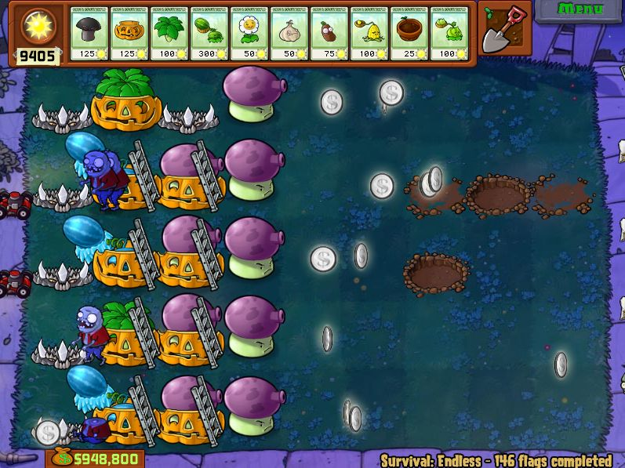

春哥是神，曾哥也是神，没有神的EL无尽不能，没有神的世界一片茫然。

某魂于2011年春节前发布这枚NE无炮，史称[“C2无神”](http://tieba.baidu.com/p/987485034)。地球文明的背景我就不多作介绍了，想必不少老吧友都记得：第二次的结束与第三次的开始，轨道与阵海的新旧世界交接，连接前后两个世界的24炮之诞生成熟，还有坑爹的DS版。那时的PVZ吧无论人气，技术，节操，均处于全盛时期。

你没看错，这货无曾无春无阳光——当然也不能无尽，怎一个坑爹了得，这怎么感觉还不如他之前的好多阵呢。

在你大喊“5P你个骗子！”之前，先让我来陈述几个基本事实，看看它有否资格位列于此。

1. 无春无曾过EL的极限挑战，这事本吧EL史上【做过且做的很出彩】的玩家只有俩，晴姨和某魂。
2. 晴姨开了先河，不过晴姨的PE无神从阵型到节奏再到经济都是一次性的，见到下一次选卡之后就可以安心地去了；某魂的NE无神，除了经济之外其他所有方面均可稳定无尽——尽管当时平渊，2花还有我纷纷在回帖中提出各种各样可能破阵的组合，但后来事实证明我们都是SB。就无神的角度来说这无疑是很了不起的进步。
3. 就一个冰瓜几个大喷，怎么可能做到节奏循环？怎么可能不怕红眼橄榄小丑？后场不怕小鬼？如此就要提到NE无神所蕴含的最宝贵财富——C2节奏，这个可是正宗C2，25秒高潮一次，后来2花的更为实用的C2f是它儿子，那个地球文明名阵之一的C2尾炸8炮知道吧，那就是C2f节奏的极致运用了。所以，变奏代奏中的C2/C2f节奏及围绕着它们的整个体系，最初始于某魂这里，是他第一个提出C2，并应用于NE无神，取得实战效果。这个与P6并称节奏双璧的东西，私以为是某魂对PVZ最重要的贡献。
4. 阵型本身细腻到基本不用再改（有篮球时1-2加伞叶，伞叶同时可做垫材）。C2节奏配合冰瓜，小鬼常年减速，单地刺王必杀。雾海无视小丑跳跳，夜晚灰烬只要放的好是不会被小丑炸的，至于橄榄用垫+炸轻松搞定，唯一麻烦点的红眼频繁垫之（反正已经无视阳光了），平时没事就往前堆大喷。玩过就知道这货有趣而不失刺激，外加阵型本身造成的视觉冲击，是个自成循环才气四溢的存在。
5. 即使如此原帖还是没加精。某魂唯一的视频里只有红眼小丑，橄榄篮球跳跳之类的全都看不到，对于一个亟需严格证明的奇特新阵来说，视频质量不高的毛病太致命。
6. 没加精不只是因为视频不全面，还有人的原因在，在原帖回帖中可窥得一二。这段黑历史还是略过不提的好，我无意使某些不必要的色彩盖过阵型本身。

现在抛去其他因素认真揣度以后，该阵客观来讲确实是神阵无误。我可以负责任地下结论说：除了阳光之外，NE无神是完美的。

如果一定要给自己留条后路，那么，NE无神是接近完美的。

下面这个[视频](https://www.bilibili.com/video/BV1Yx411y7Nm/)是我用2花的存档所录。F数很高，出怪也比较全。原帖发布几天后我们开始玩C2无神，越玩越觉得好玩，差点不能自拔，此视频即于当时录制。可以直观感受一下何谓真C2，何谓最慢节奏之魅力。

饮水思源，落叶归根。既然C2f的尾炸8炮被封为地球名阵，那么我想，把应用不广但的确是无中生有之“无”同时又符合地外阵型特点的C2无神，作为地外名阵无可非议。

## 16:00 龙啸 手动22炮——风驰电掣

手动20炮及前院14/15炮诞生以后，手动超多炮进入第二段瓶颈期，未来不知通向何方，不得已在原地不断打转，尽力以宽度弥补深度，只是常规的14炮15 炮18炮19炮变来变去，再怎么玩花样亦脱不出ICE1及超12炮节奏之樊笼。放铲垫材是个好主意，但能循环下去的顶多也就2行，3行基本是极限了，超多炮中的垫材种植对同步率要求太高，手动很快失去潜力。

10年秋，testla发出前场空炸及22炮，曙光初现。但正值无助的手动党并未看到前路，反而更为迷茫……

原因是摆在眼前的——逆天的精确度看着就发怵，没几个人敢想，敢想也不敢试，敢试也试不成。小于0.X秒的容错和各种灰烬释放使22炮后浪推前浪，一举取代 20炮成为新的不可能。2花的尾炸18炮则略简单——只是比前场空炸略简单而已啊混蛋，操作要求一样高的可怕。手速帝的半成品21炮确实是相对最容易玩的，尾炸减速小鬼并不难，可不能打全难度有蛋意义，尾炸21炮又名吃螃蟹21炮，以下略。

实质上的手动进程遂一直卡在10年盛夏，不曾想到，这一卡就是半年多。

11年1月，风花镜月发布了新22炮，神冰菇ICE2的便捷简单仿佛昭示一缕微光，冥冥之中自有主宰，贴吧新触派代表人物【灬龙啸⑨兲灬】恰好横空出世，正如其杀马特ID一般，飞龙在天，拨云见日，复现朗朗晴空。

1月31日，2天发布[手动22炮](http://tieba.baidu.com/p/1000525600)beta1.0版，出怪无MJ撑杆，首次实现半场手动空中拦截2F循环，又在两周后克服种种困难完成全难度出怪的手动22炮，以手动空拦的神级技术为本处于最辉煌时期的PVZ吧再添异彩。

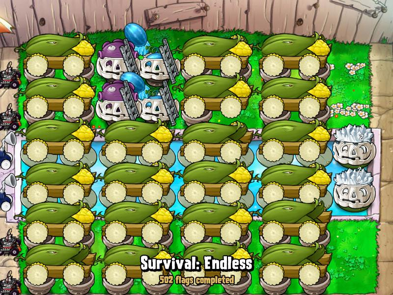

所谓极限果然是用来被不断突破的，但突破绝非易事。在22炮手动正式帖中可以看到详细的手动空拦心得及练习过程，纵观全贴，不难发现他为此所付出的非凡努力。抱着“空炸小鬼可以手动”的信念，龙啸2天结合自己的天赋与汗水，强行打开手动超多炮的前路，成为新一代贴吧核心攻略党之一，并先后发布了多枚高难度手动超多炮。其中以兼具空拦小鬼+单行垫材种植的DE16炮为最，接近极限的操作稳执当时PVZ多炮武林之牛耳。 在他的先行与引领下，越来越多的吧友进行了手动22炮的实践，并扩展至其他空拦小鬼的阵型，手动尾炸18炮亦被2花和我变为现实。

此外，2天还是位多面手，在无炮及少炮领域同样有独到理解。岸路加速无炮别出心裁，利用垫材诱骗减速红眼下锤再秒接核武咖啡豆的操作也出自他的独创，只需稍加练习，DE 场合便再无核武难放一说。当然，之前小梦证明过键控可以直接放，之后BVZ也证明无需诱骗可以直接手动丢，但先用垫材肯定容错更高，实战中更稳定。

“信则有”，就这个角度而言，手动22炮的成功之于手动超多炮，恰如空炸小鬼的实现之于超多炮理论，有着里程碑式的意义。

## 17:00 无双 花样12炮/全植物8炮——万物归藏

十四个小时前的凌晨，我着重讲述了一对玉米阵型的出世。

九个小时前的上午，我提到过一个水路无植物12炮的诞生。

二者的后续共同促成了一个[神贴](http://tieba.baidu.com/p/1011986697)。这个帖子功力了得，一出现就瞬间拉低了娱乐阵的智商，完爆了精品区常年悉心呵护的下限。

最初怒堆玉米的6/8炮所产生的推论，迟早要落地生根长出果实来，足见首个进行EL娱乐化工作以及随后进一步研究推广的玩家都是贰比——这是要多闲多无聊才能这么折腾？

具体该从哪里说起我也忘了，只记得11年寒假一个特别百无聊赖的下午，我和2花百无聊赖地在QQ上东拉西扯，扯着扯着就开始对刷脑残表情，百无聊赖地刷了会也不想刷了，可不刷又不知道做什么。那时真是好无聊，无聊到想死却又觉得去死太无聊。

然后就有了某个无聊贴。

堆七八个玉米太少，请堆二十个；丢三四排玉米太稀，请丢五六排。

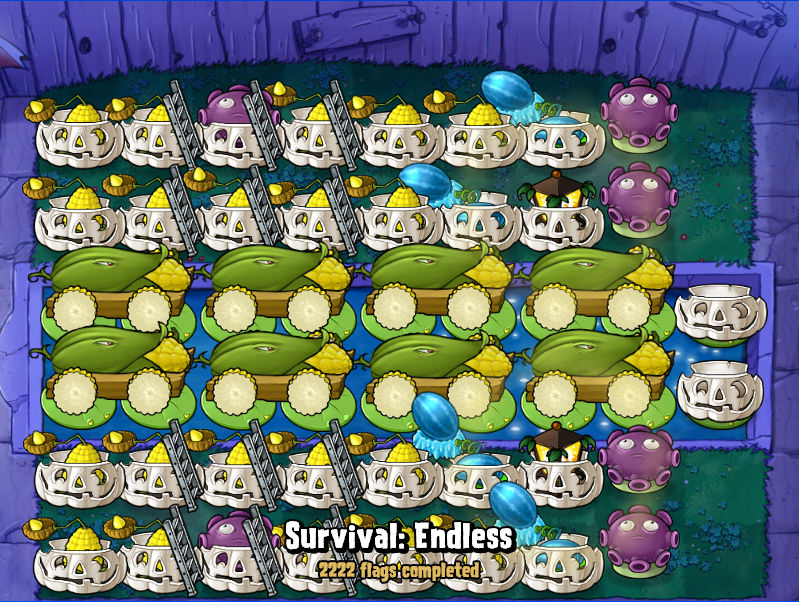

猫帝算哪根葱？

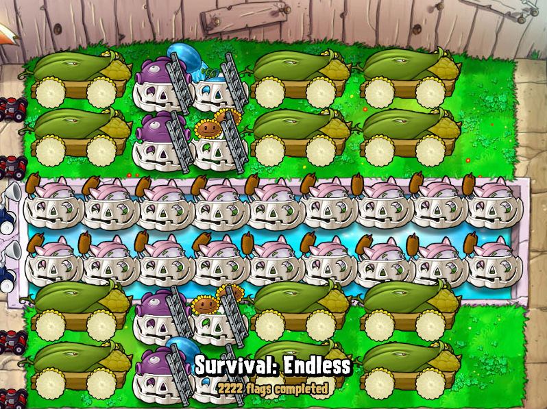

如上，水无植物的模版一清二楚，原帖中将各种各样的植物塞入原本空出的水路，结合代奏变阵，五花八门，颇具观赏性。这里仅取两例。

单体植物堆叠虽只是锦花，但也好歹是花不是草，仍有其独到一面。比起纯粹的观赏效果来，玉米/猫/杨桃之流绝不止于装饰，数量将单体效应成倍提高后，不仅收尾相当方便轻松，而且前排巨人乃至后场小鬼所受杀伤明显增加。

那么，前面所提到的对于水无12炮，MJ撑杆二选一的矛盾将如何被解决呢？

2花给出的答案，是手速帝的垫材种植，P6节奏+8垫材4路循环垫撑杆/MJ轻松搞定。之前他的水无也是用垫材的，可那只是垫红眼，完全没有发挥其潜力。而源自手速帝的垫撑杆就不一样了。垫MJ演化自垫撑杆，在精确键控的前提下比垫撑杆稳定，二者的根本目的相同。不过由于8垫材消耗阳光量极大， 2双子+天降的补给跟不上，即理论上循环达成，水无12依旧很难无尽。

至于change 6被开发出来后码字帝应用于无冰瓜水无12，再后来发现三大change变奏下双曾搭梯即可完防小鬼，所有问题被彻底解决，水无12配合键控成为可稳定无尽的EL阵型。那是将来很长一段时间之内发生的事了。

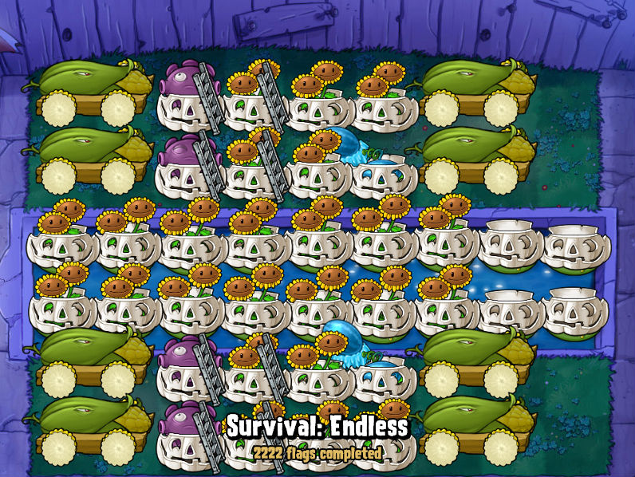

双子流则将如上闲置地全换成双子，并尽可能提高其数量，单看阵图不看相关视频，肯定没几人料到此阵阳光毫不充裕，稍不小心就会断粮，肥在外面穷在里面，外加结构不稳定，容错不高，泡沫脆弱，必然不能持久运转。那是因为这货所用垫材比较特别——这么多收入不花出去多浪费，外汇储备太多了可是有缩水风险的。

可是，这些高花费的三头双管西瓜有什么实际意义呢？完全没有，比起实用低价的垫材来，唯一的优势大概就是烧钱以彰显排场吧。正如某朝的三gldsjfahlaslkjfoawziuahogs

而2花摆出的瞎了包括我们自己在内的观众狗眼，号称第一脑残神阵的全植物8炮，其本质节奏不过是一个普通的核武双樱桃8炮打P6。能将这么多植物通过数种方式展现于同一阵同2F，除去无聊到脑残的成分，你总归要承认，这还是花了不少心思的吧。

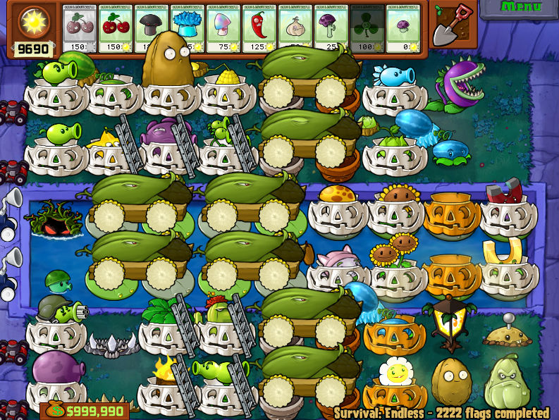

所以，花样12炮，双子流及全植物8炮，所体现的一致理念，正是一年多前平渊玉米6炮/8炮娱乐贴的重要推论——在阵形设置，带卡及节奏能够极限满足所需运算量的情况下，其余空地可以全部用来胡闹，想怎么搞，就怎么搞。

搞得笨拙，尾大不掉；搞得巧妙，养尸遛鸟。

搞得低级，玉匣填草；搞得高端，扬葩振藻。

17：00，即是必然，也是偶然。必然是前因早已种下，偶然是一对少女的寂寞。

细心的你发现了吗？

Endless的娱乐文化发展史，是一段关于无聊程度的历史。

Endless的2B阵型进化史，是一个关于智商下限的故事。

## 18:00 新酒 半炸15炮/准确17炮/动物园10炮——剑走偏锋

以前SB四人众指点江山坐而论道之时，我说过这么一番话。

“简单平凡重时间，来得早就有肉吃，肯付出必有收获；奇思绝唱则不然，有人求之一生而不得，有人灵感瞬发便参破。”

就PVZ这个小小的领域而言，在我所熟知的女性玩家中，若有一人可以解释何谓天才，那必然是2花；若有一人可以定义所谓奇才，那非BVZ莫属。

自如登台，淡然隐去，BVZ在PVZ吧真正活跃之期尚不足一年，然时贵质不贵久，一年之内，EL开局流光溢彩；数月之功，IZE氛围水到渠成。其人性宅，腹黑，略别扭，善吐槽，冰雪聪明，灵性通神。无意挥洒出妙笔，信手涂鸦成丹青。

单论EL，BVZ主要成就可归结为一养，二阵，三开：C2单卡炸荷叶，裸6墓5动物园。

“一养”即为本节将述。

2花创出养僵尸，标新立异，后来人时有仿效，然世间庸者众而智者寡，恰如美人鲜花之喻。后仿者大多得形弃意，乏然无味。譬如某后置炮养MJ，又或持活曾养小鬼，皆一心囚于原有阵位，殊无倒置引流。旧瓶不空，何来新酒？

用膳三年（2009年为用膳元年）五月初，继心9与对称8后，BVZ发表两个体位焕然一新的养僵尸阵型——[半炸15与准确17](http://tieba.baidu.com/p/1076508067)，拉开他成为地外文明晚期核心人物的序幕。

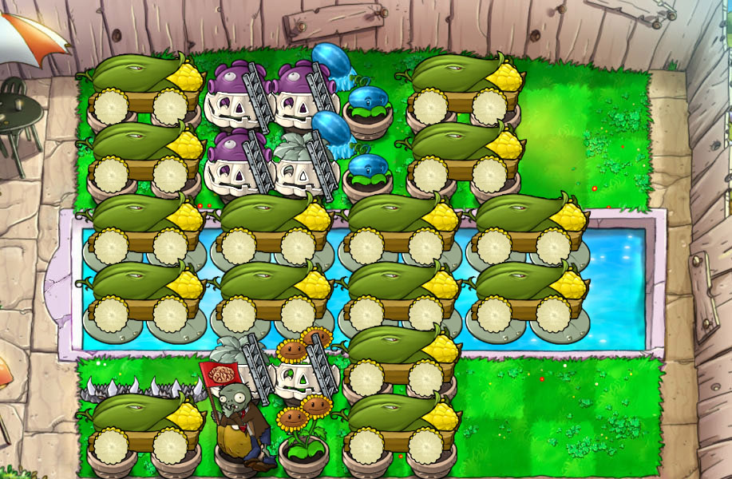

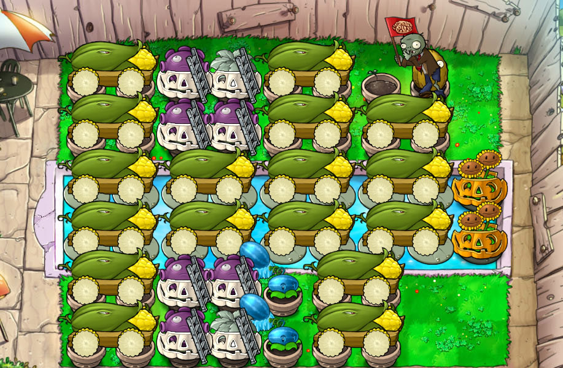

“哪里能种植物，哪里就能养僵尸”，才是对2花“即可以杀僵尸，也可以养僵尸”的最好传承，脱出旧制，溪流入海，得见不同天地。

不可否认，这句话本身并不科学，9列可以种陆炮，9列养僵尸就……，不过钻这个牛角尖，无异于买椟还珠，毫无意义。

两阵即出，运行机理并不难懂，都是P6加半边复合炮的普通节奏，以已知平常组合出未知魅力——这是EL研究之所以吸引我的重要原因之一，因此我个人对此二阵极为推崇。尤其半炸15炮，曼妙玲珑，爱不释手。

何谓准确17？炮弹不可炸到8列所养“宠物”，炸点被迫外移，上半场起手落点拖僵尸都提心吊胆。

何谓半炸15？6路后场不可有小鬼落入，须空拦小鬼，本来前场空炸即可，不过BVZ那时尚未练成手动前场空拦，不得已退而求其次，采用半场空拦，炸6路放5路。于是首个也是目前为止唯一一个半炸阵型产生。

尾炸可拦3路小鬼，前场空炸可拦2路，半炸只能拦截一路。除了对漏伴舞撑杆容错较高外，半炸似乎基本无意义？

未必有意义，但是有意思。

未必有发展，但是高难度。

未必有容错，但是够二逼。

——要时刻谨记这样的打开方式。

区区养单僵尸，仅为娱乐，几无难度，何足挂齿，数月后BVZ又开发出接近养尸极限的动物园10炮——全6路养僵尸（2）

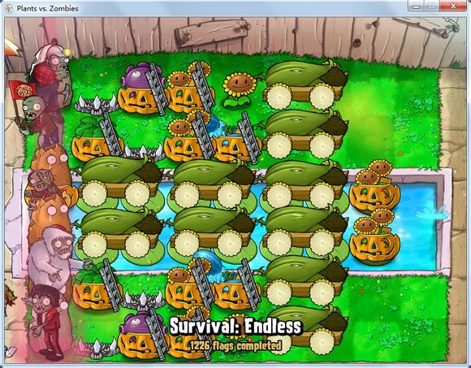

此阵已基本与轻松悠闲无缘，打开视频只听尸声鼎沸嘎嘣作响，你啃我咬络绎不绝，所带饲料刚好循环，手欠不得。原帖4楼链接中所给出的计算为成阵基础，由此，养僵尸走向精确化极限化，而半炸15炮及难度17炮又进一步丰富了其内涵。

从2花到BVZ，养僵尸从自娱自乐到建立体系，从一枝独秀到百花齐放，时间虽长，然事半功倍，堪称杰出者，两人而已。

## 19:00 旷世 炸荷叶12炮开局/24炮C2开局——叹为观止

阳光，选卡，速度。

快速开局古已有之，只是那时候仅为尽快成阵，多一次选卡少一次选卡无所谓。据我所知，最早的速度之刻意追求出现在3C8炮开局，有人来贴吧发挑衅贴，摆下 3C8炮快开局的擂台，不出你所料，这孩子毫无悬念地被吧务众完爆，绿字视频都录好了，结果没来得及出手……之后又有人来挑衅，号称砸场子，还是用3C8 炮开局……我唯一想吐槽的是你们这些货除了3C8炮还知道个啥？后来吧友【江西_美男子】正儿八经发表一枚[速3C8炮](http://tieba.baidu.com/p/1070667110)，尽一切可能拖僵尸，4F末尾即基本完成全阵。（如要种地刺王则须三次选卡）

3C8炮植物种类繁多，超低F内完成着实不易，但是实在不爽，不刺激，不带感。同月，在码字帝的启发下，BVZ运用神节奏C2，在开局过程中使僵尸长期保持最慢刷新，创造了[6F完成24炮](http://tieba.baidu.com/p/1088506718)的新奇迹。在“速度”上，EL开局终于有了能引以为豪的 PVZ吧特色成就，开局帝国又添一城。当然，严格说来6F成24炮并非最快，对于C2的更加精准的利用，可以进一步缩减F数。

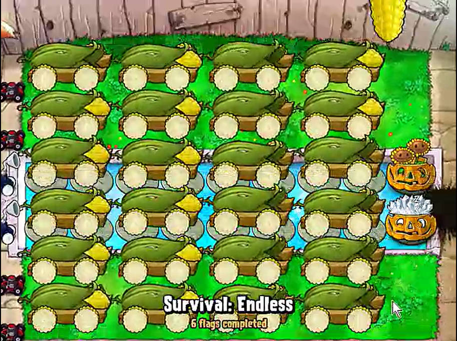

一养二阵三开，以三开为最。在对于开局的理解实践上，说BVZ是本吧第一人也不为过。

难度开局中唯一能与靠天准靠天体系相抗衡的是少卡（单卡）体系，而从目的性与达成方式来看，纯粹“为了蛋疼而蛋疼”的开局，当属[炸荷叶开局](http://tieba.baidu.com/p/1087538079)无疑。

靠天追求阳光的榨取，少卡专注卡片的极限，6F24P着重于速度，纯白炸荷叶搭梯开局又是想表达什么呢？

除了蛋疼我们找不到其他合适的回答，“拔群的视觉效果”也许可以是不错的选择。

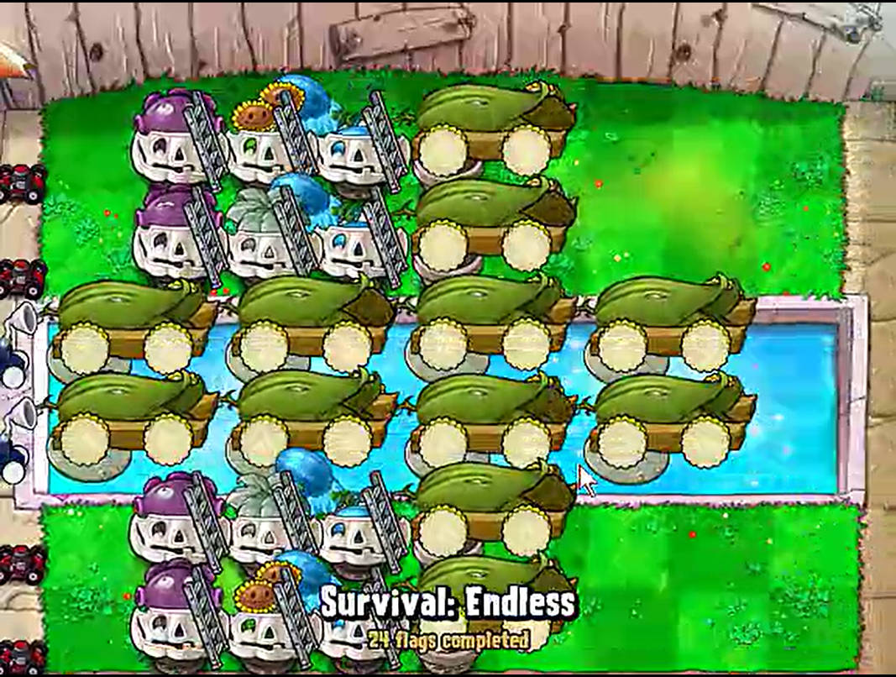

即便在EL冲关中，小丑炸掉炮前荷叶也并不常见，可想而知，通过SL与操作强行将这种偶然转换为必然要花费多少时间精力。它令人叹服其难度之高构思之巧，却不挑战任何传统意义上的极限；它使人目瞪口呆五体投地，却并未广泛应用所谓主流理论或核心科技。除了EL炮阵最基础的元素之外，它唯一赖以立足的就是它本身，几乎完全独立于传统开局体系，恍有出离五行之感。

因无聊追求更无聊，因蛋疼创出自己特有之极限，如此寂寞胜雪的感觉不只BVZ能体会到，但她世所未有的追求纯粹蛋疼的能力与表现方式在PVZ吧脱颖而出，就前人未就之奇功。或许以地球文明发展的视角看来，此类行为纯粹浪费时间，然而，在看完完整的搭梯、上白、炸荷叶全程后，我想没人可以否认炸荷叶12炮的独创、才华与执着，与其说这个“歪门邪道”的开局让BVZ在EL史上达到普通玩家再难企及的高度，不如说这只是她早已领悟地外文明之精髓而厚积薄发的日常。

不为理论惊天下，只求蛋疼动人间，无心主流何方去，但凭本意随处往。这是BVZ无法被超越的特色，亦是我最欣赏她的地方。在三次科技革命已过，臻于绝地的EL研究已出现收尾趋势的年代，一位奇才飘然以降，自成一派，亲造珍珑而后潇洒破之，津津有味，润物无声。

系铃解铃有尽时，寂寥独孤无绝期。有幸得见这般境界的我，难道还会再对常规堆彻的极限动情，对俗气浸染的探索起意？即使会，也不过三分热度，一时冲动，注定有始无终，兰因絮果。只因BVZ之后，再无蛋疼。

曾经沧海难为水，除却巫山不是云。

## 20:00 繁华 守钉耙系列——锦上添花

守钉耙——顾名思义，保护8列钉耙防止其被僵尸引发并过关。是又一PVZ吧特色的蛋疼成就。EL中的钉耙系列分为开局及阵型运转两部分，开局守钉耙一般需要大蒜将钉耙所在一路的僵尸引流，并在快速建立阵型基础后进一步施加输出，从而保证钉耙的长期安全。而钉耙阵型则需要在钉耙所在路安排重火力，压制绝大部分僵尸不过9列。

百花缭乱的钉耙保卫战并非某一人的核心贡献，而是贴吧众多新老吧友的智慧结晶，以下以编年方式简述“钉耙史”并直接附上链接。其实这种内容碎而杂的东西我很喜欢讲的——有充分理由写流水账——最好写的小学生作文之一。

### （1）

守钉耙当然不是直接从无尽生存开始，最早的守钉耙设想存在于非无尽模式，谁先想到无据可考。最先提出的是吧友【CJ他家】，而第一个成功实践的则是吧友【就站中间】，用膳二年3月4日，【就站中间】发布了[部分MG及生存困难模式的守钉耙](http://tieba.baidu.com/p/723295857)：

数日后，【CJ他家】补完[冒险及隐藏关](http://tieba.baidu.com/p/745886075)，至此守钉耙系列起步完成。

### （2）

首次在EL开局及阵型中引入守钉耙的，额，还是BVZ……疼神名不虚传……用膳三年5月下旬，经与吧友讨论后，BVZ完成守钉耙20炮开局，以经典20炮节奏完成对20炮守钉耙的理论论证，并借触派吧友【我学会了傲娇】之手实现全难度出怪下[手动20炮守钉耙视频](http://tieba.baidu.com/p/1086182863)。

### （3）

用膳三年10月，吧友狗不怕热，哦不，【猫不怕冷】用马甲发表一枚[PE钉耙10炮视频](http://tieba.baidu.com/p/1256275027)，运用到了先进的预判双冰16炮change 6科技，且卡片循环绰绰有余，可知10炮以下守钉耙完全能够实现。

### （4）

同日，在试验后我初步得出少炮守钉耙的下限，并公布于贴吧。但现在看来那个运用change 5单边[守钉耙的4炮](http://tieba.baidu.com/p/1256456663)尚有诸多缺陷，若要循环需作不少改动。而守钉耙的炮数下限也一直止于4炮。

### （5）

节操二年3月，码字帝发布[六场景钉耙无梯开局及六个钉耙超多炮阵](http://tieba.baidu.com/p/1454281225)，轻松占据EL守钉耙系列神贴首位。

节操二年5月，吧友【鲜血水晶杯】再次提高难度，将“靠天”与“钉耙”两大自虐元素合并，完成[PE靠天守钉耙搭梯开局](http://tieba.baidu.com/p/1571219107)，历经66F三十多次选卡，外加SL无数，坚定彻底地贯彻了地外文明的核心精神。

### （6）

你所看到的寥寥数贴，并不足以概括所有细节，仅仅是选取必要节点做一简述。对于守钉耙而言，每关键一步的迈出，均是细碎推力所积，乃至最终在我所讲述的这段历史中拔得一筹，离不开众玩家的贡献。

守钉耙系列自其最初的构思以来，一路受各方相助紧随主流理论发展，不断引进最新科技武装自身，两年之间逐渐壮大，不知不觉落英缤纷，蔚然成林。

## 21:00 恒毅 PE单卡开局——顽石点头

继靠天的奠基与无绿卡&少卡的过渡，鬼触BVZ的“三开”将EL开局送入全盛。C224炮开局慢中有快，以速度见长；炸荷叶12炮另辟蹊径，以蛋疼闻名。而作为最后一开的单卡开局，唯靠SL见真章。

不少高难开局对前期出怪有一定要求，较难对付的僵尸如出现太早，只能重新来过。而单卡尤其是PE单卡开局，对出怪的要求达到了苛刻的地步，非神级RP不可， 同时操作容错极低，这样导致几乎每一次选卡均需反复SL，没有爱的玩家是断然不敢去尝试的，有爱而稍缺恒心者敢想也做不到。

2010年3月，吧友 【lingxuan764】集思广益，首次实现PE2卡开局，没视频略显遗憾，不过可信度是有的，这是晴姨后EL开局的再次极限尝试。鉴于PE2卡较需要 RP，卡片数量也几乎封底，当时没人想象1卡的可能性，号称要尝试1卡的几个ID也很显然只是号称而已。

蛋疼程度和时代一样，总是要不断进步的。 8个月过去，吧友【冰蓝★璇舞】在满溢着血与泪的海量SL之后（据本人称一次完整的PE单卡开局从开始至结束需SL数千次……）不可思议地实现[PE单卡开局](http://tieba.baidu.com/p/933880563)，只是依旧没视频，图也就一张，但无论如何，“PE单卡是可能的，只要狂刷老奶奶”这样一个信念被明确下来。

在冰蓝原帖中，7楼的回复迅速暴露其智商，当然这个不是重点，不要在意细节。

信念是有了，但是没有爱，没有高处不胜寒的寂寞，没有不厌其烦一遍遍SL的毅力的话，单卡开局也只能搁置，一搁就是一年。如果不是出了个内置蛋疼的BVZ，谁知道会放多久。

2011年11月初，在与码字帝和冰蓝妹纸细致讨论的基础上，BVZ在SL共200+次后完成并发布[PE单卡12炮开局视频](http://tieba.baidu.com/p/1267199474)，终于真正在卡片上达到了极致并做出证明。

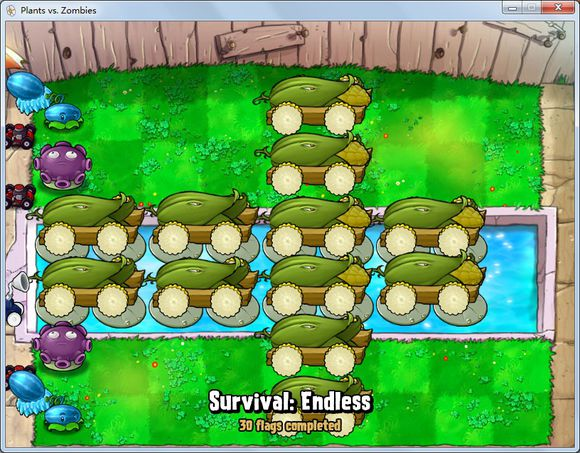

以上为30F后成型阵图，具体过程及讲解请移步原帖仔细欣赏。

单卡开局需要技术么？当然需要，而且需要很好的操作与临场判断水平。然而必须承认成型前的容错长时间为0。开始被多啃几个杨桃，出怪演的不好，F末珊瑚不给面子，操作出失误——任何一点风吹草动都会直接导致崩坏。为了让各方面符合要求的低概率RP配合剧本，唯一能做的就是一次又一次SL，直到满意为止。这正是单卡开局的第一要素——通过SL将高难转为易行，将一般变成最优，将偶然的趋近于0化作必然的1。所谓精诚所至，金石为开。

而在此之前，BVZ已完成[DE单卡开局](http://tieba.baidu.com/p/1252890518)及其余各场地的[极少卡开局](http://tieba.baidu.com/p/1245729279)。于是，PE1卡，DE1卡，RE2卡，NE2卡，FE2卡，ME3卡，基本上都已是各自极限，聪慧兼以不懈，疼神形单影只将EL六大场地少卡开局屠杀殆尽，完成一次暴走，并确立自己在该领域中不可撼动的统治地位。

## 22:00 时运 全底线4炮——机缘巧合

传统8炮的炮位某种意义上是完美的——占尽水路陆路最安全十六格，同时意味着更多炮不得不选择风险更大之地落脚，前置10炮添加两门水置炮，十字12炮则挤满水路，到了常规16炮，无处可去，只好将目光投向底线：相对超前置炮和小鬼炮而言，这里最安全。

亦即，底线炮原本只是炮数与场地妥协的产物，一般超多炮可以简单地全收矿工投篮，弥补底线炮的劣势。但是，偏有人用多炮乃至少炮舍安全炮位而逐底线，使得矿工投篮成为非高级技巧不可应付的大患，硬要化冲关为娱乐，变自如为自虐，此类阵型我们称之为蛋疼阵。

绿字的猎奇8炮变换了炮位，尚努力在底线自然免疫篮球车矿工，王子的缺底线8炮将矿工交由双冰对付，某魂的半全半缺底线8炮总算完成了矿工和篮球双爆菊花的重要指标。底线炮慢慢分离出来，开始作为冰核代炮的重要产物之一而活跃，后来我在做阵海的时候将底线炮严格分类命名并建立体系。这里不提，有疑问自行查阅阵海拾遗。

那么烦人的问题又来了——下限何在？

王子发布过水无6炮及多猫预判6炮，进一步减少底线炮的炮数。二次科技革命导致传统冰核代炮及模糊变奏快速发展，借此，我和吧友【梅布衣】发布了大量多炮&少炮底线炮阵型。到单边底线炮下限被推进至3——即半全底线3炮时，卡片循环显然还藏有潜力。而在阵海中我承认全底线7炮以下尚无法达成，足见此时无论何者，离极限都还有一大截。

11年1月，我根据半底线3炮开发出底线2 炮，作为单边底线最少炮，容错为0的极限阵以及二次科技革命时期变代奏与卡片运用大成作品之一，PE底线2炮后来被作为地球文明名阵之一录入扑克。在我心里，它更类似于“站在地球文明肩膀上的地外阵型”。而且用现在的科技来分析设阵可以更极限，只不过综合看来意义已然不大了。

在极限使用双冰及辣椒/窝瓜补足运算量之时，我已隐约感到底线2炮有余未尽，似蕴含对称性质的绝妙变化。轨道理论给了我编排运算规则并进一步压榨卡片潜力的便利，但理论上的缺口总是补不齐，无论怎么翻来覆去地折腾，我始终连底4最基本的循环也无法完成，又遗憾每次就差一点，对它的可行程度认知处于半透明的状态。

不肯就此甘心，我转而向绿字和2花寻求意见，我们摆出3个水路后场不同的底线4炮，鏖战数种僵尸组合，一撸就是一夜。3个足以代表彼时PVZ吧最高理论实践水平的2货结合轨道，几乎穷尽当时所有可用之少炮节奏玩法，乃至不惜铲炮种炮来饮鸩止渴，结果终究还是以无法通过极限僵尸组合的失败告终。我遂果断放弃底 4并定义其为“不可能达到的极限”。

我的结论即使放到今天也不算完全错，全底线4炮理论论证及实践的成功完全源于某个极其偶然的非主流灵感，仅利用当时主流成果以及常规炮阵思路是无法打开通向答案的最后一扇门的。

11年10月，帮绿字整理EL地球文明史料时翻阅旧帖，无意看到在DE前置6炮破千留念贴中我与王子唯一的一次EL交流，在提到DE9炮阵型设置的时候王子指出“可以考虑用冰蘑菇冰住上波矿工，之后一炮炸掉上波及本波挖过来的矿工”，而此时预判冰，热过渡与三大变奏体系已相当成熟，吧友【随尘归海】亦已发布全底线6炮。无聊之间，我再次动了尝试全底4的念头，这回似乎可以应付高强度出怪，冰蘑菇却又成了短板，根据王子的思路，每次双炸矿工都要冰，可预判冰也不能省，那么冰必然不够用……可见对矿工冰车篮球的应付依旧疲于奔命，节奏还是差一步。在一切皆有可能的时代，我都几乎已经确信底4无法实现了。

11月初，重览自己以前的某DE8炮。看到1炮炸半场后另一边1炮炸两波时猛然想到：纯快速只炸半场就能保证刷新，矿工出土还要自然晕，那么何不利用此时间差自然炸双波？一直在试冰后炸双波。怎么没想过不用冰究竟可不可以？

我瞬间醍醐灌顶，犹如在绞尽脑汁而不得入阁之际，忽见上帝将钥匙摆在眼前。

理论实践均证明，纯快速组合在炸半场刷新后，可以直接炸双波矿工，无需用冰。冰蘑菇缺口被轻松补足。如此简单的一点改进，决定了某个传说必然要被化为视频的命运。

此时距我最初提出底4的构思，已经过去了九个多月。

我打开EL，挖掉底4水路后场的双曾，只留伞叶，彻底摒弃了底4=两个底2的思想，以贴吧从未有过的新变奏驾驭全阵，碾过2F，大功告成。

那一刻，我找回了一年多前只身开发出change 5的喜悦。

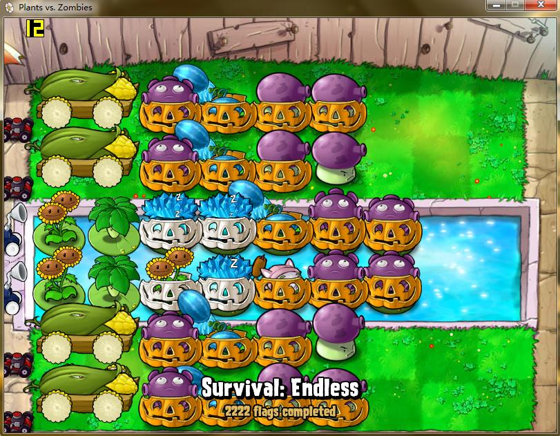

理论论证成功并不等于结束，底4的视频化过程是艰难的，为了完成全难度下至少能看的视频，我花了半下午时间，终于分别打出快慢速的针对出怪，[正式宣布](http://tieba.baidu.com/p/1288526289)底4的最终成功。

区间的这一端，果然还是闭合的。

全底线4炮是整个少炮底线炮体系的终结，它应用了轨道逆运算，预判冰热过渡，非C非P变奏，稳定IO自然激活刷新，卡片极限代奏等代表第三次科技革命成果的先进理论，同时它的成功完全依赖于“纯快速时炮炸半场必刷新，且炮自然炸后场双波矿”这样一个在大多数场合无意义的推论之成立；全底线4炮也是站在地球文明肩膀上的地外杰作，但它太蛋疼，太极限，太出离于主流发展的需要之外，注定不能像底2那样成为地球名阵；全底线4炮亦是我作过的难度最大的少炮之一，远在DE底线2或RE1炮之上，堪称5P流派镇派之宝。

游戏两年余，有何聊以自慰？

笑曰：22214468，一一一二六八百十。

## 23:00 绝顶 手动24炮——指尖日月

① PD+PI+PSD=1

② PD+C=1

③ PI+PSD+a=1

④ PSD+IP+PD=1

①≠②≠③≠④

这科学吗？很科学。少炮想发展不能尽信科学，超多炮欲进步则非靠科学不可。以上随意列举出PE24炮打开方式若干，不了解的朋友看起来应该会一头雾水，有虽不明但觉厉之感，那么我的目的就达到了。

讲点PE24炮诞生的黑历史吧。2花打出第一个视频（PI+PSD）——某晚在吧务群里聊天时向绿字和我问起我们是否有为贴吧准备新年礼物——我们反问，2 花不肯明言——我遂去其优酷空间，见一上锁视频，炮列满地，惊骇莫名——回来告诉绿字，绿字追问2花——2花承认【初步】解决了24炮问题——绿字以刚成型之轨道理论推出大体节奏——2花认可——绿字发一帖“多年来困扰着我们的某个问题被形式上解决了”——经讨论后3个SB达成基本一致，认可该节奏还是有问题，的确只是初步，须要说明全红不能无尽等等——第二天炮帝打出史上第一个循环无尽24P（PD+PI+PSD）——后面的事情你们都知道了。

总结一下，这是一个笨蛋花花自己卖萌暴露自己，然后又落入我和绿字的圈♂套的故事。

从稳定无尽的角度评估，由风花镜月及testla提供的P6节奏PD+PI+PSD是最优表达式，其他解可达成理论循环，但阳光平衡均差一筹，经济上的综合容错能力逊于前者。不过，稳定无尽只是最初24炮的目标，当它首次被成功推倒之后，玩家要做的就是继续换姿势反复推，直到玩坏为止。

手动22炮的成功，自然而然激发不少吧友内心对于手动24炮的渴望。尽管那时只有①和不完全的③，尽管①中PD的精确度与PPSSDD的难度几非人力所能达到，但是与以前很快断定不可能不同，大家要么提出谨慎的猜测，要么抱有渺茫的梦想。目睹了手动超多炮的极限被惊艳表现不断突破，包括我本人在内的玩家们即使完全看不到当下存在的理由，也依然对未来怀有一丝由过去累积而成的信念。

2011年10月，2花用change 6开发出[24炮新节奏之④](http://tieba.baidu.com/p/1244373564)，用相对易操作的激活PD代替了原来的分离伴舞小鬼高精确PD。藉此，2花在原帖中提出手动24炮的可能，新节奏的PD与IP手动难度都不大，只需练就双边PSD的神通即可。

双边PSD似乎被说的很轻松。既是神通，那就不可能轻易达成。手动22炮的单边PSD难度已经接近逆天，需要手速，手感，意识高度统一，更多时候是凭长期练习的直觉空拦而非临场对发炮参照物的观察，对此，玩过手动21炮与22炮的我有极深刻的体验。所以，连续数次成功的PPSSDD，成了横亘在众手动党面前的天堑。

本节主人公至此正式出场，吧友【随尘归海】与吧友【灬龙啸⑨兲灬】，两个合力将手动超多炮推上巅峰的非人类存在，PVZ吧并列第一的神触。两人之前均已发布多枚含单边空拦小鬼的手动超多炮，基础雄厚，功底扎实。经不懈练习，终于携手圆了这个自龙骑以来持续整整两年的遥不可及之梦。

11月22日晚上9时多，三天前还卖萌称“双边PSD什么的我看我这手速是不现实了”的归海在贴吧发布[史上首个手动24炮视频](http://tieba.baidu.com/p/1293803461)，尽管略有槽点，仍不喾于晴天霹雳，平地惊雷，以阴柔著称的change 6在他手中怒流涌动，劲力不绝，双边PSD于电光石火之间一气呵成，全吧为之拜服。若非亲眼所见，我绝不敢相信这一切仅凭一只手即可做到，撸炮真是前途无量。

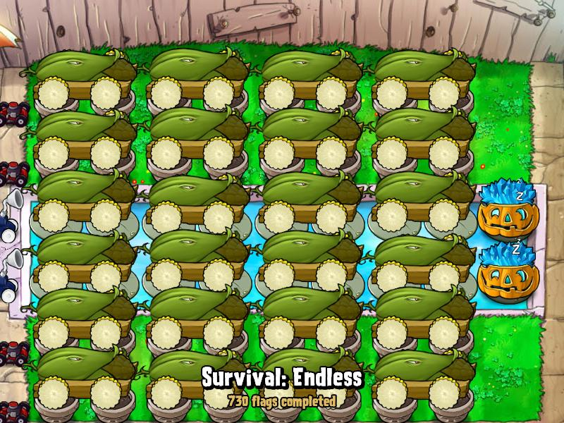

八天后，追求尽善尽美的归海发布[手动24炮2F连续视频](http://tieba.baidu.com/p/1304036019)，抛弃了分录及修改器捡金币阳光的做法，这是PVZ吧历史上第一个也是目前为止唯一一个无修改纯手动的手动24炮2F视频（这里指贬义上的修改，因而出怪修改这种增加难度的当然是另一回事）。

[🔗bilibili补档](https://www.bilibili.com/video/BV1Li421k7Ti?p=2)

归海首创神迹，而龙啸2天自是不甘落后，于11月28日发布以P6节奏PI+PSD运行的[手动24炮](http://tieba.baidu.com/p/1301866198)，只是那时科技水平尚不到位，PI+PSD无法完整循环，2天被迫修改最后两波出怪以解决冰蘑菇不足的尴尬。然而，这丝毫无损于第一个手动P624炮视频的伟大。同为手动24炮，如果说归海的change 6是柔中有刚之连绵，那么2天的P6则是暴风骤雨之苍劲，随手补炸小鬼和连续PSD的速度精度直看的人欲罢不能，其手感手速之稳，竟如钟摆往复，实已以血肉之躯达到恒动机械的境地。

同样八天后，2天结合刚柔阴阳，发布[半场P6+半场change 6的手动24炮视频](http://tieba.baidu.com/p/1312159534)，实现2F循环，并写下大量手动练习感想及节奏心得，观来感慨至深，更加佩服二人出神入化的功力。

[🔗bilibili补档](https://www.bilibili.com/video/BV1Li421k7Ti?p=3)

短短半个月，手动超多炮进入最辉煌的时刻，当空绽放，绚丽至极。两位吧友的手动24炮均有失误少许，但瑕不掩瑜。该系列视频所带来的视觉享受与冲击，凌驾于贴吧其他任何手动阵型之上，EL世界的尽头清晰可见，最多炮天高地远的霸气触手可及。

有分教：转念时鱼龙潜跃，点戳间日月圆缺。

源自#的手动超多炮命题终于可以被完美划上第一个句号。至于第二个最速传说的句号在哪里，尚未可知，传奇向来属于每一颗愿意书写的心。也许它已悄然降临，也许它永无限界，也许它就在你的手中。

用群众喜闻乐见的小段子来结束整个手动超多炮的讲述吧。

2009年秋冬，在实现PE16炮及PE20炮后，平渊有言曰“毫无疑问要键控”，“手动就素不可能”。

几个月以后我和手速帝先后借助超12炮及P6节奏完成手动20炮。

2011年2月，在平渊为纪念PE24炮所作的【我们的故事，从0开始，定格于1】一文中，提到空炸小鬼时他说：“很显然，这个操作除了手速帝以外的其他人，都应该自觉的选择键控完成。”

几天以后，龙啸2天以完爆rwtiqz的手速及精度实现手动22炮，几个月以后，手动22炮烂了大街，单边手动空拦小鬼已不再稀奇。

于是，2011年7月，平渊在EL黑历史百句吐槽中，将措辞修改为“单边小鬼拦截可以手动完成，双边必须键控”。

几个月以后………………

百分之百被piapiapia的设定碉堡了

## 24:00 归元 ICE3——毫厘乾坤

【身入苦海销尘垢】，异人也，素以浑厚踏实，滴水不漏著称。无论阵型理论，均极尽长期构思精心筹划之能，日积月累，实属不易。攻略每出，必附海量文字，详尽细腻，人所难及。近目以观，其文严谨中正，密密麻麻，直感黑云压城，倏尔竟头晕目眩，浑不知几度春秋已逝，俄而醒转，大惊，自叹弗如。众皆赞曰：“此真码字帝也！”

ICE3是关于极致，关于绝唱，关于码字帝的故事。

一般而言，第三次科技革命后所有超多炮理论的延伸拓展创新，均为轨道理论的逆运算及已有节奏的优化与潜力挖掘，全部属于地球文明的范畴。而源自游戏本身精密运行机制且兼容ICE1&ICE2所有优点的ICE3，是唯一的例外。

首个明确表现ICE3的视频还要追溯到2011年4月码字帝所发布的前置6炮攻略中，当时它是一个“bug”，一个只能用来看看然后惊曰“原来可以冰的巨人扔两次小鬼啊”的小彩蛋，时值超多炮查漏补缺刚刚开始，广度深度力不从心，以当时的理论科技水平根本无法想象它的应用。

PE24炮是EL世界的尽头之一，亦是最值得PVZ吧骄傲的超多炮。那么，既然有了PE24炮，为什么不能有FE24炮？2011年秋，借RE&ME16炮的水到渠成与黑夜场合特性，码字帝的双核FE24炮及吧友【FreezedIce】的双冰FE24炮先后问世，似乎就“存在”的角度来讲FE场合已相当圆满。

有“存在”无“高度”可不是PVZ吧的作风，2012年2月初，码字帝以[FE24炮](http://tieba.baidu.com/p/1405342382)作为载体，对原来的双冰P6节奏进行优化并降低了阳光消耗，成功实践ICE3的华丽创意。

PVZ 中的最小单位为帧，而最短有效时间约为0.01s，一个连续动作的实现依赖于程序判定的“关键帧”的生效，同样地，巨人举手扔出小鬼的全程分离动作中，存在“小鬼飞出”的关键帧，若该关键帧的判定被取消，则即便巨人已做出扔小鬼的动作，小鬼飞出的事实依旧不会发生。而极端精确生效（误差不能超过 0.01s）的冰蘑菇就能以自身的冻结效果取消判定，从而使得视觉上出现“巨人做出投掷动作后扔了个空，小鬼从手中回到背上，需要再投一次”的神妙效果。 这种将游戏运行机制利用到纤毫毕现令人发指地步的冰蘑菇使用，就是ICE 3。无需多想ICE3必须键控，而且要在具备一定质量至少游戏时不会卡帧的电脑上键控……

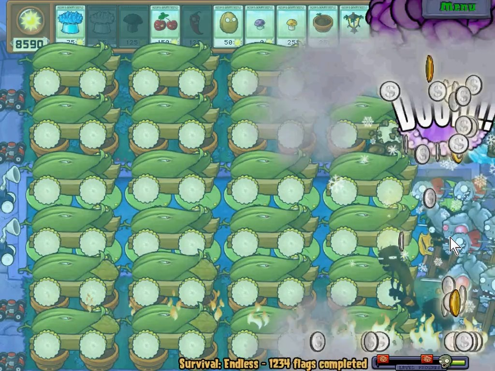

我坚信，以ICE3为轴承运行的FE24炮或者其他可能存在的阵型，绝不能实现2F连续手动，否则我吃键盘。

在FE双冰24炮中，码字帝借助ICE3编排出优化后的P6轨道，对于轨道中段两拨精深入微的双冰使用作了具体详细的解释，有兴趣者可参阅原帖。

从游戏机制原理中土生土长的ICE3，被我视为这个地外故事的终点。它是从那么久远的过去到这样平易的现在为止，最后一个让我发自内心鼓掌叫绝的PVZ成果。之后无论无炮，少炮亦或超多炮的发展，要么是对地球文明的深化延伸补完，要么承接地外之旧锢照猫画虎，再难有异构佳局。

连码字帝自己都承认，过于高端的ICE3是屠龙之技。屠龙之技本用以屠龙，然而这世间从未有龙，是以此能历经艰险练就，却无用武之地。诚然神乎其技妙至毫巅，终究已弃世离尘，尽得一败难求之孤独。

对于以ICE2或硬代奏就可以流畅运作的FE24炮而言，ICE3在大放异彩之后，唯剩高不可攀的寂寞；对于现行几乎所有超多炮来说，ICE3遍寻四海，却依旧找不出一条惊天动地的真龙。也许它并不属于这个PVZ的时代，甚至并不属于这颗“地球”，只不过如ORT一般，搞错了降临的时间而已。

我回过头去，仔细看着最初的键控PE14炮，又认真想着最后的精确FE24炮。

夫至大，天地弗能含也；至微，神明弗能领也。

ICE3是已处于后技术时代的PVZ吧之地外星云中，最傲气最耀眼的那抹流光。它以自己的超凡脱俗导演出最完美的谢幕，将我面前已打开一整天的泛黄书页，轻轻合上。

## EXTRA ?:?? 拾遗 1:00＜?:??＜24:00

讲故事不是写账簿，理应取主舍次，不能事无巨细凤毛麟角都一一覆盖，然而历史长河中总有些不大不小的浪花，虽不足掀涛引流，但不失精彩，总觉弃之可惜。特作一拾遗补漏，将选取素材时其他较有价值备选一并附上。

### （1）魂氵岦§艽々幽——NE底线少炮

二次科技革命刚开始时，某魂的PE底线炮系列及NE底线3炮/4炮将底线少炮从泳池拓展到前院，承接王子做了十分重要的过渡。除去坑爹视频的因素及少许bug，阵型本身颇有创意，难度也不低。后来DE底线2炮的布局即借鉴了NE底3炮。

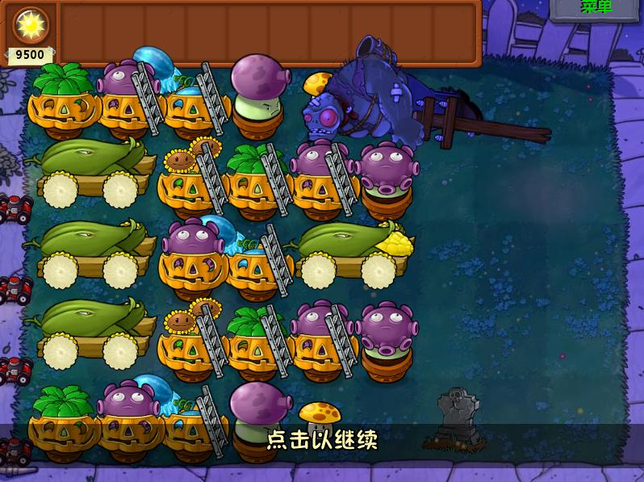

### （2）手速帝——嚣张12炮&大蒜12炮

两阵都很简单，可贵的是早期12炮前场与后场的偏自虐式创新，可视为比较具有代表性的古典花样12炮。

### （3）5P——超前置底线4炮

[倾斜4炮的变种](http://tieba.baidu.com/p/878383273)，现存有超前置炮的最少炮阵型，这个真的有点难玩……有点而已

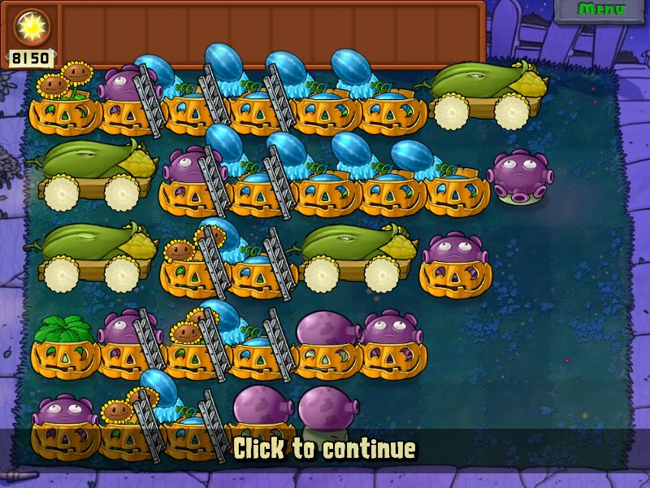

### （4）风花镜月&梅布衣——数字游戏

EL娱乐文化之一，植物数字有讲究，阳光平衡有讲究，理论节奏与时俱进，那当然也有讲究咯。

你能找出所有的5吗？你能保证开局收尾阳光不变吗？

[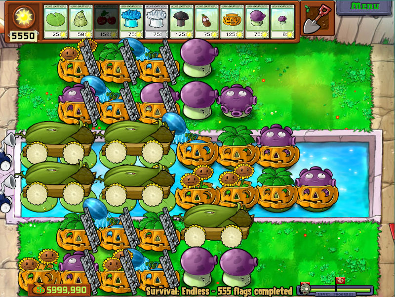](http://tieba.baidu.com/p/868203551)

[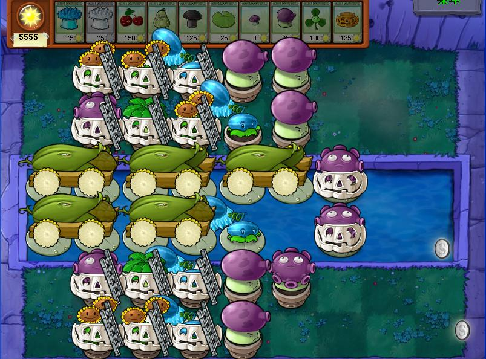](http://tieba.baidu.com/p/1059652061)

### （5）BVZ——8炮高F炸荷叶变阵/靠天24炮开局

招牌技能，无需多言，不仅重现12炮开局风采，更添一份面对海量僵尸时依然如常蛋疼的从容。

[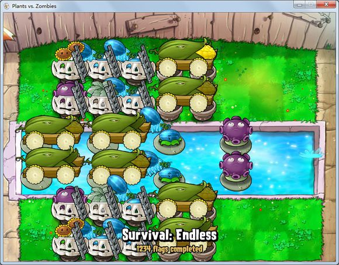](http://tieba.baidu.com/p/1205562311)

至于某个刚填完不久的名为无阳光植物1000F冲关实为靠天24炮开局的[坑](http://tieba.baidu.com/p/1308831918)，我只有三个字想说：大骗子

### （6）归海/2天——前场空拦+后场处理&前场空拦+垫材操作

除手动24炮外我个人最欣赏最推荐的手动超多炮，论速度或不能胜之，不过总操作量绝不逊色。空拦与其他繁复操作之结合，多面注意之兼顾，别有洞天。二者均为双边PSD前手动超多炮最优秀代表，其后也光华不减。

[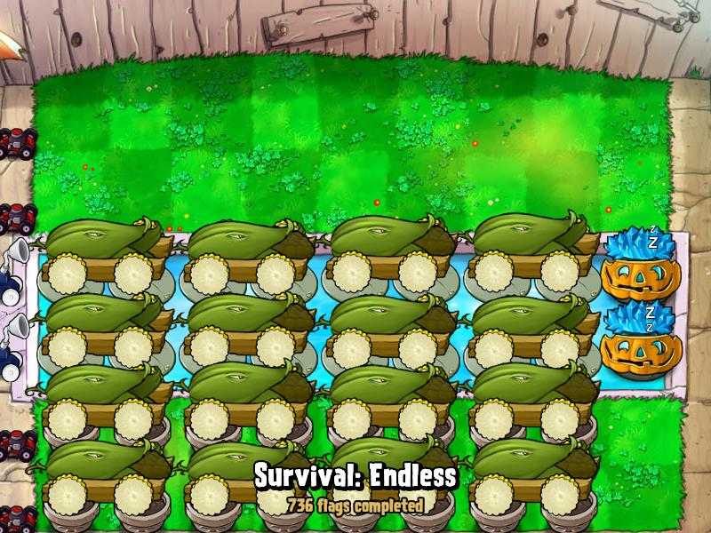](http://tieba.baidu.com/p/1289540813)

[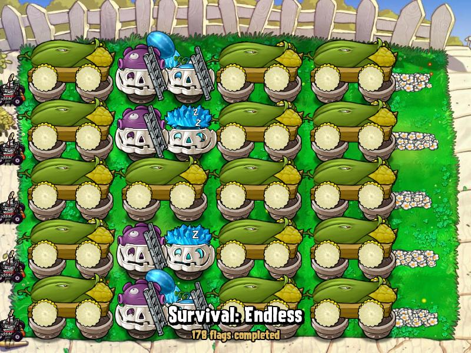](http://tieba.baidu.com/p/1264948486)

六样小吃，色香各异，未知各位食客是否品得独特风味?

---

至此，主文毕。乃以今日之初为旧时之末作结。

纵览地外全史，绮丽多端，诡谲有道。本忖山穷水尽，忽见柳暗花明。奇人异士辈出，龙兴凤举；名作佳构不绝，珠联璧合。巧于思，精于质，强于技，长于乐。既似老辣神算，谈笑之间层层迫近，心细于发，妙解珍珑；又如澄澈童真，浑不知其所来所止，跳脱无方，自得天趣。使人迭声叫绝乃至瞠目结舌之能，已臻化境。

后人有湿赞曰：

地外文明出奇志，缤纷下限尽囊括。

二笔青年思维广，脑残儿童欢乐多。

巧借天工作常理，神来之笔布星罗。

只恐璀璨成绝唱，已无鬼才再开拓。

我的故事讲完了。

由于轻微的精神与性格分裂症作祟，故事中部分人物性别可能不具有引用价值，但是一切有关EL历史的讲述没有错漏，一切有关EL本身的评价格外真实。是的，我怀有这样的信心，因为这是属于PVZ的世界，这是属于PVZ吧的故事。我曾叹息我来晚了，半途方入，未能见到参天大树发芽的模样；我亦曾庆幸我赶上的那么早，恰逢其时，能够在枝繁叶茂的蔽日树冠中，缚上几朵小花。

三年前的jiangxichu键控14炮是起手画，是天外飞仙，是一副手卷的起始；两年半后的键控ICE3是终止符，是屠龙之技，是一轮昼夜的落幕。源于超多炮，而又归于超多炮的短暂华彩，在我的记叙里已然划上句号。或许属于PVZ地外文明的历史就此结束，或许潺潺流水不息向前，尚有新石刻划。谁又可知？青春的心若不曾止步，跃动的笔则理应继续。

大概还是会与普通的交替不同吧？24点的结末，不曾意味过新的0时。因为构成它的，并非永恒时光的无尽轮回，而只是某个游戏的有限瞬间。恒河一沙，沧海一粟。

然而，这特殊的一天是如此绚烂、充实又快乐。良辰美景虽短，却早已嵌入记忆。今生今世，我都难以忘怀，我们都难以忘怀。

此情可待成追忆, 只是当时已惘然。

全文完。

以上就当成给贴吧的长（duan）假礼物吧，继续躺尸前大喊一声我恨绿字爱2花更爱BVZ。顺祝基友们国庆快乐，月面又少一坑。
