# 三代炮阵史
## 【历史向】超多炮科技研究之路——FI与ND的奇妙冒险

> 作者：FreezedIce（[🔗百度贴吧](https://tieba.baidu.com/p/3898640711)）
>
> 发布时间：2015-07-16
>
> 收录日期：2024-05-05

## 一、初尝甜头

昨日在扑克帖里提及我和ND的合作问题，于是和ND怀旧了一波，趁这个机会也回顾整理一下几年来相互合作研发超多炮的历史吧。

高考之后才开始上网，因查找空轨攻略而进入贴吧，然后想起高中常玩的小游戏PVZ，于是加入了聚集一堆二百五玩家的植吧——那年还是会员制，狗牌貌似是专注丧尸？当然知道丧尸什么意思是很后来的事情了……

最初只是关注一些常规的阵容，无炮啊10炮什么的，虽然有稍微做点研究的想法，那时基本理论体系已经构建完毕，显然仅仅按照植吧百事上所说，把一个阵容玩到2000F就能骗精是绝无可能的。因此其实也没有太多这方面的想法，毕竟手残，玩个火焰12都天天被海豚啃炮。

那年的植吧还是有些活力的，时不时地跳出一两个有持久力的折翼，遛狗的也不仅仅是只会群嘲的捞比；蛋总白天搬运新闻抱怨室友，晚上持续不断报复社会；文艺吧主虽然退位，但也经常调戏213吧主；经验制度刚刚上线，诸多老会员争相给即将出现的十级命名；当然还有惯例的新闻联播，报道当日植吧的各种信息。一边刷着持续更新的页面，一边翻着精品区的老帖，那就是2011下半年潜水中的我所做的事情。当然比起各种看不懂的帖子，【吧友互动】区里的各种互黑、同人区里的一些经典以及诸如从受到攻24炮纪实以及百条吐槽这样的游戏文化更能引起个人的兴趣。

很偶然地，点进了浮到首页的按键精灵教程贴，然后自己尝试结合已有的帖子，写一个打超多炮的脚本。翻了翻日记本，大约是11年12月23日开始用按键精灵前台操作尝试玩22炮，24号到28号连着把逆转1、2、3再打了一遍并且用28号一天推完了复苏，在准备积极备战期末考的时候开始作死尝试FE双冰24炮的节奏探索，成功在期末所有科目考完的1月13号晚上打出视频，从此以技术党（伪）的身份进驻植吧，打入1群。

在那之前，已然会关注作为植吧知名2货兼主播的ND，觉得这个ID非常有意思，也曾经与之有过一些交流。最初对自己的研究完全缺乏自信的时候，是在归海触的个人贴吧率先发布关于双冰24炮的阵容节奏，结果被ND目击到了，于是加入1群之后，逮着ND出没的机会在群里一脸人畜无害事不关己地发言，成功地引起注意，然后ND发来了好友申请，于是两个英死早成功建交。

尽管被ND简称为FI的我发布了一个精品，而ND则是在PVZ吧待了一年以上的老吧友，那时候这两个人都还是PVZ上完全彻底的小白，虽然加好友后立刻装模作样地开始讨论PVZ的话题，实话说都是些很没有营养的内容……然而就是从这里开始，持续了一年半的合作正式起步，并且很大程度上推进了无尽生存中某一版块的研究进程。

早先的讨论，其实是没什么结果的。由于腾讯的聊天记录只能回溯到去年7月15日，更早的内容也无从考据。要说的话，在12年寒假中期，有印象的也就是我在自制一个16炮挂机，并且学习按键精灵的一些语法，而ND则在尝试他的屋顶8炮，虽然他有跟我阐述自己的想法，然bing卵，因为我听不懂

第一次合作的内容，是被我称为ND20炮的首个无冰拦截超多炮（也被称为纯灰烬炮阵，虽然其实还是用了垫材的啦），契机是此前一直在玩10炮的ND某日突然说，挖去陆路前4炮的20炮，或许可以打P5节奏的拦截。初步惊诧过后，看到了之中的可能性的我，不禁十分佩服这个精妙的想法，于是兴致高昂地去打视频。然而很快就遇到了问题，要说理由的话无非就是能收矿工的精确P5会漏本波巨人，因此不得不将节奏改成P5u，某几波快一些，在前场处理巨人矿工，某几波慢一些，在后场炸小鬼矿工，同时前场引入垫材。由于并不知道这个阵容所具有的历史与文化含义，因此出于很不成熟的考虑，铲掉了水路的两门炮，改用毁灭代炮，是后来在与码字帝的私信中了解到目前缺乏纯炮输出的阵容，因此重新补了个不用1800卡的20炮的视频——然bing卵，扑克里收录的还是18炮

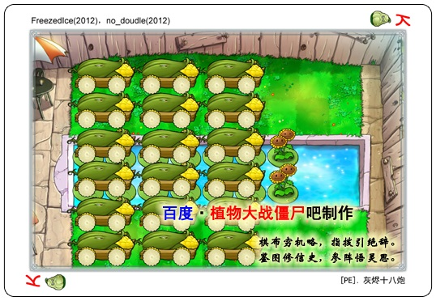

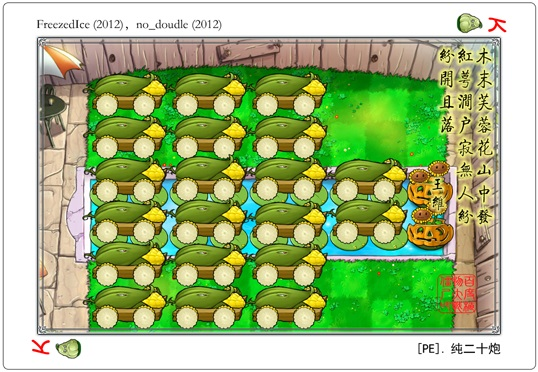

最初打视频的时候，简单地以为只用P5即可解决，因此那时是计划由明白按键精灵用法的我来打视频（ND当时正在学习最基础的用按键精灵打10炮，而且经常犯一些很奇怪的错误，比如语句包含中文逗号啥的），帖子交给提出想法的ND发，然而进行下去之后才发现问题并非那么简单，有必要由实际进行摸索的我来组织语言阐述详情。这也成为之后的一个模板套路，很多时候ND提出一个想法之后我都觉得“哦草妙之极矣我来帮你打视频”，但是打到最后发帖的依然是我，因为想法实现的过程中始终有很多之前完全不知道的问题持续浮现，而在细节上欠缺把握的ND始终很难把问题考虑周全阐述完整，因此虽然文字基本没什么人看，但是我还是不放心把叙述说明交给他——对应地，ND则觉得我每次发帖废话都特别多——这也是能够持续合作的一个基础，在超多炮领域我们正好是互补的，我缺乏富有灵气的想法，而ND缺乏对体系和细节的把握。

帖子发布之后，收到了出乎意料的结果，一觉醒来发现居然被灯笼置顶了，而且他很感动（误）。后来我才知道，我和ND误打误撞，实现的是一直以来就被灯笼、炮仔和BVZ思考过的阵容，不得不说ND的想法确实很厉害啊……

当然，发帖的第二天我就踏上了去学校的火车，原以为和ND的合作暂时告一段落，此后可以投身学习，事实证明是我图样，毕竟即使是在植吧，我也是折腾超多炮折腾得最丧心病狂的……话虽如此，去学校后，我还是稍微安静了两个星期的，尽管ND一直在跟我念叨20=10\*2，那么也应该有16=8\*2，12=6\*2，当然这里就暴露了他基础知识不扎实的问题了——只是在当时的条件下，现在我不知道这些方案是否可行——毕竟20炮已然非常勉强，在当时的条件下，16炮是非常不现实的，遑论12炮了。

在超多炮尝到甜头之后，我们就把这个领域作为研究重点——话说我也不会别的领域就是了。最初的摸索是漫无目的的，唯一确定明白的原则就是要尽可能地节约灰烬，无论如何这肯定是第一步。

## 二、三周年爆肝

某天ND同学说，DE20成功了。照他的说法是I后的PD，省去了D。曾经思考过这个的我立刻反应过来，一定是在P落地前一刻放垫材。多说无益，立刻投入实际的测试当中。

在ND看来很简单的事情，做起来并不容易。实话说，我也不知道他到底怎么做到的，根据他的描述，他把用冰一波拖延了将近30秒，然而这根本是不现实的事情……为了让受冻结的巨人都被垫材垫到，确实有必要拖延时间让巨人走远些，但是此前无论放不放垫材，撑杆都会啃炮。所以时间上的限制还是很紧张的。此外，撑杆比较受（误），身后判定非常靠前，因此如果放任撑杆自由越过春哥，空间上炮火无法覆盖。一时间难题铺面而来，完全没有解决的思路，甚至于用于阻隔跳跳的搞基果到底放在1路还是3路，都成为一个难以处理的问题。

那年IZE的研究方兴未艾，无尽生存的3个高端玩家占据IZE贴吧，学风严谨的码字帝也是那里的常客，怀着攻克DE20野心的两个小白，也在那里得到了许多有用的帮助。总而言之，好容易克服了各种障碍，打出了第一个DE19炮的视频，但是码字帝的一句话让我意识到，炮炸双边快速是有可能引发刷新的，之前没发现这个华点是因为我一直在用刷怪器，这保证了红白眼的密度，然而自然出怪的条件下，巨人比♂利不高的时候，快速僵尸的血量比例很可能超过刷新阈值。这个4月1号发布的阵容，结结实实地把发帖人愚弄了一番，迫不得已，必须进行修正。

对比了PSD+PD+Ice2=1的节奏，惊讶地发现他们有很大的共同之处，双边PSD后，采取分离炸，根据僵尸刷新与否，制定不同的方案，可以在用冰时机、灰烬数量大体一致的情况下，将刷新情形的Ice2与不刷新情形的冰+激活炮+垫材完全对齐，从而达到灰烬的节省。这个理论是很简单的，存冰位的数量稍微难计算一些，但是也只是稍微难了一点而已。更麻烦的在于脚本，为了应对两种刷新情况，不得不在脚本中使用各种条件判断，因此结构变得十分复杂，此外笔者当年写的脚本完全是幼儿园水平，导致调整起来非常繁琐。

总而言之，5·1爆肝工作，总算是赶在3周年那天完成了所有工作。最后发布的内容是“理论上只需要20炮即可循环”但“实际上差了一个卡槽”的DE19炮，以及为了处理海豚而不得不增加附加炮并留出缓冲空间的PE21炮，也就是扑克里的绝望之路——事实上扑克里的评语真是令人汗颜，这就是那个吧，语文考试里的阅读理解题，要求学生答出作者都没有考虑过的思想情感，毕竟当时做阵容的人完全没有想过那么多……截止到那个时候，一切都还是非常模糊的，完全没有什么明确的思路，仅仅只是因为ND一句话，我们就持续摸索了两个月，而且非常没有目的性，碰到问题就解决问题，但是完全不知道下一个问题将会何时出现，就是处在这样极为被动的状态上。

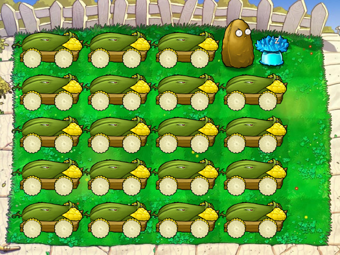

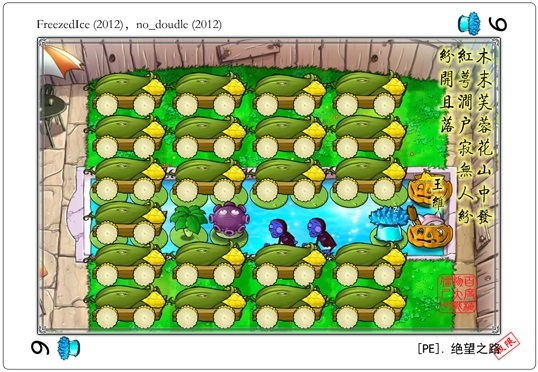

顺带提一句，4月开始ND就持续掉线了，毕竟之后的工作只是战脚本而已，不再需要他脑洞的支持，也因此到我5月发帖的时候，他的理解仍然停留在4月的水平，该说不愧是2么，名副其实。

该说是赶工期呢还是说偷懒呢，总之时间上为了三周年庆，难度上脚本过于复杂，非定态节奏的超多炮，也就只到此为止了，留下一个半成品和废话连篇的帖子，此后这个方向再没有前进过一步。

## 三、下半场节奏

爆肝两个月后进入了贤者模式，此后一个月不再进行持续系统的研究，只是和ND有一搭没一搭地交流想法，ND的脑洞层出不绝，相当一部分被我吐槽根本不现实，也有一些是存在可能性的我看不懂的东西，比如他曾经在茶校花贴吧发帖询问的无炮。与超多炮相关的则是他对于非定态节奏的怨念衍生了对“炮炸单边快速可以不刷新”的执着，尽管当时因为被蛇咬而成为惊弓之鸟的我一开始对此并不抱持乐观态度，事实证明是我想太多，有巨人的情况下，炮炸单边快速不需要考虑意外刷新的可能，于是ND就开始谋划半场12炮半场石英钟无炮的构型，当然，因为这个想法意外地简单，我于是鼓励他自己写脚本，不过他始终表示太困难了写不出来，然而其实就是懒（

很意外地，在6月1号，突然开始思索花花学姐发布的change 6节奏中，无冰一波并炸炮的发射时机。毕竟按照常识而默认的，PSD前4炮0.95预判发射时机，与之前的小鬼拦截根本就接不上。发帖询问后得到结论，花花学姐表示并炸炮就是紧随先前拦截炮延时2160ms发射的，于是自己的一个想法就能考虑落实了。

之前做研究的时候，对PSD的理解是摆满炮的半场必不可少的高输出，然而这样流于表面的理解是不科学的。尽管当初摸索FE双冰24炮、PE纯灰烬20炮以及非定态节奏的几个载体阵型时非常不知所措，也在重复大量无意义的劳动，但自身的姿势水平也得到了长足的提高。如果说此前的超多炮还是以花花学姐给出的一些脚本运行参数作为基本理论，那么这几个月的摸索，则是将超多炮领域的数据由模糊转向精确的前置工作。

为了让自己的想法有理论基础，当天中午吃完午饭，我就杀到学院机房，开始进行数据测试。这是对超多炮领域数据的第一次精确测量，需要知道的是拦截小鬼的时空参数以及用冰之后巨人的解冻时间，单纯依靠时空帖是得不到答案的。测试的方法很初等，用刷怪器大量产生待测僵尸，利用按键精灵脚本设置各种时机可调整的操作，结合植物动作持续时长逆推待测数据。原计划做到2点就去上课的，但是实在是停不下来，于是就一口气把阵容也做出来了。久违地独立思考探索，距离上次已经4个多月了。

发布的阵容是变奏22炮，搭载的核心思想是从PSD中扣取灰烬，将change 6的节奏在下半场压缩为|IP PD| PD。然而那时候毕竟思想上还是太low，仍然只把整个变奏考虑为一体，总数量上把输出要求从24炮缩减到20炮，对这个组合并没有更深入更多角度地思索，仅仅只是意识到这个节奏虽然在上半场无法成立，但如果是神之系列，上半场也同样可行，于是在时机尚未成熟的时候，过早地陷入对神16的考虑。

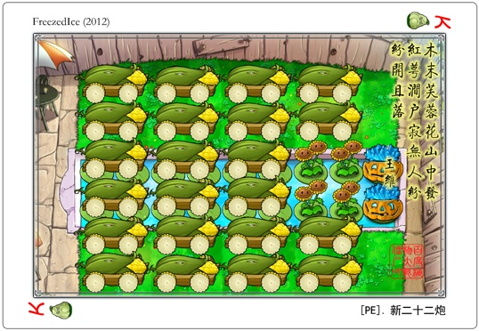

还是ND，在关键的时候提醒了我一句，在有风的屋顶，两个半场都能进行拦截。由于此前从未涉足屋顶，因此这里也成为了理所当然的华点。精神振奋的笔者旋即开始屋顶场地的攻略。

由于风的存在，如果不考虑存冰问题，就连RE20都可以存在。但是当时并没有合适的存冰手段，所以退而求其次，挖去两炮存冰，同时节省下相应炮位保护所必须的恰好同位两炮热过渡，RE18浑然天成。然而仅仅只有节奏是简单的，为了习惯屋顶的场地特性，不得不费很大力气测试RE场地发炮的时空属性，在确认了斜坡炮的时间修正与覆盖范围偏移之后还必须要进行炮位的调整，此外由于垫材的缺失，循环中的巨人撑杆以及红字前的拖延也需要小心斟酌，这些也成了节奏之外必须被说明的内容。

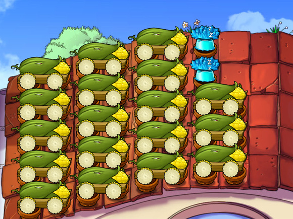

即使找到了将PSD压缩为PD的手段，以浅薄幼稚的观点，即从灰烬数量的角度观察，仍然仅仅只是把24变成20而已，离神16仍然是有一段距离的。与暴力的P6不同，change系节奏中代奏的灰烬卡不得不复用，因此效率大为降低，若不从根本上改变节奏，神16仍然是不可行的。

依旧没有将|IP PD| PD分解并进行深入剖析的我，并没有找到合适的处理方式，只是非常丧病地考虑连续复用|IP PD|，而持续时长也仍然控制在严格的12s，甚至连测试一下这变奏的安全时间范围的念头都没有，不得不说那时候的观念还是太死板。尽管连续用冰可以把灰烬要求缩减到18，但是仍然有2炮的缺口，经ND提醒，测试证明小鬼和矿工可以在后场一并处理，于是简单地直接使用这个结果，也并没有测试矿工的具体时间以及小鬼矿工的空间分布。不得不说那时候过于急躁了，从RE18发布到神16发布仅仅间隔3天，虽然之前多花一点精力精确化数据，之后的工作可以节省更多的时间，但是当时并没有这样的认知。

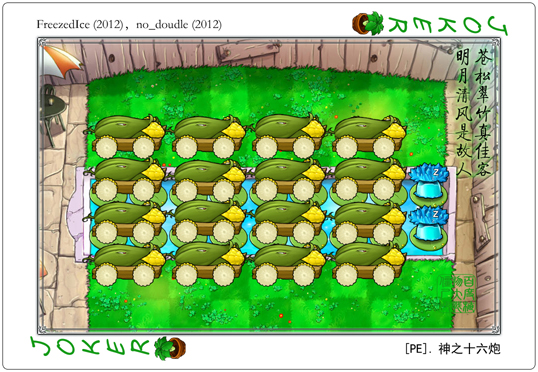

无论如何，节奏还是跑起来了，然而也仅此而已。作为必然结果，存冰不可能持续，这充其量仅仅只是表演阵容，然而它却得到了高度的赞誉和评价。说起来超多炮一直处于这样的情况，受到的关注和赞誉始终是高过其质量的，非要说原因的话，大概也就是因为炮多罢了。小白喜欢意淫超多炮，dalao也非常重视超多炮的发展，就连笔者本人，也是因为其外型和节奏而入坑。但是实际做下去才知道，很多看上去酷炫的阵容，真的不过如此而已，需要奇思妙想的地方不少，但是并不惊艳，也不成气候，那年的RE18和神16，都不过是给未来铺路的砖石罢了。

## 四、新世界的大门？

坑爹的神16发布后，ND一直想对其进行修正，不过我对此并不太上心，说到底最核心的节奏问题并不是代炮手段的细化能够解决的。原本该进入期末复习了，不过始终是停不下来。

那时候喜欢翻黑历史以加深对植吧的了解，不仅仅是文化上的，对PVZ的发展，尤其是超多炮方面，也很感兴趣。继续重复翻看超多炮老帖的时候在码字帝的⑨列炮上得到了灵感，针对change6必须双存冰的问题而提出了⑨列临时存冰的想法，成功修正了24炮的两种手动节奏并且给出了真正能够成立的DE19炮。ND立刻提出⑨列持续存冰的可能性，但是当时的我简单粗暴地否决了这个提案，理由未知，只能说当年图森破。

此后继续在老帖子中得到了灵感，翻到炮仔曾经说自己尝试用PD+C攻克24炮失败后，自己也有了兴趣。由于一个月以来超多炮领域数据的精确化，当天晚上在床上就完成了基本的简单计算，初步论证了可能性。虽说是日后非常重要的垫材代奏手段的首次表演，载体阵容的实现异常简单，毕竟节奏就是固定的一种，边听歌剧边完成了视频录制。

仅仅只是一个月，代奏手段的更新、⑨列临时存冰理论和垫材代奏的出现却已然极大程度上拓展了超多炮领域的可能性，即使是想比半个月前，那个所谓的神16也已经不够看了。数据趋于精准，而手段也愈发多样，新世界的大门，似乎正在被逐渐推开。

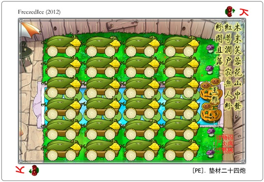

然而并没有被推开。

虽然确实是找到了一些神奇的手段，当时的眼界仍然还是不够。或许也是因为长时间都处在从传统理论到现代理论的转变之中，而且习惯于仅仅只是关注某个阵容，基于阵容而漫无目的地研发探索，散点般散落在各处的各大场地极限阵容，我并没有把眼光转移到他们之间的联系上。此外，关于6月的3个主要工作，其实各自也都还有很大的不足，并且这些缺陷完全不为研究者所自知。

因此尽管当时是我最高产的时候（总共发了5个帖子，独立的成果占了60%），尽管ND早已摆下2字炮阵作为16炮保护各种炮位的探索基础，此外也有其他吧友摆下诸如心17炮这样的不错的造型，尽管当时计划和ND一起在暑假拉上当初被我们超多炮帖子吸引的小盆宇共同做些研讨，看上去在这样的情形下研究戛然而止是挺可惜的事情，不过从之后的科技发展来看，让那个脑子发热并且钻进传统理论中各种不必要的桎梏里的研究者“头脑稍微冷静一下”或许是很合适的。

总而言之，关于PVZ的思考，中断了4个月有余。

在那期间，ND终于愿意动脑子把他的半边12炮补全，讨论后舍弃了下半场不必要的IO设置，改为半边无植物的构型。这回理论上的难度基本没有，因此我仅仅只是帮他写了个脚本而已，这也是ND第一个独立自主的PVZ技术贴，可喜可贺。

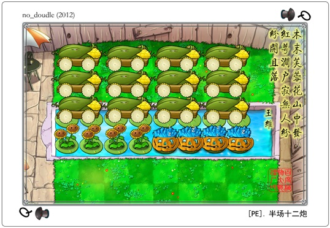

不过值得一提的是，那个帖子是偷懒了的。半边12炮面对红白眼的组合，利用的是炮炸半边快速不刷新的特性，但是对于只有红眼的情况，偶数F会出现红眼某波不刷新的情况，从而导致节奏的波动，因此这种僵尸组合也是最高难度组合，必须用其他的方案，此外对于完全没有巨人的组合，也需要采用另外的打法。当然这样的两个轨道都是存在的，并没有什么不可行的地方，所以尽管ND表示懒不想打，我也没有进一步坚持自己的意见，反正那时的PVZ吧，能看出这个破绽的，恐怕只剩码字帝一人了。

## 五、DE20与RE20

12年下半年，11月中旬。

不知道是抽了什么风，我突然想起ND此前一直坚持的⑨列持续存冰，并且莫名其妙地接受了这个设定，于是简单脑补之后上线对ND说“我突然觉得DE20炮是可行的”。

当然他只回复我省略号。

细节上的问题自然不少，毕竟所有场地都用来放炮了，不过只要解决了⑨列持续存冰的问题，一切也就不在话下了。从一开始就很明确认识到，⑨列持续存冰是个概率问题，不过实际演练后才知道，即使是出怪器刷的僵尸，在合理的保护机制下，冰被吃的概率也只是百分之一的量级罢了。

话又说回来，毕竟是DE20炮，细节上的问题绝不容忽视，然而时隔数月，处理起这些问题，似乎更加得心应手了一些。无论如何，有脑子有目的地做事情，效率总是更高一些的。总之，冰的保护、撑杆的处理、跳跳的处理、弹坑的处理、小鬼的处理、铲炮种炮的安排，变奏时间的微调，这些各种让人头大的问题，似乎已然有了个解决的脉络，从一开始就明白个中关联，不会那么毫无章法。当然，第19波的跳跳还是有些监介的，为了处理这个与弹坑相关联的判定问题，不得不将3路弹坑安排在奇数F，偶数F19波做出“战略性铲炮”的妥协，虽然一开始还是不太想接受这样的做法，不过很快也就释然了，并且这样的黑科技此前有过应用（花花学姐某阵容在快速组合挖曾哥），此后也有其用武之地（NE20、FE纯灰烬24等）。总而言之，将自己的思维束缚在不必要的牢笼之中，实在是过于愚蠢了，用按键精灵开F1的自己对死抱着“手动”“阳光”不放手的家伙进行过的嘲笑，说起来还真是没这个资格。

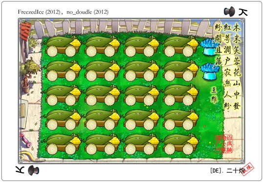

其实11月18之前就完成了阵容，不过ND死活要拖到下周再发帖，做出来这样的成果后总是希望尽快展示出来，可是他不发，我也没他办法。干脆就利用这一周时间把原理差不多的RE20也打出来吧，虽然我这么想，但是打出来之后他也不发，表示只发DE20，我赵日天只好服了。不过关于细节的阐述，在我的一再要求之下，总算是能让我满意了，虽然根据回帖情况来看，这么多废话或许真的不需要也未可知。

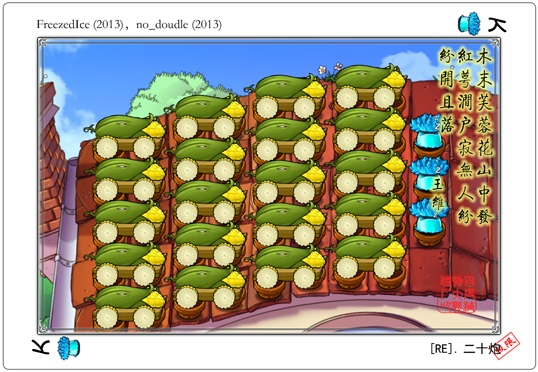

## 六、NE20

随着DE和RE的攻克，全场地最多炮只差夜晚场景的了。ME过于鬼畜就不考虑了，首先是NE的事情。

NE20的开发，我已经基本记不得了，根据ND的说法和我的一些模糊的回忆，大体是ND先自己利用无冰车的特性排布了一个轨道，虽然还是有一些问题没有考虑到，不过大方向上把握得很准确，因此基于他的排布方式，结合阵型运作的实际需求，首先确立双冰连用这个基础并且延长变奏时间，从这里出发往前后一步一步在细节上推倒重来，进行合理的配置。最后得出的结果，如果只看灰烬数量和轨道排布，那么基本上和ND最初给出的节奏没有出入。

在NE20中，值得一提的与冰的Ice3相同时间量级的，毁灭的1cs作用。NE20中为了应对5行的小鬼拦截+弹坑造成的某半场垫材使用限制，必须采用PSD+PD的组合，这导致炮的生效时机各不相同。毁灭虽然可以同时代2炮，但是这2炮是时间捆绑了的，因此如果扔在3路的毁灭无法拦截1路小鬼，代炮就无法成立。

头天晚上刚意识到这个问题的时候，我的内心几乎是崩溃的。不过无论如何我打算试验一下，毕竟和炮不同，毁灭的判定范围还是非常大的。事实也确实如此，颇出意外地，居然在脱手后0.01s，核武能够拦截到飞出的小鬼。于是这个问题就这样不为人知地解决了，尽管它要比Ice3来得惊险，然而无论是最初那毁灭性的打击，还是最后绝处逢生的1cs，没有实际研究过那个节奏，怕是无法想象到我当时所感受到的冲击吧。

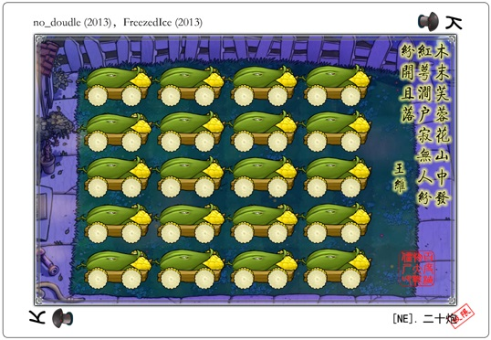

就算NE20完成了，我们也仍然不认为ME20是可以考虑的，多了冰车，少了垫材，NE的处理方式根本就派不上用场。所以就这么收官好了，抱着这样的想法，把PE和FE24炮做了优化，并且给出了RE19的解。PE24炮是基于精确计算后优化了所有细节的产物，为示游刃有余，录视频的时候故意带了4张紫卡，最后极限组合阳光增长了75；FE24则结合了冰变奏与垫材手段，最初由我打出阳光下降170的视频，经ND优化轨道后节省了150，阳光仅减少20；RE19则是校正数据后的产物，此前听信花花学姐11.22s的说法，因而否认了RE19的稳定性，但实测结果是11.70s，因而成功续了0.48秒的命。虽然NE19暂时无解，不过我们在内心里就这样宣告，全场地全炮数已然完结了。

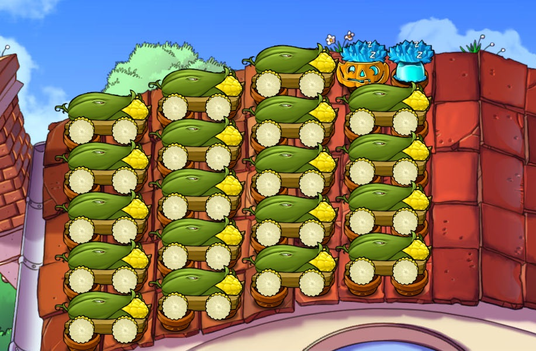

话虽如此，摆明了一起发出去肯定有很好的视觉效果，说不定过年的时候置顶挂一星期都成，结果ND非得拆开一个一个发，也是有智商任性（

## 七、撸炮贴的诞生

此外还进行了一些测试，关于倒计时的假说。这些东西我一直在植吧搜索，但是始终找不到确切的说法，甚至消息源也弄不清楚，在自删帖还不存在的那个时候，只能说百度的吧内搜索太辣鸡了。总而言之，用按键精灵弹窗这样的非常幼稚的功能，大体是对刷新机制有了个初步的概念，更进一步的探究无法进行，因此只是作为假说发布罢了。

最多炮补完（伪）之后，也就没有继续做东西了，那段时间注意力转移到恶补童年长篇上，整天跑隔壁宿舍通宵看柯南或者足球小将。5·1假期的时候倒是心血来潮，让ND发一个超多炮答疑帖，看看能不能找到什么新的想法，不过似乎没有什么值得留意的内容。茶校花倒是在帖子里提到ME的更多炮，不过即使其他场地20炮已然出现，ME仍然缺乏想法——说到底，尽管RE的阵容打了好些，ME我始终没有涉足，码字帝的超多炮，ME16是一直没认真看的。

和那个帖子是否有关，此前是早有想法还是单纯地水到渠成精满自溢，现在已不可考了。能确定的就是6月份实习前对ND说，想要整合一个超多炮的理论帖。原定计划是和之前的几个帖子一样，把关键内容告诉ND之后让他发布，但是整合的内容出乎意料地越来越多，更是温故而知新，给出了许多此前没有的内容，此外那段时间刷PVZ吧频繁了一些，着实被风气和部分ID恶心到了，于是决定自己发帖，顺带群嘲一波，虽然被灯笼勒令整改了（

作为基础部分的数据解释说明，一些是基于此前的结果，另外一些则是为了这项工作而特地进行的，实际测试之后得到了相对详细的数据，在后续的工作中也起到了不小的作用。理论部分则提出了“压制强度”的说法，ND一直表示这个理论并没有什么卵用，而且从来没有听说过，然而哪个理论不是人提出来的哇。

当然，对压制强度进行分类，确实意义不大，或者说分类标准就是数格子，此前一直都是这么做的，以后也一样。虽然现在有尝试把各个格子的压制强度数据输入，让计算机辅助思考可行解，不过这是最近的事情，而且未必有什么结果。在当时，特地设置那样的分类，或许我只是为了行文方便吧

帖子的内容主要还是整合，大都是以前做出了的东西，分类讨论后可以讲得更清楚罢了，当然也有助于理清思路。真正算得上是新东西的，中压制补完了ME13-15，强压制让变奏时间更加灵活，引入ch5从根本上改写节奏以压缩输出，为此特地把1年前的2字阵拉出来挂。

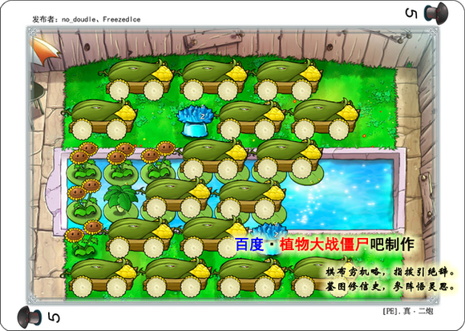

此外就是在变奏时间上走极端，采用ch4实现ME18。

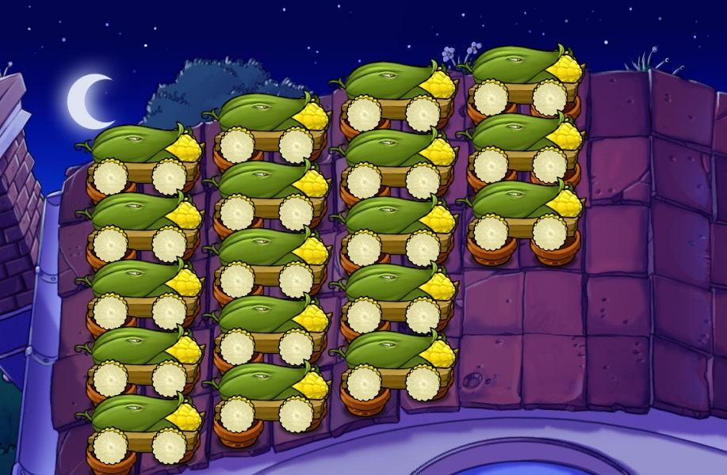

之后没过几天，吃饭的时候突然想到利用上界之风的判定拖延时间，把无冰一波的炮炸和用冰一波的热过渡组合为拦截炮，给ND发消息拜托他帮忙测试，得到理想的结果后回家打视频，从巨人的角度确实完成了ME20的存在性证明，当然稳定性至今无解，无论如何18s一波的用冰是必须要有的。说起来实际录ME20的录像的时候，后排悄悄说一句我是把小丑不炸给钩上的，所以视频里小丑从来没爆过一次，不然赌RP真的是很难受的事情，虽然小丑炸阵容的概率本身不算特别大，但是原本小丑和扶梯的啃食就是很讨厌的事情，此外录制视频的时候对精度要求较高的节奏非常容易出问题，实在是不想引入更多的变数……阵容本身不是稳定的，这一点从来就没有否认过，不如说一直在强调这点，所以录制的时候稍微偷懒一点，大概也没什么问题吧（

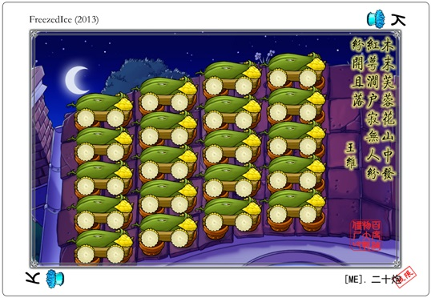

虽然之后还有我补完火焰16、ND发布天台8炮，不过和合作基本没关联了。13年暑假之后，超多炮理论这一块就一直处于沉寂的状态，PVZ的后续研究也一直是不认识的ID做着我看不懂的东西。事实上在撸炮帖发布之后，我的PVZ研究就已宣告结束了，虽然还是会在饭点和睡前刷一下植吧，不过就算是有新的科技，也就只是点进去看看主题是什么，细节一概不多看了。尽管此前考虑过针对阵容的压制强度可以列出很多线性不等式，可以让计算机辅助进行可行解的探索，这些东西也就统统扔给ND，看会不会有什么新的发现吧。

我和ND合作研究的成果已经给出了一个相对成熟的体系，同时也留下了许多待解决的问题，上述楼层留下的思考题就是其中的一小部分。据ND说现在1群有一些对超多炮甚感兴趣的小盆宇，不知道在他们手里，这个领域可以发展到什么地步？无论如何，随着科技的推进，比起单干，持续的合作会更有效率。

以上，关于12年之后的超多炮发展及合作研究的回顾到此结束。另外，希望下次植吧集体诈尸的时候，可以在超多炮领域，看到不一样的天地。

---
>注：原文并无小标题，系为阅读之便所加。