# 七代炮阵史
## 后冰骨架往事

> 作者：Crescendo（[🔗bilibili](https://www.bilibili.com/read/cv17018442)）
>
> 发布时间：2022-06-08
>
> 收录日期：2024-05-05

## 序

近几日与某人闲聊扯皮时，提到好像我的所有文章风格都很学术，透露出一股浓浓的理工科味。我辩称这也是情非得已，受体裁内容所限罢了。其实像风云录这样的，本可以夹叙夹议走轻快路线，奈何其信息含量之大与密度之高决定了这种牺牲一部分效率的表述方式并不合适。

另一方面，我一直有想为键控炮阵写技术史的想法。即使只看公开资料，最早也能追溯至今年一月炮伤概率发布时。尽管如此，到真正下决心动笔又花了许久，时至今日连浩浩荡荡的十三年植吧史都写完了，技术史依旧不见踪影。

此前几番起稿，都涂涂画画后仍甚觉不满，只好作罢。身为技术玩家，思前想后却不知从何处对“技术”下笔，真是“不识庐山真面目，只缘身在此山中”。

最初几版里，我还试图为创吧以来的键控炮阵发展写一部总览全局的通史——然而事实证明我想多了，通史的枯燥乏味程度远超想象，且历史细节之处极难考证，很可能变成既不诙谐也不准确的两不像的鸡肋文章。

重温旧贴时，我翻到了《从0到1》和《冰冰与ND的超多炮历程》。这两部作品都是历史上曾经出现过的自述性技术史记，全面覆盖了第一代至第三代炮阵史。可惜自第四代起这里就断代了，据某人说有填补这一块的打算，那我就静候佳音了。总之我最终决心效仿此二者，将时间框架限定在2020年末以来，至2022年初的这段时间，专心致志地讲好第七代技术党的故事。

啰嗦了这么多，应该做一下自我介绍了。我个人涉足的PVZ领域较多，据说所有围绕PVZ可能存在的玩法都可以在我个人空间里找到（大雾），这里就不展开讨论了。

本文关心的是炮阵技术史，那么在键控炮阵领域，我在21年初正式入坑，主要技术活跃期至同年11月结束，能拎上台面的视频总数小一百个，勉强低于阿b单个合集的上限。这一年也是第七代技术党在炮阵领域最活跃的一段时期，我有幸接触了许多有才有趣的PVZ玩家，共同创造了许多技术与人文成果。

接下来，请允许我将你带入第七代炮阵技术党的世界，借用他们的眼睛，看一看这一年内发生的天翻地覆的变化。

## 1. 乌云

对近现代物理历史有了解的读者想必很清楚乌云二字的隐喻义……好吧这句话其实是语C，不过挪用过来倒也很合适。

要讲“后冰骨架”，得先说说这个“冰骨架”是个什么东西。

如果这是一场官方新闻发布会，那么这个问题的答案是：冰骨架于2018年正式提出，是基于循环复用、极限波长、弱逐波方法三大核心的一套昼夜皆适用的键控炮阵解阵理论。

如果您听不懂这些是什么，不用害怕，我会用尽可能通俗地语言不准确地解释一下上述装X词汇。

循环复用最简单，假设我有八门炮，按一定顺序标号，例如从1号到8号，用完1用2，用完2用3……用完8后再用1，这叫循环。再假设我有一个节奏，根据此节奏运阵，那么请问重复节奏时，有必要每次都严格使用同一门炮吗？显然没必要，每次用炮时场上存在至少一门已恢复的炮即可，至于这门炮具体是哪一门并不重要，这就是复用。

……你说这么明显的事情谁不知道还需要单独提？好吧，毕竟真理往往都是很简单的嘛，况且当时还在按键精灵时代，其特性决定了每次发炮时都要明文指定欲使用的炮位，远不如今天pao_operator自动找炮完了还能告诉你差1cs恢复那么便捷。

关于极限波长，听着玄乎，其实就是无视了巨人和小丑后的无伤波长。巨人和小丑固然有威胁，且威胁还不小，但当时暂缺成熟的计量方式，那么干脆先无视之，把剩下所有僵尸（主要是冰车和扶梯两位大佬）各自的威胁取最大值，得到“最大安全波长”，即所谓极限波长。巨人的话垫一垫解决，小丑的话脸一脸解决，很轻松啦——至少当时是这么说的，信反信。

在解阵时，结合使用循环复用和极限波长，可以较快速地排布出一套循环解。极限波长负责拖时间，将每一波都拖到不可再拖；循环复用则可以检测最大拖延的情况下，某一节奏能否成立。

光有这些仍旧是不够的，因为不是所有阵型的最优解都是循环解。哪怕最简单的FE八炮带双核打P6，PPPPNN，这个节奏本身也是无法循环的，但连杯杯都知道从第一P起手，NN后还能接4次P，6+4=10已足够安全渡过1f，可见不循环的节奏作为逐波仍可能成立。

所谓弱逐波方法论，就是先确定一个看似可以循环实则差一点点的节奏后，选取特定波次起手，配合一些特化操作，使其在1f跨度内成立。它意识到了炮与灰烬间的可相互替代性，顺势提出冰作为最节省运算量的神之绿卡的唯一特殊地位，提倡以冰为纲的布轨思想。

关于冰骨架的介绍就此打住。时间来到2020年下半年，此时距离冰骨架提出已过去近三年。这段时间内，“冰骨架”声名远扬，脍炙人口，懂炮阵的不懂炮阵的都爱谈一谈《零度三连》，倍有面子。白昼场地，基于冰骨架理论的新式连续冰波被陆续开发出来，气势如虹，有人甚至直接把连续冰波当成了自己在植圈的ID。夜间场地更不必说，本就是冰骨架的大本营，各类狂拽炫酷的拉风阵型琳琅满目，展现着但求一败的常人无法比拟的孤傲。

我承认以上描述有添油加醋的成分，不过在当年，冰骨架大抵就是这么火。可在表面的欣欣向荣之下，冰骨架许多潜在的问题也渐渐暴露了出来。一长列整齐排列的骨牌，其实只要碰倒一块，便会全部哗啦啦地落下。

## 2. 穿越

不得不说，在任何年代的任何时间段，总有那么一两个自带穿越特质的人，例如09年的jxq，10年的特斯特拉，11年的某魂……这个名单还可以一直列下去。

这倒也没什么可奇怪的。万物生于有，有生于无。哪怕是被某些人誉为“从天而降，普照众生”的冰骨架出生前，早就有了许多“冰骨架雏形阵”，看一眼就知道麻雀虽小，五脏俱全，什么循环复用极限波长弱逐波统统一网打尽，和典型冰骨架阵无异。再比如零度三连里的一些节奏，如C8u等，有人误以为是首发，其实一年前C8u就已经正式提出而且叫这个名了，遑论13年就已有类C8u节奏的实践。当然，正式提出者与全面推广者仍具有其不可替代的历史意义，这是无从否认的。

在2020下半年，以上道理仍旧适用。当冰骨架大行其道之时，极个别人已经悄然突破了思维定式，发出来自未来的呼唤。

我们要讲的第一位穿越者，是于20年3月入坑的少年乙。他有两个外号，对年上称“年宝”，对年下称“水哥”，另有小号“法定的XX人”一枚，是近年推动全面依法治囯的主干人物之一。如果用一句话总结他的炮阵历程，那就是“彪悍的人生，不需要解释”……咳咳，搞错了，应该是“以个人天赋碾压炮阵而完全不需要依赖其体系”。

客观上说，他留给后世的阵型总数并不多，大概一只手就能数过来，但这丝毫不影响他作为第七代以来最优秀的炮阵玩家之一的地位。他所创造的最复杂，也最为精妙的阵型之一，ME蝎十一炮，发布于2020年9月，而其所承载的操作元素与运阵理论，少说也领先了主流科技半年乃至一年之久。

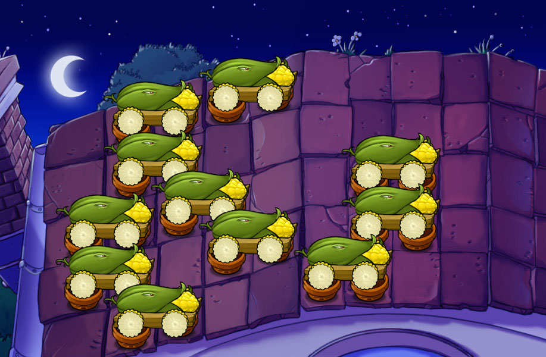

当年这个阵刚出来的时候，我也有关注，然并卵，看了也看不懂，尤其我当时还只是一个主攻少炮与IZE的玩家。原视频下我没有评论，只在某群聊里聊到此阵时撂下过“我感觉位移铲种破坏造型挺可惜的”这样一句不明所以的评论，如今看来实在是有点难绷。

至于当时其他炮阵技术党们，我相信他们中的许多人也是看不懂的，理由就是直到2021年8月评往年鸽莱美时，论及20年最佳炮阵可否给蝎11，这才开始第一次对此阵的稳定性进行全面探讨——最终还是冰轮用年年自己提供的脚本，跑了数次选卡后，才得以确定那套解法是非常完善的。

很久以后，我才意识到蝎11是唯一真正称得上是“参数6逐波”的阵容，时至今日仍是如此。它和冰骨架没有半毛钱关系，从一开始就是绝对的强逐波。它对关键复用片段，起手收尾特化，以及结合特定阵设特点极致压榨运算量等技巧的运用都是出神入化的。而从蝎11发布，到它真正被理解，经过了将近一年时间，这还是在炮阵科技迅速发展的时代背景下。

和年年私聊时，他告诉我他对先前的技术成果一概不知，刚入坑时还闹出过“发明”连拦结果翻冰冰贴时发现早已有之这样的乌龙。他参考的外部资料极少，几乎限定在撸炮贴与零度大表这几样，却能留下领先时代的高质量技术成果，凭借的或许是他个人的游戏理解，或许是精益求精的严谨态度，或许更是他与生俱来的伽罗瓦式的做阵天赋。

在这个世界上，的确是有天才存在的。

## 3. 转变

参数转变是什么？能吃吗？

2020年10月，蓝色风格发布ME20炮无铲种新解，其采用的节奏略显反常。第一循环节双冰连用，是参数7下的“邻冰位”，一切正常；可到第二次循环时，为掩护白冰，没有严格按照循环节奏执行节奏，而是将刚刚恢复的两炮立刻打出，插入一个加速波，制造中路火力重叠，保白冰平安。

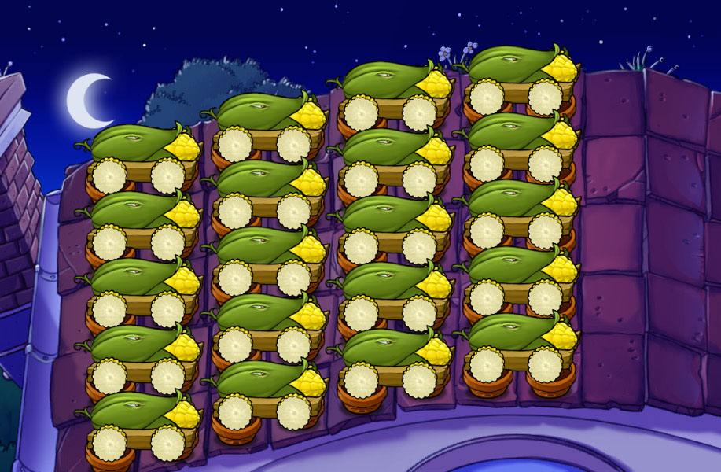

事后我们知道，正是这个阵型首个实践并提出了“参数转变“的概念——当时应该没有直接提出这四个字，而是称作“邻转间C7u”之类的，不过这只是细枝末节。这个将邻C7u与间C7u无缝衔接在一起的逐波节奏，一经发布就引来了许多关注，甚至我和空空作为两个少炮玩家私聊时都提到了它。

从传统冰骨架的视角来看，这套操作是十分光怪陆离的。长年来，我们认为冰是绝对的老大，炮核樱只是为它打工的小喽啰，因此始终把冰效率放在第一位，宁可炮等冰，不让冰等炮。可在蓝色的这个阵里，额外加速波的插入不仅可行，而且必要，发挥着至关重要的作用。尽管新加速波引入了撑杆和三血红等需要用额外运算量处理的烦人僵尸，但如果没有这两炮，白冰根本无处可放，模仿者被巨人砸成相片后阵型会直接告破。

终于，参数转变悄无声息地浮上了水面，或者更准确地说，它露出了冰山一角。实事求是地说，这个ME20的打法本身存在一定问题，细节之处也不够完善，冰波拖至1672过长，有投篮碾冰、漏跳跳等多重隐患。但不可否认的是，它就是第一个参数转变的完整载体，将灵机一动的想法落实到了轨道上，从无到有地证明了其存在性，这就已经十分足够了。

## 4. 东风

先前积累的这些准备工作，已经足以构建一套与冰骨架不同，甚至取冰骨架而代之的新理论体系。需要的只是有那么一个人，摆出那么一个阵，正式宣告新时代的开始。

万事俱备，只欠东风。

这股东风，终于在2021年2月吹了起来。2月13号，冰轮新浴发布了NE三花18炮，原名为“膜柯林18炮”，不过这个阵型还有一个更响亮的称号——后冰骨架时代第一阵。

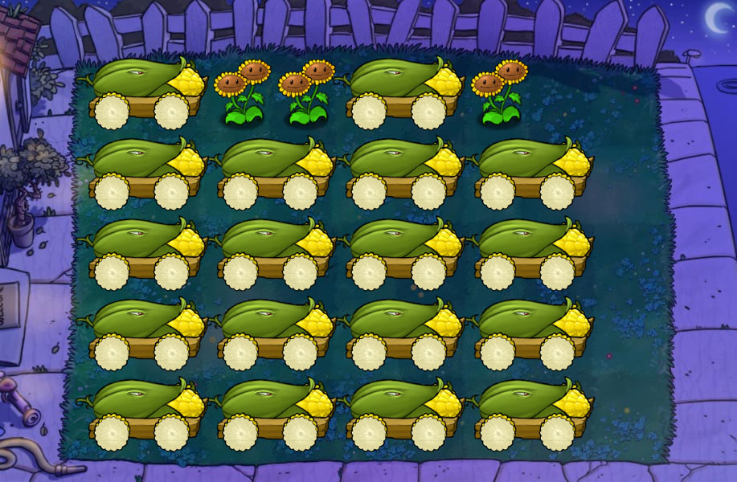

在描述运阵细节与解阵思路的贴子《冰骨架与炮骨架的对话》一贴中，冰轮提到他做此阵的初衷是想应用参数转变，为间C7u转邻C7u找一个载体。他从“1610+601+664+601=3476”的恒等式出发，抛弃以往以冰为纲的思路，着手以炮CD协调各级运算量。

他说，这是一个用常规冰骨架思路无法解释的阵——如果套用C7u的框架，一次“循环”的总长大概是1354+1610+601+664+601 = 4830，甚至小于冰冷却，如果先选择参数解阵的话，很可能从一开始就错过了这个解！

这句话就像一颗重磅炸弹，二话不直接把屋顶给掀翻了。此前，即使有人意识到冰骨架有问题，可能部分情况下并非最优，但“先选参数再做解”是天经地义的事情，从来没有被否定过。先有循环，再截取相位，导出逐波，是所有人公认的操作流程。如果带着旧时代的有色眼镜看，那么这种离经叛道的行为简直是做了一个违背祖宗的决定。

然而事实胜于雄辩。人们发现，原来冰骨架不是100%绝对地正确，原来冰骨架并不能解释一切；原来冰骨架也会漏解。

在炮阵领域，怕的从来不是思路不完善，而是从一上来就忽略了某些思路。历史上有无数这样的例子：某些阵ch6死活打不了，改为ch5就立刻得解；一些ch5打不了的，ch5u轻松完爆；ch9解不出的，C8u可以碾过。从后验视角看，这些节奏之间都是高度相似的，只要转转脑筋抖个机灵就出来了，可这恰恰也是最困难、耗时最久的一步。

当“漏解”的魔咒降临时，新理论与新秩序就已经呼之欲出了。

这个NE18之所以能够称作后冰骨架时代第一阵，不仅因为它创新程度高，解阵思路新，更因为冰轮为它附上了详实的文字说明，将他许多个人想法整理成文，发表于《冰骨架与炮骨架的对话》一贴中。

如果现在回看那篇文章，抛开里面一些比较伤春感怀的哲学思考内容，其实后来提出的许多新兴概念，都可以在那篇文章里找到踪迹，包括关键复用片段、先排关键复用片段再排首代尾代、使用炮CD协调节奏等等。出于某种考虑，冰轮将这些新理论统称为“炮骨架”，大有和“冰骨架”成对立之势的意思，不过这种“炮骨架”当然是和历史上那些个经典节奏没有半毛钱关系的。

新世界的大门，正在一点点被推开。

## 5. 口粮

从炮阵领域，到键控炮阵领域，再到精确键控炮阵领域，对精度的要求越是高，对计算能力的要求也越高。对于活跃在一线的键控炮阵技术党们，精准的植僵时空数据与对游戏底层机制的准确破译，是技术研究基础中的基础，其重要程度几乎可类比为口粮，一顿不吃饿得慌。

遗憾的是，如果将数据比作口粮，那么从2019年起的两年时间内，炮阵基本长期处在慢性饥饿状态，闹着全领域范围内的饥荒。

诚然，零度于20年4月正式发布了随机数修改器，还附上了锁随机数极值得到了较精确僵尸数据，后者就是那张许多人都见过的黄色图片，也称作“零度大表”。

然而数据挖掘这条线，到这里也就断了。

我相信零度对技术有深刻的理解，也有完善的个人工具，可是其他人，特别是最需要数据的炮阵技术党们，并没能继承他的技术栈。即便是最简单的像零度表这样逐帧读取僵尸状态的事情，许多人都是做不来的。至于更复杂一点的，比如计算植僵攻防判定距离，求僵尸精确位移，还原小鬼飞行轨迹，亦或自行编程测定某些数据，就更是抓瞎了。

于是你会发现一种怪异的现象。许多最基本、最简单的数据问题，一靠祖传，二靠盲猜，总之先把脚本跑起来，出问题了就再微调脚本，再不然就把烫手山芋甩给第三方，比如“巨人相位干扰”“延迟引信干扰”“脚本卡顿”……千错万错，反正不是阵的错。

如果你不信我以上说的，可以穿越回19~20年，去大街上随便找一个炮阵大佬，问问他：完防投篮的极限波长是多少？热过渡最早时机是多少？最右炸点是哪里？给定某个炸点，如何求不漏小鬼的拦截延迟范围？想要无冰或有冰分离ABCD僵尸的最早时机是？冰波垫梯丑的最优时机是？恐怕大多数问题要么没答案，要么只有一个模糊的约值，即使这些问题并不刁钻，也不罕见。

要研究这些问题，其门槛本身并不高，相关基础理论早就被10年的yxq和19年的不在宝前给懂完了。然而万事只怕认真二字，猜数据也是数据，严谨计算数据也是数据，一切只在一念之间。

很幸运的是，随着新一代技术党抬头，不仅涌现了一批解阵好手，更有极个别乐忠于研究游戏底层机制与精确数据的人。他们中的代表人物就是Elovi，又称小e。

说来小e刚入吧的时候，还是2020年9月，他发了个贴子叫《填几个坑，楼下发图打视频真的太麻烦了，ch4要拖满三个收尾时间，稍不注意就翻车…》，非常蠢萌（雾）。从事后来看，做阵，或者说打阵似乎的确不是他的专长，这里面部分因素可能是他的三次元同学知道他的b站账号，因为用的都是同一个id，于是每每当他发pvz视频时就会招来一通吐槽……我也是醉了，属实是个人信息管理不善。

2020年12月，小e转战数据挖掘，很快就学会了零度开发的rtvz测试框架的使用。他随即用rtvz测定了完美预判冰下投篮的极限波长，以及超过极限波长后的具体砸率。多年来，围绕“冰波投篮无伤波长”这个“未解之谜”可以说是众说纷纭，从古早的1975，到1930，又有人说1937……最终小e一锤定音1929，打了所有不懂底层游戏机制还喜欢在纸上一通乱算言之凿凿的人的脸，用实际行动证明了没有金刚钻，就别揽瓷器活。

解决这种简单的问题，只能算是道开胃菜。

2020年年底，小e通过对土豆爆炸范围与矿工速度的精准计算，给出了1列~9列所有位置精准土豆的种植时间范围。

2021年2月，他使用rtvz测定了各个冰时机下所有僵尸的坐标极值以及其随时间的变化，并于3月制作了分离数据大表，详细列出了不同场地下生效于某一行的炮每cs能分离的僵尸种类，兼容无冰分离与有冰分离。

同月，他编写并发布了精准模拟小鬼行动的python脚本，而这个东西经过我和他约两个月的升级与修订后，变成了一个大名鼎鼎的exe文件：拦截计算器。

同样在5月，我们在零度的帮助下还原了游戏内僵尸位移的精确机理，为从纯程序层面精准模拟游戏运行的bvz框架铺好了路。

回到本章开头的比喻。如果说数据是口粮，那么小e的出现，辅以他与其他炮阵技术党之间的密切合作，基本上为两年以来的数据饥荒画上了句号。唯一不变的一点大概就是零度仍旧是反汇编方面的幕后大boss，从这个角度上说，我和小e等人不是粮食的生产者，我们只是粮食的搬运工。

## 6. 得道

俗话说：师傅领进门，修行靠个人。

在我个人的炮阵历程里，“师傅”这个角色大概是不存在的。不过我精神上的导师有两位，不妨和大家分享分享。

第一位是我的本命爱豆，六代最优秀的炮阵技术党之一，冰巫师墨舞，也被称作“胡”。21年之前，我虽然会键控，但也只是写一些简单的自由炮阵或少炮阵的脚本。

真正对键控超多炮感到兴趣的契机，是我看了胡的视频后惊为天人，感叹世界上竟有如此工整，严谨且精致的炮阵视频。从精密的轨道排布，到精确的自动发炮收尾，再到很合我口味的日音BGM与不明觉厉的哲学式简介……这些大部分发布于18~19年的老视频仿佛一件件艺术品，丝毫未随着时间褪色，反而愈显韵味。

“想成为和胡一样的人”，这就是我入坑超多炮的初心。

我的第二位精神导师，就是前面提过的少年乙。说来惭愧，自我入坑起近一年的时间里，我和年年虽然活跃在同一群聊中，却鲜有过技术交流，大多只是插科打诨罢了，想来也是因我尚未对超多炮萌生兴趣之故。

2021年4月某日凌晨，年年毫无征兆地退了所有群，顺带自删了所有b站视频。当时已过凌晨一点，群里也只有泠衣、雪雪与我这样几个人还在。震惊之余，我们当即的共识是二次元无所谓，三次元人没事就好。泠衣和雪雪想必是去私聊年年疏解郁结了，我虽也担心，但此前和年年关系并没有那么近，连个人好友也没加，只好默默打开PVZ，写了个他的处女之作肺16的脚本，并上传了视频，作为某种纪念。

几天后，在机缘巧合之下我拿到了一份年年写的脚本。里面的内容直接让我傻了眼：详尽的注释，严谨的时机计算，逐波编写的操作，连女仆秘籍的开关都是严密计算过的，甚至收尾也是智能判断的。从代码的细致程度与绝对字数上，就能看出其作者早已运行了这套脚本无数遍，有着绝对的自信。它不再只是一串符号，一个工具，更是一只精致的钟表，一件工艺品。

我当时自嘲说，看了年年的脚本之后，再看自己的脚本简直就是手扶拖拉机。大概就是在这个时候，我暗自下定决心要认真对待自己的每一个阵，绝不再得过且过。

这场风波过后，我的心智似乎被磨炼得更成熟了。曾经日夜欢笑水群的网友，一夜之间人间蒸发的滋味，的确是很奇妙的，仿佛老天有意告诉你，你已经不再是那个没心没肺刚入坑的新人了。那些和你同期入坑的，曾经陪你一起闲聊云阵的，总有一天都会默默转身离去。

## 7. 求索

自21年2月发布第一个键控超多炮阵起，我开始了总计三个月左右的探索阶段。

这段时间内，各种逆天脑洞很多，各类可行或不可行的科技也都试了个遍。由于还没学会判定计算，又找不到公开可用的数据，每做一个阵都得单开一个存档，锁定随机数后调极限出怪测试时机与落点。辛苦与麻烦自不必说，但也算是乐在其中吧，每次发布视频后都是小有成就感的。

然而探索过程并没有想象中那么顺利。

当时为了做阵，查阅了许多资料，但查着查着就越发觉得事情不对劲。有些看似稳定的“范式”，实际上经不起推敲，跑几次选卡就会暴露出问题；许多对外宣称“得解”的阵型，其实也是张空头支票，一部分依靠幸存者偏差录个2f视频作为表演，有些更加明目张胆，录制时就用修改器做一些手脚，使迟早药丸的阵型运行时能看起来稳如老狗……这简直如同植吧的表面一样坑。

在这样的故事背景下，我遇到了QED4，也就是人们口中的“Q姐姐”。TA的实际性别至今仍是个谜，本着“疑女从男”的态度，本文暂以“他”指代。

QED与我同期入坑，但一上来玩的就是超多炮，比我早了半年左右，算是半个前辈。我们最大的共同点，大概就是网上冲浪强度极高，创作巅峰期轻松突破一天一阵，从早到晚都泡在群聊里钻研各种技术，硬是把游戏玩成了社畜工作（笑）。

21年3月底，QED加入小e群，我与他结识后一拍即合，开始没日没夜地讨论各类炮阵问题。当时的我刚做完第一个拿得出手的炮阵作品，也就是对NE神之12的修正。

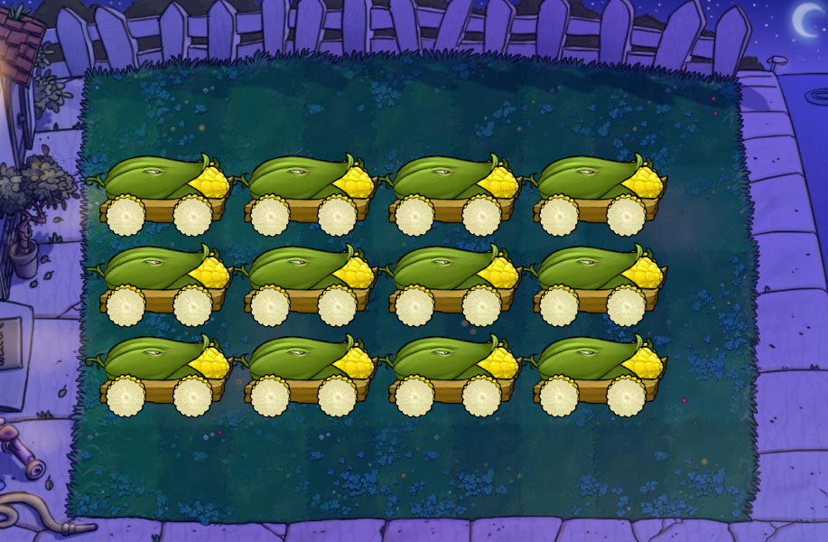

大体思路上和原阵无异，但原解因为参数6的复用问题，不得不在最后一个加速波引入冰杀小鬼，看着都蛋疼，有必要予以修正。

我用Rnd简单测定了最晚全垫舞王的数据后，算出加速波最晚可在388左右激活（精确值389）。要复用尾炸炮，则需要有一炮延迟129拦截，可在NE场合这无论如何都是做不到的，偏偏差了一点。我很快想到，既然炮不行，为什么不试试核呢？借助小e的py脚本，我确认了1路核至多延迟190都能稳拦下三行鬼，绰绰有余。此外，我也顺手做了一些其它方面的优化，删去铲种，并且修正了原变速解漏跳跳的问题。

和QED的聊天中，我对彼时的科技进度以及一些著名问题有了初步了解。当时不知道是哪个乐子人，搜罗了各路无解阵型，做了一张“时局图”：

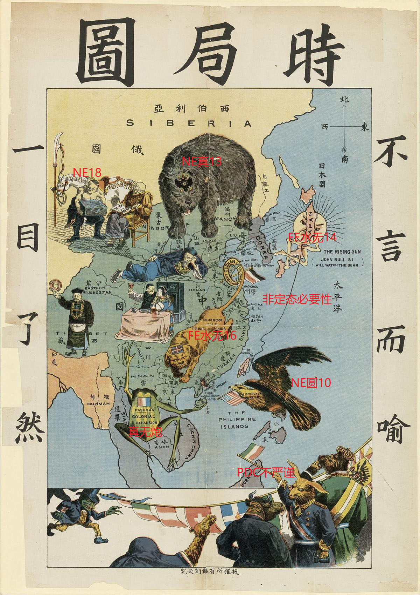

这些只是无数天坑的沧海一粟。

有人挖坑，就得有人填坑。4月上旬，我开始着手处理FE18守全的问题。摆在我面前的有两条路：一个是QED去年做的邻C7u解，另一个是柯林的间C7u解。

然而，这两个解各自都有不少缺陷。邻C7u有一波要用减速PDD分离冰车矿工，并黑掉一部分的梯丑。但万事过犹不及，由于分离炮可能伤到过多僵尸，加上不得不使用B分离海豚，即便是极限出怪都可能出现意外刷新然后在欢声笑语中打出gg。

间C7u方面，因为要用位移铲种，需要玉米当垫材，玩过IZE的都知道25%的黄油概率可不是闹着玩的，冷不丁定住一只巨人就能让整套拦截操作全线崩盘。除此之外，冰波后统拦连接两次精舞有不可避免的砸率，且原解下冰波海豚、加速波伴舞都有伤，大小问题不断。

无论如何，我决定先试试邻C7u解。QED版中，为满足最后一个加速波359激活的精舞的复用，前面的冰波要拖到1714。我联想到如果用NE神12那种垫舞王的方式，可以进一步延后时机，拖到388激活。藉由此技，冰波波长压缩进了1685，再配上智能脚本尽可能晚铲垫材，炮伤有了显著减少。虽然没能发射火箭，但也算是飞了个热气球。

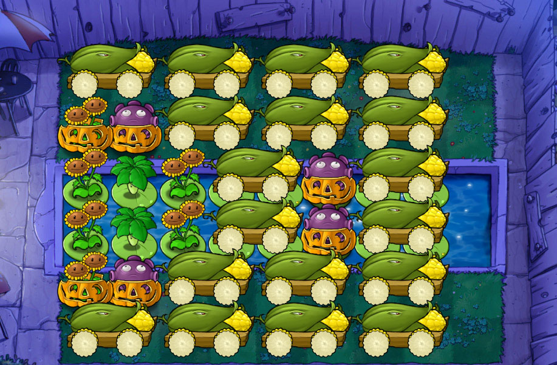

可惜以我当时的能力，能想到的优化手段也就止步于此了。尽管确认了减速PDD+388激活的复用方式很吃香，但最关键的意外刷新问题仍旧坑爹，甚至为了确保录制成功率还得使用锁定波长功能强行保胎，而这个功能用在这里与作弊无异。

无奈之下，我只好放弃邻C7u，转投间C7u。

QED曾和我说，前人已经试过了所有的参数7解，现在想来这个说法属实是比较搞笑的。刚开始研究没多久，我就意识到原间C7u解中的位移铲种似乎并不是必要的。理由很显然：阵型一共18炮，是偶数；所有激活炮拦截炮都是双边对称的，也是偶数，唯一的例外是冰波分离B，正好跟樱桃凑一对，因此位移铲种多出来的一炮并没有被用在任何地方。稍作验证后，果真如此，我竟一时泪流满面五味杂陈不知道该说点什么。

总之，黄油投手的问题就这么解决了。经过严密计算，炸海豚炮可以提前生效以消伤，因为1路炮拦2路巨人允差极大；同时凭借减速僵尸每8cs才判定一次啃食的新结论，冰波波长可以稍作延长，再微调精舞时机，加速波伴舞的炮损问题也解决了。

连续精舞的砸率仍旧棘手，不过我灵机一动想到如果以轻微炮损作为牺牲，换来零砸率，似乎是个稳赚不赔的生意，毕竟将心比心站在炮的角度上被啃几口总比直接被砸扁要好得多。那么极端情况下，就可以把最后一个加速波的精舞替换为常规PD，再在冰生效前垫撑杆，以引入杆损的方式避免了砸炮惨案。

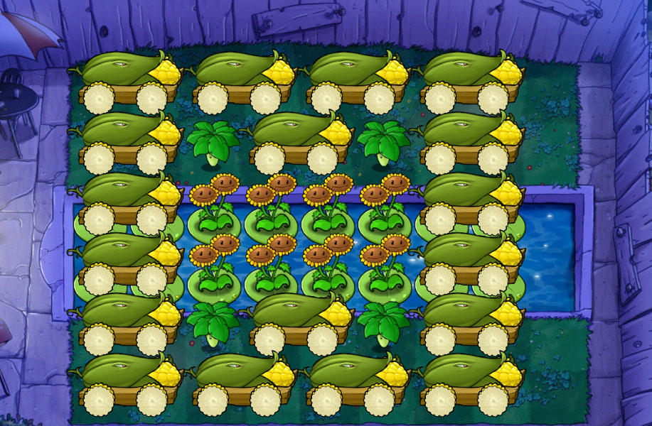

4月下旬发完优化后的间C7u视频后，关于FE18的讨论就告一段落了。我清楚这只是一个妥协解，远未尽善尽美，但在研究过程中我的技术进步是巨大的，这些做阵经验也将日后转化为解决其它方面问题的宝贵能力。另一方面，我也更清晰地看到了冰冷而残酷的现实，深刻地认识到了动口不如亲为求人不如求己的大道至理。

## 8. 淘金

说来，2020年8月我就被拉进Eden了。不过如同植吧风云录所记载的，那时的e群已经接近风烛残年破败不堪百无聊赖奄奄一息……好吧当然没这么夸张，但技术讨论的确很少见了，我在里面也因此常年潜水，偶尔产生的聊天记录什么的亦不曾仔细翻过。

直到21年某天，不知哪根筋搭错了，我突然想起去翻e群的群文件。不得不说qq群文件真是个很强大的功能。一通考古勘探过后，我找到了几个之前从未在别处见过的技术工具，其中就包括复用计算器与初版速度计算器，上传者都是零度。

复用计算器顾名思义，是专门用于检验某种循环或逐波节奏运算量复用情况的便民工具，和你们现在看到的版本是一样的。

而这个速度计算器就厉害了，它内置了最快巨人每cs的位移数据，支持分段输入，能够精确计算多段相位下巨人的行动位置。

要知道在此之前，相位重置问题始终是砸率计算的最大痛点。根据游戏设定，巨人投掷或砸垫后会重置行走姿态，回到最初的起点。又由于巨人行走并非匀速，这一来一去就会造成误差。这点误差听上去不致命，看上去无所谓，实际影响却非常大。许多纸面上“刚好成立”乃至“留有容错”的操作，实战里却可能不稳。它就像是把达摩克里斯之剑，谁也说不清它什么时候会落下，只能支支吾吾搪塞过关。

……而这一切难题直接被这个其貌不扬的excel文件给解决了。

2021年4月，我将速度计算器分享至当时活跃的几个技术群聊，引来众人围观。一通热烈的讨论与计算过后，验证了几个结论：

原先对C6u守7列节奏（如NE中开12、FE最后之作）是有砸率的；

连续PDc是有砸率的；

加速波接16s+冰波，只在冰波垫一次是不够的，有砸率。

前两项不是什么新鲜事，早先录制视频的时候就有人翻车过了，这次算是实锤。第三项是新发现，顺带着干死了部分“不拘小节”的阵型。

但比这几个结论更重要的，是对长期以来灰色角落的全面点亮。21年5月吧庆日，拦截计算器正式版发布；一周后我发布了“【Endless】常用数据”，集合了跳跳极限波长、屋顶PDD延迟、I3PD下扶梯撑杆炮损等使用rtvz测定的数据，将多个历史遗留问题一扫而光。

从2020年12月到2021年5月，经过六个月的时间后，砸率可以精确计算了，分离炸有逐帧数据了，热过渡炸点可以求了，跳跳投篮撑杆扶梯等僵尸的威胁程度可以量化了，全伤巨人落点以及小鬼拦截允差可以用拦截计算器算了。

在这一刻，我很想自豪地说，“数据全靠猜，翻车就重开”已成为过去式。键控炮阵终于回归了它原本应有的价值取向，重拾起了曾一度尘封的理性与客观。

终有一天，《超多炮笑话集》会变成一纸废文——这大概就是我当时的梦想。

## 9. 困惑

理想很美好，现实很残酷。

在更精确的数据框架下，更多的问题被暴露了出来，这就意味着要花费更多的精力解决。这些问题中最典型的钉子户，莫过于对C6u守7。

对C6u与巨人砸率间的恩怨由来已久。2021年3月，我做了一个叫“FE可拆卸全对称16炮”的娱乐阵，其大体思想就是把PE全对称16搬到FE，怒铲守不住的两门水路9列炮，关末再种回来。显然这只是一种行为艺术，而珍宝跟我说之前已有FE最后之作这一“14炮守7范式”，因此在技术方面应当是可行的。

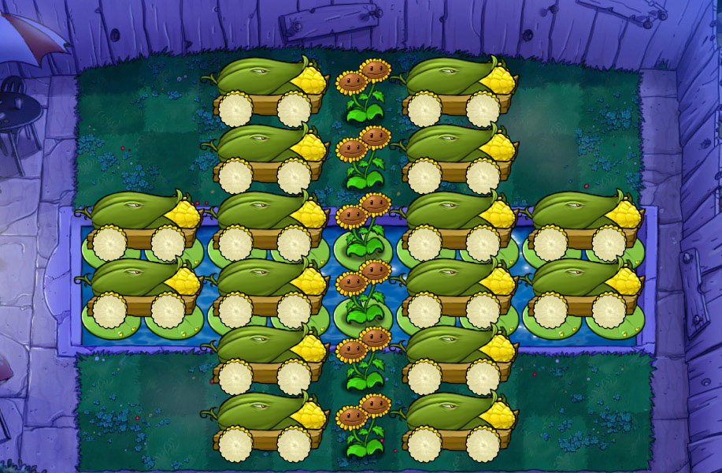

……然而乐着乐着就乐不出来了。重复调试脚本的过程中，我发现按原先那种对C6u打法，巨人是有明显砸率的！而且旧版本AVZ有个谜之bug，被砸炮后程序会直接闪退，跳Fatal Error，给沮丧的玩家来上当头一棒，雪上加霜。

士可杀，不可辱。草草把娱乐阵做完后，我决心跟对C6u好好算一笔账。通过录像分析，我确定了原解的砸率主要来自于加速波出生的巨人，其根源在于每波只垫了一次，压制力不够。此前，NE中开12也好，FE最后之作也好，乃至其他所有用这个节奏的阵型，无一例外用的都是这个有缺陷的垫材逻辑。

于是我想，既然每波一垫不够，改为两波三垫总够了吧？未经太多思索，我决定在减速波多垫一次，于8列下垫。

3月下旬，我以此法对NE中开12进行了翻新，还附上了一个巨人全锁最快速度的演示视频，视觉效果拉满。

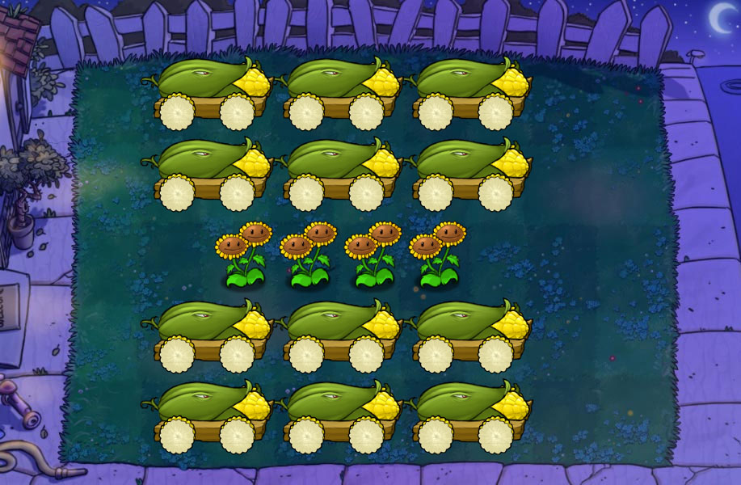

然而当时的我还是太天真了。

首先，这种垫材逻辑可能会干扰投掷，需配合智能脚本，伺机铲垫。因此，所有巨人步伐一致且行动速度最快不见得是最坏情况，因为这样就不需要考虑铲垫问题。

其次，由于冰波单垫被强拆为双垫，垫材时机变得极为诡异，完全垫不到梯丑，因而扶梯可能啃炮。

最后也是最关键的一点：NE场地下3-7核是会漏1路巨人的！原视频用的是2-8核，但这一来有巨人对核举锤异步投掷的风险，二来与新垫材逻辑不兼容。意识到这一点后我基本破防了，只换来了珍宝的一句“没事嘛，适度SL有益身心健康”聊以宽慰。

进入4月份后，我和QED仍会时不时聊起这个话题，探讨FE最后之作是否存在稳定解。QED提醒我可以试试位移铲种，拼凑出一个C7u，但我经过尝试后发现卡槽十分紧张，细节上的困难较多，进度缓慢。我们不得不承认，若要在FE稳定守7，炮数下限很可能是15。

4月月底，还在无限纠结C7u中的我突然意识到了一个华点：既然要两波三垫，减速波双垫行不通，那为什么不加速波双垫呢？

表面上看这是做不到的——加速波波长才746，小于垫材CD的751，不可能垫两次。不过，虽然加速波第一垫是要垫MJ，但由于减速巨人锤击生效需要一定时间，这批垫材其实可以提前放置！

我迅速列出一个草案：减速波激活后先垫一次，顺便垫加速波MJ，然后加速波激活后再垫一次，一并照顾两波巨人；此后减速波垫材按原样不动。这样一来，三次垫材的施放位置都是9列，且没有啃炮问题。经速度计算器验证，这套方案是完全可行的。

劳动节当天午后，我发布了垫材逻辑修正过后的FE最后之作，提出了“规范化对C6u”。核坑方面我也顺手做了优化，原视频规划不善，用了4坑，实则2坑足以。

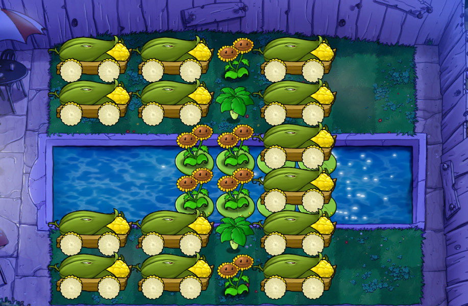

功夫不负有心人。许久以来“对C6u守7”的困惑，终于迎来了掷地有声的答案。

一个月后，我把中开12翻了出来，完成了第二次翻修。核位改回2-8，用南瓜骗锤的方式化解之前提到的砸核问题，由于N后接dd尾炸，1路炮对2路小鬼拦截允差大，因此2路部分巨人投掷得晚些不影响节奏正常运行。和FE最后之作相比，中开12的细节问题更多，但随着做阵水平的提高，一切也就都迎刃而解了。

## 10. 太极

人们总说，这个游戏里存在着太多千钧一发的巧合。从精准之舞，到1437+1437+601=3475，似乎一切都是宝开命中注定的安排。

这种想法肯定是片面的。在这个游戏里，刚好成立和刚好不成立的东西几乎一样多，只是人们更容易关注前者罢了。

这些恰巧不成立的例子里，连续PDc可能是最著名的一个。

PDc这个东西说起来真是历史悠久，最早可追溯到2010年炮帝最初想要实现24炮的思路，即PD+C直接碾过。这个想法在两年后被冰冰“实现”，留下了垫材24炮这一名阵。冰冰用的论证方式很简单，巨人最早895砸炮，加上投掷时间再垫两次，被PDc完爆。我只能说他的智商也被完爆了……大约2017~18年起，人们逐渐明白由于相位重置，连续PDc是有小概率翻车的。

有一种处理方案是利用栈位特性，即巨人落锤时若范围内有多个植物，只砸栈位低的，因此可以人为控制，使超前置炮拥有高栈位，不容易被砸。

据传，零度用这套办法优化过垫材24，然而b站也好e群也好到处都找不到视频，姑且不深究了。QED告诉我，这种办法是治标不治本的，原因在于巨人行动并不一致，如果有多个巨人对炮举锤，先落地者只砸低栈位垫材，但后落地的依旧能砸扁春哥。

2021年5月初，事情突然有了转机。起初是QED觉得PDc的砸率可能被夸大了，想实测一下。我跟他确认垫材时机时，发现他用的是537垫，但因小喷和阳光菇存在坐标偏移，要完全无伤的话需要559垫。他表示，这一点炮损应该无所谓。主攻手控超多炮的粉笔加入对话，提出“砸率>>>炮损”的观点。

很快大家就意识到，既然559垫可以提前到537垫，岂不是可以继续提前么？只要有一个智能脚本，根据巨人的实际位置调整垫材时机，如果走得慢就常规559垫，走得快就在对炮举锤前的一瞬间垫，就能将砸率兑换为撑杆炮损。

以动代静，以柔克刚。太极之道，实为至理。

一天后，我上传了以智能脚本运行的垫材24炮视频，借用自然转白后可以PD省阳光的特点，实现严谨零砸率+2f降400，论证了阵型的可行性。

当极限数据只差一点点恰巧不成立时，智能脚本就成了解决这类问题的利器。新垫材24发布几日后，我用类似的方法对PE小②做了修正，将长波压缩进18.58s严谨PD波长，短波以智能土豆垫矿工的方式降低炮损。直至今日，这种思路都广泛运用于各类阵型中，为许多理论上存在微小缺憾的操作亮起了一盏明灯。

## 11. 化境 

细心的读者可能会注意到，从前面几章起，笔者本人的存在感似乎特别强，几乎所有阵的视频都出自笔者之手。

这倒也不是我自吹自擂。当时的我的确高产，每天都花大把时间在PVZ上。作为必然结果，我在排节奏、写脚本、出视频等各个环节越发得心应手，逐渐步入个人能力的高峰期。

在此期间，我一直在思考的一个问题是对蓝色版ME20的优化。2021年5月上旬我发布的“【Endless】常用数据”中，明确指出了形如ME20的构型，冰波跳跳的极限波长仅有1641，因而原解采用1672波长是可能会寄的，且由于冰波过长，分离炮漏掉的投篮亦有一定概率碾掉复制冰。此外，原解在最后一个加速波被迫采取401激活，这点炮损虽然称不上巨伤，但对一个无铲种解来说难以忽视。

5月15日，晓云上传了一个优化版的邻C7u，其主要思路是将樱桃用作第一加速波的代奏，由正位复用转为错位复用，将冰波缩短至16s整，即参数7下冰波长度的下限。

这样一来，跳跳和投篮的问题就不复存在了，加速波炮损也得以消除。唯一一点美中不足的，是下半f因复用问题，有一波不得不用双边分离，视刷新情况于刷新后约14.7s或15.7s激活。如此，分离炸漏掉的小丑会有小概率炸炮。但瑕不掩瑜，整体而言这个解的完成度是很高的，一经发布我就在下面评论了句“参数7解算是修成正果了”。

谁也没想到半个月后，说这句话的我就被自己打脸了。

这个故事说来话长。我们先从传统冰骨架说起。旧观念里，人们认为不同冰位之间存在着本质区别，同为邻C8u，邻间对之间不可混为一谈。但随着新时代到来，蓝色、冰轮等人已经多次例证在逐波语境下，所谓的“参数”（也就是冰位）并非神圣不可侵犯。

我隐隐中萌生了一个不成熟的想法：邻C7u能打的阵，间C7u理应也能打；反之亦然。

6月某日晚，抱着这种心态，我分析起了现有ME20的轨道。我意外地发现，目前的邻C7u节奏并未真正节省运算量，将同样的轨道重排后的间C7u同样可行！受天台场合花盆CD限制，NDD波次后无法接冰波，需要额外插入一个加速波。这样一来，就有了一个以C7u为复用内核，以间C8u为表层节奏的逐波雏形。

这个“不伦不类”的C7u-C8u融合节奏有许多得天独厚的优势。和零度间C8u解相比，它无需铲种，亦没有双色PDD导致的炮损。和原C7u解相比，它的冰波长度直接突破了参数7的下限，由16s整缩短至15.4s。另外，它避免了非定态解中双边分离后强拖时间的尴尬，且复制冰均于加速波放置，绝无小丑炸冰之虞。

一天后，我正式发布了新ME20的视频，后冰骨架时代的代表作就此爆诞。

从确定节奏到视频发布这短短一天时间内，大部分工作量都在于炮序排布，以及精确坐标的计算。而这个节奏本身的潜力是不言而喻的。它一举打破了不同参数之间的壁垒，将总循环拖至54s，以优雅而简明的方式向世人展示着以炮为纲，而非以冰为纲的逐波规划思路的魅力。

我至今仍记得，新ME20的视频发布后，我久久也无法理解其中的内涵。虽然我是它唯一的创造者，但我并不能理解它的全部。节奏成立，脚本完备，阵型稳定，可是为什么？为什么要这么做，为什么这样做更优？我并没能找到答案。

我能做的，只是一遍遍地循环那个视频，痴痴地把葉月的Snow Veil听了一遍又一遍。

经过整整一个月时间的思考后，我决定为后冰骨架时代做一次正式定性，梳理过去一段时间内出现的全新解阵思路。7月初，《参数转变》一文发布，首次否定了原冰骨架体系提出的极限波长与弱逐波等理论，提出了“关键复用片段”、“正位复用”、“错位复用”的概念，对新式逐波思路进行了总结性陈述，宣告了后冰骨架时代进入高峰。

## 12. 离别

正当科技繁盛，蒸蒸日上之时，一件出乎所有人意料之外的事情发生了。

6月12日，QED通过b站动态宣布退圈退坑，表示“q群不会退，但也不会再说话了”。非常惭愧地，我至今也不知道他当时到底为何而退，四处询问也未果。我不清楚是否有人知道个中缘由，但碍于某些原因无法直言，可我始终都是一头雾水。

QED就这样走了，一去不返。

我无权评价他的个人选择，更无权指责他不打招呼就离去的姿态，因为和他频繁交流的这两个多月时间，是我刻骨难忘的技术成长期，也是在他一次又一次的指导下，我才有了对游戏更深刻的理解，有了更多继续钻研下去的动力与热爱。

送君千里，终有一别。

借此机会，我很想正式地表达一次自己对QED的感谢。二次元如何并不重要，但我衷心地希望他在三次元一切安好。

年年走了，QED也走了。转念一想，泠衣、蓝色、冰轮、珍宝、南瓜、乃至小e等曾经的技术党，早已各自休坑退坑了。不论承认与否，当年那个意气风发的第七代，已经在不知不觉中成为了历史。接下来很长一段时间内，继续在一线科技前沿奋斗的，实质上也只剩我一个人了。

## 13. 重拾

不知从某日起，我思考阵型时已经不再会漏算任何东西。复用计算器上排布完毕后，直接写成脚本就能跑。当年丢三落四，一不小心就漏考虑某个僵尸导致崩盘的日子，永远地停留在了回忆里。

此阶段开始，各项成果之间不再有一条明确的发展主线，因此请容许我将部分时间线按需拼接，尽可能有条理地总结一下各个故事。

我们先来说说后院场合的守全命题吧。2021年5月中旬，暂时结束了对FE守全问题探索的我，想对原先的PE16守全进行优化。

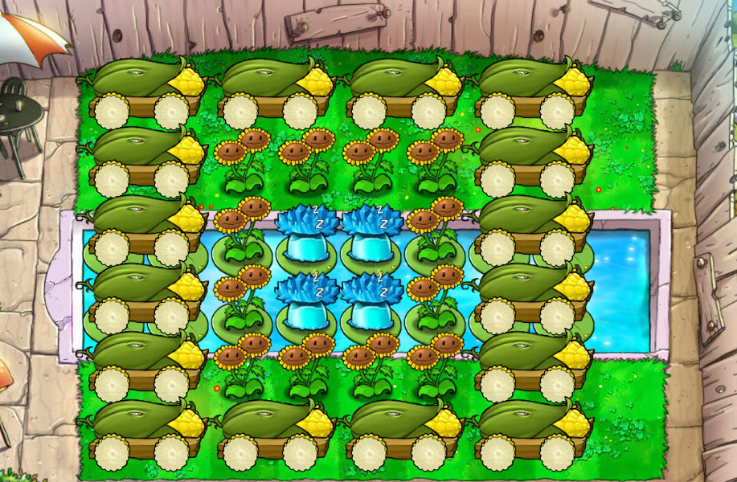

原解的问题不言而喻，冰波拖至1622乃至1654，且除去首代外每一波都这样拖，玩家乐意，梯子小丑可不乐意。

QED在去年曾发过一个视频，将RE16的I6i节奏移植至PE16，将冰波长度有效缩短至1380。然而受当时科技所限，仅能首代4波，冰CD正好差一点恢复。

这个视频里给了我灵感：首代波次不够的问题很好解决，反正只是全红关有轻微透支，实际自然出怪下绝大多数情况都是会提前转白的。由于冰可以储备，多预留一些冰位，就能动态平衡。而且与RE不同，PE场地用垫不受限制，故可在原13s级冰波的基础上每波加一垫，根治小丑问题。

6月初，我将小e测定的小丑位移数据导入速度计算器，制作了一个能准确计算小丑行动位置的小丑计算器。由此，I6i解法下小丑炸率严谨为0的事实得以验证，是历史上开出的第一张理论炸率清零的彩票。

7月某日，我重新思考先前FE18守全的间C7u解时，想到如果充分利用冰波炸实B，错开垫材时机，也许能够消除砸率，且不引入额外炮损。

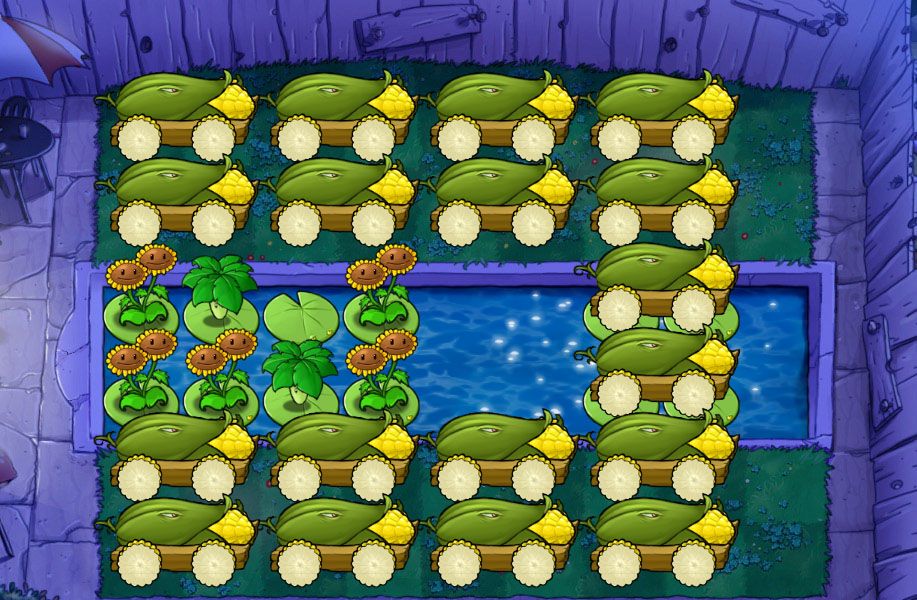

有砸率缺陷的片段很简单：【减速波→加速波①→加速波②】中，减速波出生的巨人可能超神。

一番规划后，我得到了一个无比复杂的垫材逻辑：将五张垫材卡分为2+3两组。冰波激活后，先垫56，第一加速波再用剩余三张卡垫156。2路巨人由炸实B处理过，无需额外关照。第二加速波刚开始时，用已经恢复了的两垫垫12，之后再用三垫+蓝冰垫1256。至此，每一波巨人都得到充分覆盖，优雅且彻底地解决了砸率问题。

不妨一提，这个间C7u解FE18算是为数不多留存至今的旧冰骨架化石，或者用我的话说，是“冰骨架最后一阵”。之所以这样说，是因为它的阵解里涉及到的一切思路都是非常传统的，比如所谓1639极限波长，以及截取循环相位得到的弱逐波等等。它就像是一棵饱经风雨的银杏树，记录着旧时代曾经存在过的痕迹。即使邻C7u新解出现后，它仍是极红全难度出怪下的最优解，于风雨中孤立，默默地看着后冰骨架时代发生的一切。

## 14. 破竹

聊完了PE/FE，该说说NE了。

NE是个令人又爱又恨的纠结场地。在无炮领域里，由于其不出冰车的特性使得各类妖魔鬼怪阵型都可以在NE稳定运作，说是极乐天堂也不为过。可对运算量充沛的炮阵而言，不出冰车带来的那一点好处通常可以忽略不计；另一方面，墓碑这样的场地特色决定了许多阵型都要牺牲宝贵宝贵的全难度卡槽空间，且100行距意味着漏炸炮落点上行僵尸的现象尤其严重，外加夜间本身的高难度属性，其实际难度接近地狱级别，寸步难行。

直观上看，自2013年NE20横空出世后，NE守护全场的炮数下限常年停留在20，稳如poi。期间零星几次出现的探索，固然有历史意义，却都难成气候。

2021年6月中旬，我对NE19进行了优化。在那之前NPC先发过一个视频，大体思路继承自先前的减速PDD+388激活最佳复用拍档，可惜细节上的问题实在太多，关键的几处问题如388波垫舞王导致的伴舞炮损，以及此后1672冰波的巨量炮伤，都是自由放任状态。

为此，我修改了冰序逻辑，消除了388波次的炮损，并以之前做非极限FE真二时用过的轮垫手法化解了1672波的炮伤问题。我顺便用了一手参数复用，下f处将邻C7u转为间C7u，化解弹坑与撑杆间的冲突。

一通操作过后，新NE19全难度阳光少掉一千，满足经济可续航指标，首次将NE场地守全场稳定下限定义为19。因其发布时正值QED退坑，此阵亦称作“怀念QED19炮”，谨以此纪念那些年Q姐姐想实现NE19而不能的夙愿。

作为副产品，我对此前冰轮发布的三花NE18做出了修正。基本框架继承自NE19，同为邻C7u，砍掉分离炸以弥补缺失的一炮。

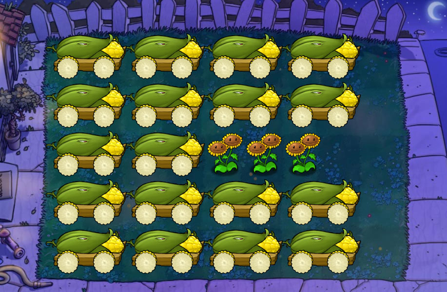

听着简单，但炮数毕竟是少了，各方面尤其是收尾都十分刺激。我利用NE场地不出冰车的特性，热过渡炮恢复后按兵不动，用作激活，此后再炮炸后场矿工，将原本的1672冰波有效缩短至1605，完成“热过渡置换”。收尾时缺炮，就想尽方法节省，以精确的垫材逻辑与复合运算排布手法，完成严谨收尾。

## 15. 除故

 

推动科技线的工作有条不紊地进行时，一些跟不上发展需求的旧时代遗物也在逐步淘汰。

首当其冲的是I5，即一种类似 13|13|6 这样类ch5但不是ch5的白昼负数复用节奏。其首发阵容钻石15不必说，各类打法数不胜数，从ch5u到ch6怎么玩都行。

长期以来被认为是I5典型载体的胡版PE神16，在2021年5月份新PE16守全发布后其实就已经社会性死亡了。6月下旬，我终于想起来这个躲在历史角落里瑟瑟发抖的阵，将I6i节奏照搬过来，达成炸率清零+节省阳光千余，I5从此退出主流科技视野。顺带一提，这里的I6i首次结合BPSD将首代波数提升至5，全红关亦无冰透支，当然这一点对PE16守全而言区别并不大。

跟I5心连心的好兄弟I7，日子过得也好不到哪里去。原先的I7孤阵DE中开14，集众多I7“优点”于一身的同时也集众多运阵硬伤于一身，从难以解决的巨人砸率，到无法忽视的小丑炸率，到家常便饭式的梯子炮损，再到小丑炸核、巨人砸核……总之是浑身上下都是破绽，几度都让试图补锅的我望而却步。

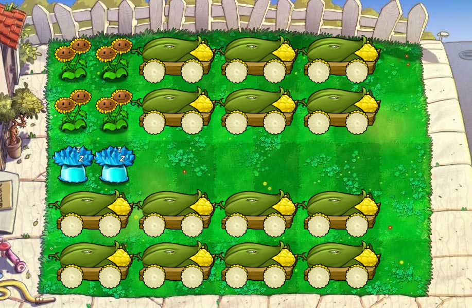

2021年10月，我翻出了先前折翼的DE14“守全场”，思考其采用的1622连续冰波。该节奏本身自然是无任何无尽可能性的，不过我想到，若充分利用尾炸延迟，也许能将冰波适当缩短。计算结果显示，单纯I4i的冰波长度下限约在1550。当时通过rtvz等手段，已经确认了常规冰波有垫材阻挡的情况下，波长拖至1500左右都很安全，因而1550虽非万全之策，还算勉强能接受。

玩弄复用计算器时，我意识到，和以往的假设不同，连续冰波并非永远和循环节奏画等号。具体来说，刚刚结束首代切入节奏时，完全可以使用I3PD以提前炮的生效时机，缩减波长，此后再转为I3Pd。究其原理，和夜间排布逐波时关键复用片段的道理是如出一辙的，无非是让炮早生效与晚生效的艺术。

在适当的位置插入N代奏后，我得到了一个逐波化的新I4i节奏，大部分波长均经过特化，为1485波，仅收尾时为凑CD以及下f时转为1550，总体冰波平均长度仅1500。抛开零砸率、核武零炸率这些不说，单是炮伤就比原解下降了两个数量级，正式宣告了I7退休。

作为衍生品，DE14炮含核坑守全也能稳定运行了，这里贴一张阵图意思一下：

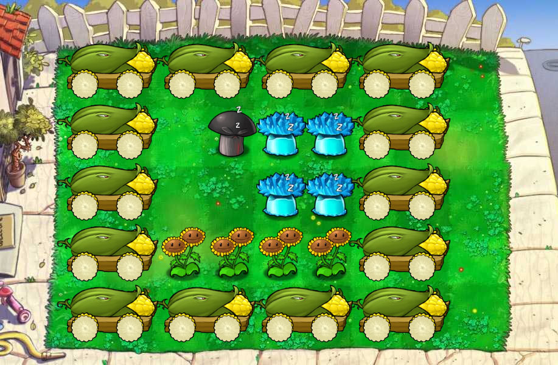

为I5和I7复盘，只需要一句话：存冰位充足时，白昼拦截阵型的最优解几乎总是连续冰波。这里暂且留一个口，实际上迄今为止并未发现任何明显反例。像PE神16、DE中开14这样边路中路大开，闲置格子堆积如山的阵型，自然是用不到I5、I7作为最优解的。

最后我们来聊聊被笔者誉为“近年开到最大的空头支票”的664科技。

想当初，在2018年，这东西刚提出的时候是何等风光啊，大街小巷上任何技术党都恨不得蹭一波顺风车。约莫一年过后，大家也渐渐发现它不太对劲了。虽然宣传得很美好，似乎是一剂根治参数7正位复用差个几十cs不够复用尴尬的良药，实际上用得起、愿意用的阵型却寥寥无几。所谓“1672-664陷阱”被提出，用于描述参数7复用之难，言下之意无非是说664跟1672一样不靠谱。

再到后来，1672也没人提了，因为人们逐渐感觉664比1672还坑。除了漏上行巨人之外，三叶草路还有炮损，真正稳定的特殊垫材原来只有大蒜一个。你可以脑补一下孔乙己被人打了后忍辱负重回到酒店的那种样子，664大概就是那么惨。

原先的陪嫁品里，FE真2走得早，2021年5月就转投1672了。毕竟它只守两路超前置，办法不要太多，一路大蒜，另一路垫材轮换，拿下1672不在话下。前文提及过，这个非极限版真2同时也是轮换垫材逻辑首发阵容。

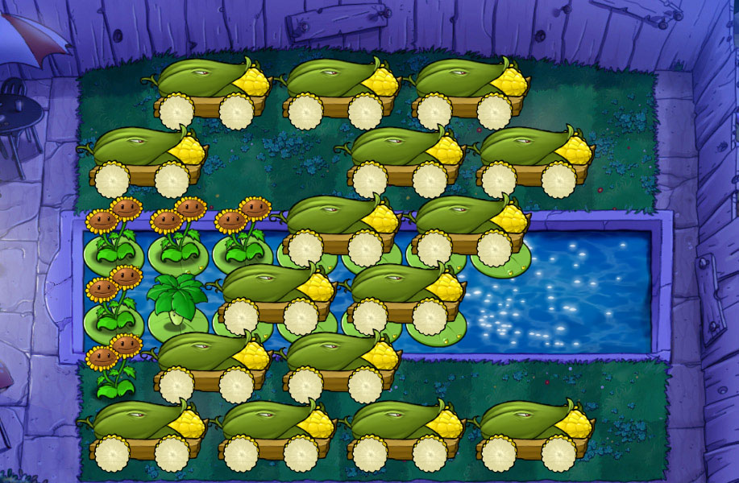

另一个载体，FE神16，稍微坚持得久些。活跃技术党们其实早已达成共识，FE神16显然没必要664。然而碍于原阵各类极限操作较多，包括巨人砸率、撑杆炮损、中场延迟等小问题不断，因此翻修起来并不那么容易。

21年9月，我发布了FE神16翻新后的版本，将664缩短为631，一笔勾销各类疑难杂症，算是给664留了半尸。

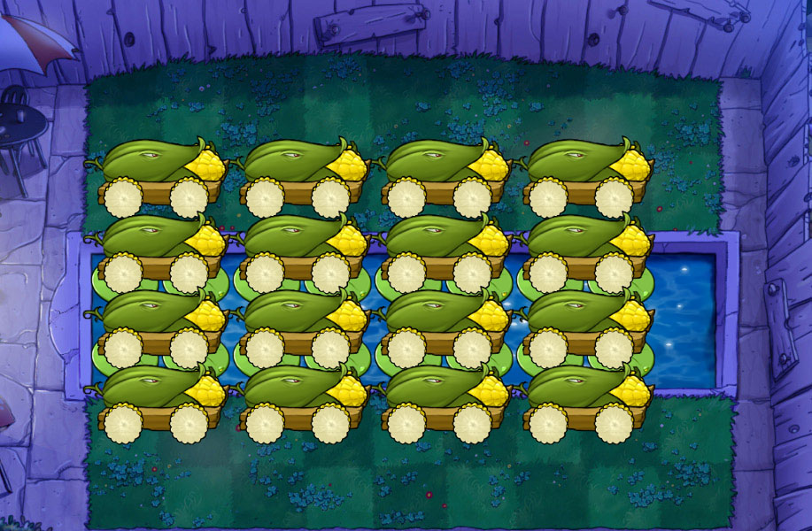

故事到这里还没有结束，因为664还有最后一个载体，即我在2021年3月发布的NE雪花14。当时的我那叫一个抓耳挠腮，无论如何都想不出好办法凑齐复用，走投无路后才选用664，尽管并没能找到有效方法处理可能漏炸的上行巨人。

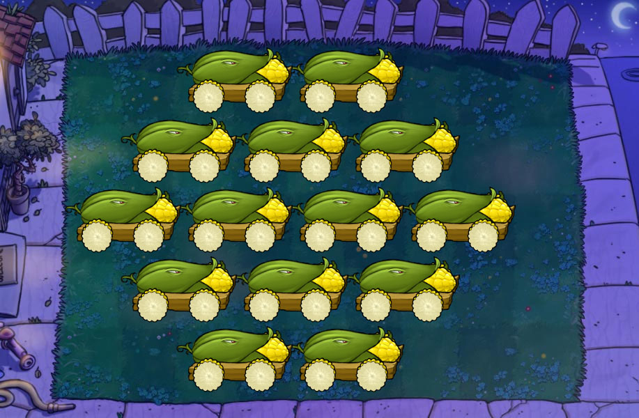

以之后的我的做阵水准，对于这种问题简直是降维打击。2022年5月，我抱着怀旧心态重新研究了一下这个阵，不出半小时就把664干掉了。终于，664寿终正寝，和众多其它小可爱们一同静静地躺在历史的垃圾堆里发烂、发臭。

我想说，讲这些被淘汰的科技，不代表是要否认它们全部的价值。要知道，“淘汰”这个说法的分量可是很重的，如果单是效果类似或是某一方略优，远远称不上谁被淘汰。我们必须明白，淘汰的背后是科技的巨大进步，是操作体系与节奏理论的稳步发展，是全新的版本答案的诞生。淘汰的意义，从来不在于淘汰本身。

## 16. 至臻

在江湖上，一直流传着这么一个传说：砸率、炸率、炮损乃超多炮领域之上的三座大山。若能攻克一座，已是小有所成；若能攻克两座，则功绩斐然；至于同下三座，毕其功于一役，化群峦为飞灰，更是神话奇迹，非寻常人可为，人称“三清”。

……更多废话略去，简单来说就是三个五行极限超多炮被我三清了。

ME20来得最早，于2021年6月修成正果，前文已述，不再重复。

接踵而至的是NE20。这事说来也巧，我本没有翻新NE20的打算，因为我一直以来都以为胡解是很完美的。直到某天落笔验算时，意识到原节奏下双冰连用，15s冰波后接13s是有概率被巨人砸炮的。我在胡视频的评论区里留言询问后，居然真的得到了本人回复——砸率的确有，应对方法是分离炸右移，蹭一蹭速度极快的巨人。

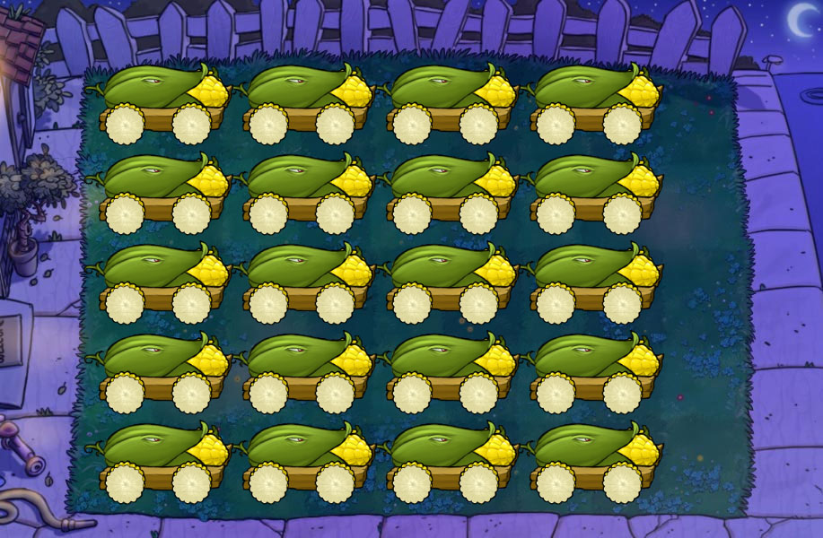

这显然只能是一种权益之计。所谓分离炸，就是要不伤巨人而分离快速，不应违背其初衷。原邻C8u下，双冰连用会带来各种麻烦，短冰波与撑杆间的冲突尤甚。我当即意识到邻C8u是没有出路的，应当尝试其它排布方式。

于是我排了一个间C8u逐波，辅以一系列精确计算，论证了整体与局部的严谨性。下f收尾时，沿用了胡解B-PPDD的手法，在某种意义上算是一种致敬。就这样，一个砸率严格归零、炮损严格归零、炸率比以往任何解都低的NE20新解诞生了。

“三清”得最晚也最艰难的，是DE20。21年6月时，我曾试图以19年胡版为基底进行翻修。当时的我可能过于急躁，意识到热过渡收跳炮撑杆并非任何情况下都有伤后急于发一个视频证明自我，却没能审视原节奏框架的一些固有问题。

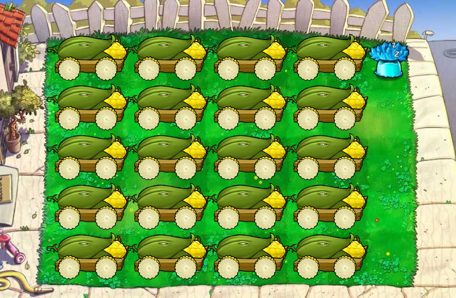

直到21年10月底，后起之秀yayayakumo发了一个玩I6节奏的DE20视频，我才意识到了跳脱出原框架的可能性。I6下冰波拖得过长，9列临时冰比ch6还险，不可取，然而这种将波长拖长后强凑正数复用的思路是很有价值的。

完善亿点点细节后，我于21年11月发布了DE20三清版本，彻底打破“9列存冰必然存在小丑炸冰之命门”的神话，也为我个人对主流科技阵型的探索画上了休止符。

## 17. 尘埃

> 对于自然科学学科，教科书上的寥寥数行，往往需要数十年甚至上百年的研究积淀。站在科技的最前沿，无论是个人还是小组，都只能从很小的一个方向艰难地以很小的步伐前进，一点一点地摸索。
> 
> 诚然PVZ只是一个游戏，与实际的科研不可同日而语，但本质上二者有相似之处。
> 
> ——《冰冰教你撸炮》

新兴科技如同泉水般喷涌而出的时代过后，便是竣工收尾的总结陈词阶段。

2021年9月，我发表了《砸率通论》，洋洋洒洒竟有两万五千字余，从僵尸运动模型，到相位计算方式，再到守各个炮位的常用范式与例阵分析，力求将“砸率”讲得明白、讲得透彻。事后来看在文字排版方面可能仍有改进之处，然而想必我这个懒人也不会再改了，路人看客觉得文献太硬啃不下去无可厚非，有愿意钻研之有心人通读一遍也就够了。

除了砸率之外，对炮损与炸率的分析也至关重要。然而在2021年9月当时，相关数据也好理论框架也好，实在太少，基本是啥都没有。在这样的条件下，我总算是把尚处于雏形态的BVZ框架缝缝补补，跑了一些数据出来，又基于和小e讨论的一些理论原则，将炮损与炸率统一为“炮伤”，写下了《炮伤概论》。字数上较少，仅一万五千字左右，但从起笔到收工足足经过了近五个月，其数据深度与内容含量是极为深厚的。

炮三篇里其实还有最后一篇，也就是《动态计算》，可惜我已无力再写，就留给第八代的新生力量们了。

除了以上理论框架构建的工作之外，我也着手填补了长期以来缺失的从新手入门到高阶理论之间的进阶教程部分。21年11月底，《炮阵快速入门——工具篇》发布，对现有技术资源做了详尽整合，应有尽有；12月，《炮阵100选》发布，对现有阵型成果首次做出较全面总结，虽然还是有人不认真看然后问一些比较火星的问题，但至少以后可以甩个链接了，也算是功德圆满。

写到这里，我不禁感慨：我们不能奢求建立所谓的技术大厦，因为它从来就没有存在过，过去没有，以后也不会有。我们只是时代里的一颗尘埃，做一些自己想做的事，仅此而已。

我要讲的轰轰烈烈的后冰骨架时代故事，至此结束。

## 18. 拾遗

拾遗部分用来补叙一些与主流科技发展路线关系不大，但其创作成果与价值取向同样具有意义而不可忽视的一些人与阵。

**拾遗一：拦截干扰与单冰**

ng收割机，又名牛哥收割机，最大特点是号称要更新然后虚晃一枪，现已创下吉尼斯最大鸽子世界纪录。

牛哥最大的贡献有二，一是发现了BPSD与I3PD之间天作之合的极好相性，将BPSD作为一种极具优越性的首代手段推广至五湖四海。这个事情发生的时间大约在2021年年初，具体节点已不可考，可能牛哥个人的印象里会更早一些。

其二就是对各类拦截干扰命题的探索，拦截加冰瓜不算啥，拦截加玉米还锁定黄油投手才叫酸爽，总之就是怎么蛋疼怎么来，感兴趣者可以自行翻阅b站上的相关视频。

牛哥钦定的官方接班人叫做yayayakumo，虽然后者估计完全对此事不知情。ykm于21年7月起活跃，此后热衷于探索零冰开、少冰开、禁白冰等命题，留有诸如PE最后之作零冰开、PE最后之作禁白冰等优质作品，值得一看。

**拾遗二：侯哥大战九列炮**

没有人比侯哥更懂九列炮。

从入坑起不久，侯哥就跟九列植物杠上了。保护9列炮只是基本操作，保护9列南瓜、9列地刺、9列花盆+地刺王、9列胆小才是他的挚爱。这长江天险后，就是江东铁壁（大雾）。

实际上侯哥至今仍旧活跃，保持着傲视其他费拉不堪毫无武德的七代退坑成员们的更新频率，实乃劳模。可惜侯哥的作品与主流科技发展关联度着实不大，只好在正文部分内忍痛割爱，特此补足。

---

全文完，共2.1w字有余，不知各位看得是否尽兴。本文对部分人物的性别描述不一定可靠，但史实部分描述均可靠且具有引用价值。

以下是鸣谢赞助商部分。首先感谢我的好姐妹雪雪，我们今天之所以聚集在这里，就是为了庆祝他的生日……。其次感谢这一年内提出各类奇思妙想的玩家们，以及陪我日夜水群的群友们。你们都是最棒的。

